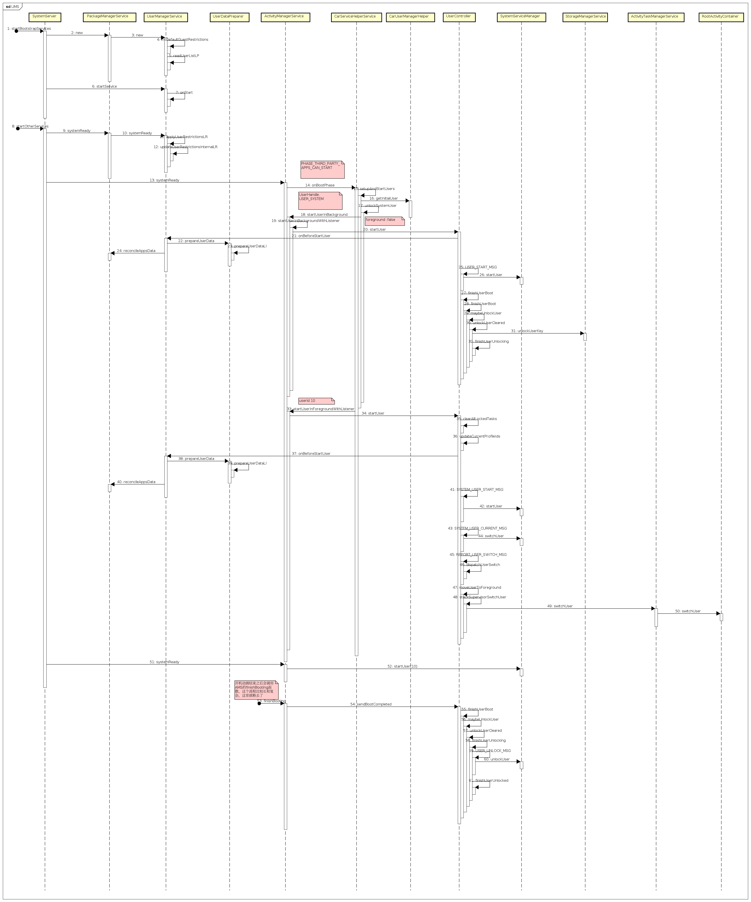

# **Android Q Automotive OS 多用户启动流程**
# 简介

Android Q auto版本上开机存在2个用户，分别是user 0和user 10，user 0 称为无头用户，用户后台管理，user 10是current用户，下面我们看下这部分的代码逻辑和实现。

# 启动
## 构造方法

这部分是老生常谈了，我们当然先要看下UserManagerService这个服务的启动过程，于是我们又打开了SystemServer类：
```
  private void startBootstrapServices() {
    //省略部分代码，这里看这个服务还是很重要的，居然在bootstrap这个函数中
        traceBeginAndSlog("StartUserManagerService");
        mSystemServiceManager.startService(UserManagerService.LifeCycle.class);
        traceEnd();
    //省略部分代码
   }
```
这里仍然是老套路，通过servicemanager查找类，反射调用类的构造方法，然后初始化一个类对象，这里就不废话了， 但是我们在usermanagerservice内部类lifecycle中没有看到初始化类对象的逻辑，usermanagerservice是一个单例，在PMS构造函数中创建过， 所以这里并不用再去创建，我们直接看usermnagerservice的构造函数中都搞了哪些事情：
```
// PMS 构造函数中的调用
            sUserManager = new UserManagerService(context, this,
                    new UserDataPreparer(mInstaller, mInstallLock, mContext, mOnlyCore), mPackages);
//UMS的构造函数
    private UserManagerService(Context context, PackageManagerService pm,
            UserDataPreparer userDataPreparer, Object packagesLock, File dataDir) {
        mContext = context;
        mPm = pm;
        mPackagesLock = packagesLock;
        mHandler = new MainHandler();
        mUserDataPreparer = userDataPreparer;
        synchronized (mPackagesLock) {
            mUsersDir = new File(dataDir, USER_INFO_DIR);
            mUsersDir.mkdirs();
            // Make zeroth user directory, for services to migrate their files to that location
            File userZeroDir = new File(mUsersDir, String.valueOf(UserHandle.USER_SYSTEM));
            userZeroDir.mkdirs();
            FileUtils.setPermissions(mUsersDir.toString(),
                    FileUtils.S_IRWXU | FileUtils.S_IRWXG | FileUtils.S_IROTH | FileUtils.S_IXOTH,
                    -1, -1);
            mUserListFile = new File(mUsersDir, USER_LIST_FILENAME);
            initDefaultGuestRestrictions();
            readUserListLP();
            sInstance = this;
        }
        mLocalService = new LocalService();
        LocalServices.addService(UserManagerInternal.class, mLocalService);
        mLockPatternUtils = new LockPatternUtils(mContext);
        mUserStates.put(UserHandle.USER_SYSTEM, UserState.STATE_BOOTING);
    }
```

## 主要干了这么几件事儿：

    创建MainHandler，主要用于处理WRITE_USER_MSG消息。
    创建data/system/users路径然后创建user 0 路径。
    初始化guest用户的默认restrictions。
    从/data/system/users/userlist.xml文件读取用户信息。
    发布服务到servicemanager。
    把user0 的状态设置为STATE_BOOTING。

## onStart方法

这个方法比较简单，就是获取UMS的实例，上面已经说过，由于UMS是单例，对象的初始化其实实在PMS的构造函数中。
```
        public void onStart() {
            mUms = UserManagerService.getInstance();
            publishBinderService(Context.USER_SERVICE, mUms);
        }
```

## systemReady方法

systemReady方法是在PMS的systemReady中调用的：
```
    public void systemReady() {
        //省略部分代码
        sUserManager.systemReady();
        //省略部分代码
    }
```

## UMS的systemReady函数：
```
    void systemReady() {
        mAppOpsService = IAppOpsService.Stub.asInterface(
                ServiceManager.getService(Context.APP_OPS_SERVICE));

        synchronized (mRestrictionsLock) {
            applyUserRestrictionsLR(UserHandle.USER_SYSTEM);
        }

        UserInfo currentGuestUser = findCurrentGuestUser();
        if (currentGuestUser != null && !hasUserRestriction(
                UserManager.DISALLOW_CONFIG_WIFI, currentGuestUser.id)) {
            // If a guest user currently exists, apply the DISALLOW_CONFIG_WIFI option
            // to it, in case this guest was created in a previous version where this
            // user restriction was not a default guest restriction.
            setUserRestriction(UserManager.DISALLOW_CONFIG_WIFI, true, currentGuestUser.id);
        }

        mContext.registerReceiver(mDisableQuietModeCallback,
                new IntentFilter(ACTION_DISABLE_QUIET_MODE_AFTER_UNLOCK),
                null, mHandler);
    }
```

对user 0 执行applyUserRestrictionsLR，
```
UserManagerService: Applying user restrictions: userId=0 new=Bundle[{no_modify_accounts=true}] prev=Bundle[{}]
```
## onBootPhase方法

onBootPhase 方法中如果AMS ready之后会执行cleanupPartialUsers操作
```
       public void onBootPhase(int phase) {
            if (phase == SystemService.PHASE_ACTIVITY_MANAGER_READY) {
                mUms.cleanupPartialUsers();

                if (mUms.mPm.isDeviceUpgrading()) {
                    mUms.cleanupPreCreatedUsers();
                }
            }
        }
```

# USER 0的启动

user 0的启动来源于CarServiceHelperService,在systemserver启动的时候会判断当前是不是car版本，如果是car版本，会启动CarServiceHelperService，CarServiceHelperService重写了onBootPhase方法，在PHASE_THIRD_PARTY_APPS_CAN_START 阶段会启动user 0。 frameworks/opt/car/services/src/com/android/internal/car/CarServiceHelperService.java
```
    @Override
    public void onBootPhase(int phase) {
        if (DBG) {
            Slog.d(TAG, "onBootPhase:" + phase);
        }
        if (phase == SystemService.PHASE_THIRD_PARTY_APPS_CAN_START) {
            checkForCarServiceConnection();
            // TODO(b/126199560) Consider doing this earlier in onStart().
            // Other than onStart, PHASE_THIRD_PARTY_APPS_CAN_START is the earliest timing.
            setupAndStartUsers();
            checkForCarServiceConnection();
        } else if (phase == SystemService.PHASE_BOOT_COMPLETED) {
            boolean shouldNotify = false;
            synchronized (mLock) {
                mSystemBootCompleted = true;
                if (mCarService != null) {
                    shouldNotify = true;
                }
            }
            if (shouldNotify) {
                notifyAllUnlockedUsers();
            }
        }
    }
```

启动用户的操作都在这个函数中setupAndStartUsers，注意这里的区别，user0 的启动时Background，user10的启动是Foreground：

```
    private void setupAndStartUsers() {
        //省略部分代码
        // 启动user 0 
        try {
            // This is for force changing state into RUNNING_LOCKED. Otherwise unlock does not
            // update the state and user 0 unlock happens twice.
            if (!am.startUserInBackground(UserHandle.USER_SYSTEM)) {
                // cannot start user
                Slog.w(TAG, "cannot start system user");
            } else if (!am.unlockUser(UserHandle.USER_SYSTEM, null, null, null)) {
                // unlocking system user failed. But still continue for other setup.
                Slog.w(TAG, "cannot unlock system user");
            } else {
                // user 0 started and unlocked
                handleUserLockStatusChange(UserHandle.USER_SYSTEM, true);
            }
        } catch (RemoteException e) {
            // should not happen for local call.
            Slog.wtf("RemoteException from AMS", e);
        }
        //省略部分代码

        // 启动user 10
        traceLog.traceBegin("ForegroundUserStart");
        try {
            if (!am.startUserInForegroundWithListener(targetUserId, null)) {
                Slog.e(TAG, "cannot start foreground user:" + targetUserId);
            } else {
                mCarUserManagerHelper.setLastActiveUser(targetUserId);
            }
        } catch (RemoteException e) {
            // should not happen for local call.
            Slog.wtf("RemoteException from AMS", e);
        }
    }

```
启动user10 的过程中，有个switchUser的操作，从user0 切到user 10：
```
            // 发送 SYSTEM_USER_CURRENT_MSG，REPORT_USER_SWITCH_MSG 进行用户切换
            if (foreground) {
                mHandler.sendMessage(mHandler.obtainMessage(SYSTEM_USER_CURRENT_MSG, userId,
                        oldUserId));
                mHandler.removeMessages(REPORT_USER_SWITCH_MSG);
                mHandler.removeMessages(USER_SWITCH_TIMEOUT_MSG);
                mHandler.sendMessage(mHandler.obtainMessage(REPORT_USER_SWITCH_MSG,
                        oldUserId, userId, uss));
                mHandler.sendMessageDelayed(mHandler.obtainMessage(USER_SWITCH_TIMEOUT_MSG,
                        oldUserId, userId, uss), USER_SWITCH_TIMEOUT_MS);
            }

     // 将user10 移动到前台
    private void moveUserToForeground(UserState uss, int oldUserId, int newUserId) {
        boolean homeInFront = mInjector.stackSupervisorSwitchUser(newUserId, uss);
        if (homeInFront) {
            mInjector.startHomeActivity(newUserId, "moveUserToForeground");
        } else {
            mInjector.stackSupervisorResumeFocusedStackTopActivity();
        }
        EventLogTags.writeAmSwitchUser(newUserId);
        sendUserSwitchBroadcasts(oldUserId, newUserId);
    }
```
switchUser 最终会调用到ATMS和RootActivityContainer等，进行HOME和相关的activity task调整操作，这里暂不展开。

## 解锁

在开机动画结束之后会调用AMS的finishBooting函数，这个函数最终会调用UserController里面的解锁动作，这里会把user10解锁，因为user0前面已经解锁了， 这里的解锁过程不会继续往下进行。
```
06-02 11:57:13.397  1908  1928 D ActivityManager: Finishing user boot 0
06-02 11:57:13.397  1908  1928 W ActivityManager: Expected user 0 in state BOOTING but was in state RUNNING_UNLOCKED
06-02 11:57:13.397  1908  1928 D ActivityManager: Finishing user boot 10
06-02 11:57:13.397  1908  1928 I ActivityManager: User 10 state changed from BOOTING to RUNNING_LOCKED
```
## 流程图

开机过程本来就复杂，再加入多用户之后显得更加迷惑，其中还有很多细节并未展开，比如其中的切换用户操作等等。


