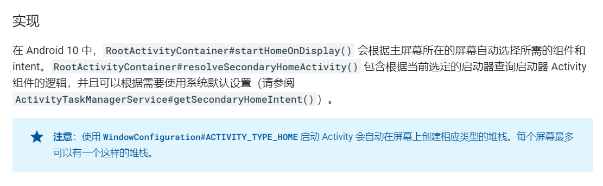

# **Android Q SECONDARY_HOME**
# Android Q SECONDARY_HOME

android 10 增加了对多屏的支持，但是2个屏幕就需要有2个桌面，secondary home应运而生，今天我们来看下secondary home的实现和原理。
简介

我们看下谷歌官方网站的介绍：

官方介绍比较简单，下面我们从代码方面去探究一下。
# 特殊的intent

Android Q 新添加了下面一个INTENT_CATEGORY，专门用于匹配第二屏幕上的桌面
```
  /**
     * The home activity shown on secondary displays that support showing home activities.
     */
    @SdkConstant(SdkConstantType.INTENT_CATEGORY)
    public static final String CATEGORY_SECONDARY_HOME = "android.intent.category.SECONDARY_HOME";
```
# 启动过程

我们知道开机的时候，会在user unlock之后启动真正的home，我们看下Android Q 启动home的逻辑和实现： 触发启动home的地方还是没变，在AMS的systemReady中，只不过由于AndroidQ 重构了AMS，这部分启动home的函数转移到了ATMS中，这是AndroidQ 新加入的一个类，专门负责activity和task display等相关的逻辑。

```
 /**
     * This starts home activity on displays that can have system decorations based on displayId -
     * Default display always use primary home component.
     * For Secondary displays, the home activity must have category SECONDARY_HOME and then resolves
     * according to the priorities listed below.
     *  - If default home is not set, always use the secondary home defined in the config.
     *  - Use currently selected primary home activity.
     *  - Use the activity in the same package as currently selected primary home activity.
     *    If there are multiple activities matched, use first one.
     *  - Use the secondary home defined in the config.
     */
    boolean startHomeOnDisplay(int userId, String reason, int displayId, boolean allowInstrumenting,
            boolean fromHomeKey) {
        // Fallback to top focused display if the displayId is invalid.
        if (displayId == INVALID_DISPLAY) {
            displayId = getTopDisplayFocusedStack().mDisplayId;
        }


        Intent homeIntent = null;
        ActivityInfo aInfo = null;
        // 主屏幕启动home
        if (displayId == DEFAULT_DISPLAY) {
            homeIntent = mService.getHomeIntent();
            aInfo = resolveHomeActivity(userId, homeIntent);
        } else if (shouldPlaceSecondaryHomeOnDisplay(displayId)) {
            Pair<ActivityInfo, Intent> info = resolveSecondaryHomeActivity(userId, displayId);
            aInfo = info.first;
            homeIntent = info.second;
        }
        if (aInfo == null || homeIntent == null) {
            return false;
        }

        if (!canStartHomeOnDisplay(aInfo, displayId, allowInstrumenting)) {
            return false;
        }

        // Updates the home component of the intent.
        homeIntent.setComponent(new ComponentName(aInfo.applicationInfo.packageName, aInfo.name));
        homeIntent.setFlags(homeIntent.getFlags() | FLAG_ACTIVITY_NEW_TASK);
        // Updates the extra information of the intent.
        if (fromHomeKey) {
            homeIntent.putExtra(WindowManagerPolicy.EXTRA_FROM_HOME_KEY, true);
        }
        // Update the reason for ANR debugging to verify if the user activity is the one that
        // actually launched.
        final String myReason = reason + ":" + userId + ":" + UserHandle.getUserId(
                aInfo.applicationInfo.uid) + ":" + displayId;
        mService.getActivityStartController().startHomeActivity(homeIntent, aInfo, myReason,
                displayId);
        return true;
    }

```

我们看下getHomeIntent的函数实现,就是查询CATEGORY_HOME类型的intent：
```
    Intent getHomeIntent() {
        Intent intent = new Intent(mTopAction, mTopData != null ? Uri.parse(mTopData) : null);
        intent.setComponent(mTopComponent);
        intent.addFlags(Intent.FLAG_DEBUG_TRIAGED_MISSING);
        if (mFactoryTest != FactoryTest.FACTORY_TEST_LOW_LEVEL) {
            intent.addCategory(Intent.CATEGORY_HOME);
        }
        return intent;
    }
```
如果不是主屏幕的话调用的是resolveSecondaryHomeActivity，我们看下这个函数的实现：
```
    /**
     * Return the intent set with {@link Intent#CATEGORY_SECONDARY_HOME} to resolve secondary home
     * activities.
     *
     * @param preferredPackage Specify a preferred package name, otherwise use secondary home
     *                        component defined in config_secondaryHomeComponent.
     * @return the intent set with {@link Intent#CATEGORY_SECONDARY_HOME}
     */
    Intent getSecondaryHomeIntent(String preferredPackage) {
        final Intent intent = new Intent(mTopAction, mTopData != null ? Uri.parse(mTopData) : null);
        final boolean useSystemProvidedLauncher = mContext.getResources().getBoolean(
                com.android.internal.R.bool.config_useSystemProvidedLauncherForSecondary);
        if (preferredPackage == null || useSystemProvidedLauncher) {
            // Using the component stored in config if no package name or forced.
            final String secondaryHomeComponent = mContext.getResources().getString(
                    com.android.internal.R.string.config_secondaryHomeComponent);
            intent.setComponent(ComponentName.unflattenFromString(secondaryHomeComponent));
        } else {
            intent.setPackage(preferredPackage);
        }
        intent.addFlags(Intent.FLAG_DEBUG_TRIAGED_MISSING);
        if (mFactoryTest != FactoryTest.FACTORY_TEST_LOW_LEVEL) {
            intent.addCategory(Intent.CATEGORY_SECONDARY_HOME);
        }
        return intent;
    }    
```
这里面有2个特殊的地方，第一个是config_useSystemProvidedLauncherForSecondary是否设置，如果设置了就是用系统提供的默认的secondary home：

```
    <!-- Force secondary home launcher specified in config_secondaryHomeComponent always. If this is
         not set, secondary home launcher can be replaced by user. -->
    <bool name ="config_useSystemProvidedLauncherForSecondary">false</bool>

    <!-- This is the default launcher component to use on secondary displays that support system
         decorations.
         This launcher activity must support multiple instances and have corresponding launch mode
         set in AndroidManifest.
         {@see android.view.Display#FLAG_SHOULD_SHOW_SYSTEM_DECORATIONS} -->
    <string name="config_secondaryHomeComponent" translatable="false">com.android.launcher3/com.android.launcher3.SecondaryDisplayLauncher</string>
```
# 原生launcher3
packages/apps/Launcher3/SecondaryDisplayLauncher/src/com/android/launcher3/SecondaryDisplayLauncher.java

```
<manifest
    xmlns:android="http://schemas.android.com/apk/res/android"
    package="com.android.launcher3">

    <application>

        <activity
            android:name="com.android.launcher3.SecondaryDisplayLauncher"
            android:theme="@style/SecondaryLauncherTheme"
            android:launchMode="singleTop"
            android:configChanges="orientation|screenSize|smallestScreenSize|screenLayout|colorMode|density"
            android:enabled="true">
            <intent-filter>
                <action android:name="android.intent.action.MAIN" />
                <category android:name="android.intent.category.SECONDARY_HOME" /> // mark
                <category android:name="android.intent.category.DEFAULT" />
            </intent-filter>
        </activity>

    </application>
</manifest>
```