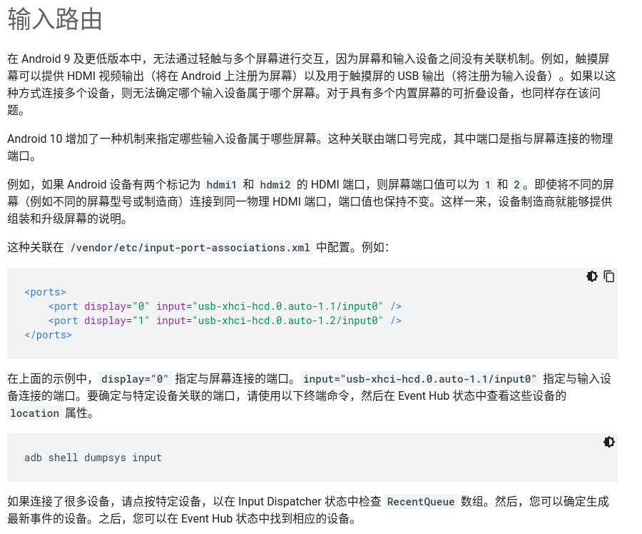

# ** Android Q 多输入 **
# AndroidQ的输入和屏幕绑定调研
##  官方介绍
AndroidQ主持多屏幕，那么多屏幕的输入是如何实现的呢，google官方网站中提到过： https://source.android.com/devices/tech/display/multi_display/input-routing


## 代码实现
### EventHub

从上面的介绍能看到，思路就是输入根屏幕的ID绑定，从说明中可以大概看出驱动层应该是通过usb端口绑定的，因为屏幕上电的时候usb端口是可以确定的。 下面我们来看代码，大家都知道，输入事件的上报来源于EventHub,EventHub在初始化的时候会打开输入设备（device），先来看下openDeviceLocked函数,这个函数的调用是在getEvent的时候，对devicePath进行扫描，看输入设备是否有变化

```
status_t EventHub::openDeviceLocked(const char* devicePath) {
    ………………………………省略部分代码
    // Fill in the descriptor.
    assignDescriptorLocked(identifier);


    // Allocate device.  (The device object takes ownership of the fd at this point.)
    int32_t deviceId = mNextDeviceId++;
    Device* device = new Device(fd, deviceId, devicePath, identifier);

    ALOGV("add device %d: %s\n", deviceId, devicePath);
    ALOGV("  bus:        %04x\n"
         "  vendor      %04x\n"
         "  product     %04x\n"
         "  version     %04x\n",
        identifier.bus, identifier.vendor, identifier.product, identifier.version);
    ALOGV("  name:       \"%s\"\n", identifier.name.c_str());
    ALOGV("  location:   \"%s\"\n", identifier.location.c_str());
    ALOGV("  unique id:  \"%s\"\n", identifier.uniqueId.c_str());
    ALOGV("  descriptor: \"%s\"\n", identifier.descriptor.c_str());
    ALOGV("  driver:     v%d.%d.%d\n",
        driverVersion >> 16, (driverVersion >> 8) & 0xff, driverVersion & 0xff);

    // Load the configuration file for the device.
    loadConfigurationLocked(device);

    // Figure out the kinds of events the device reports.
    ioctl(fd, EVIOCGBIT(EV_KEY, sizeof(device->keyBitmask)), device->keyBitmask);
    ioctl(fd, EVIOCGBIT(EV_ABS, sizeof(device->absBitmask)), device->absBitmask);
    ioctl(fd, EVIOCGBIT(EV_REL, sizeof(device->relBitmask)), device->relBitmask);
    ioctl(fd, EVIOCGBIT(EV_SW, sizeof(device->swBitmask)), device->swBitmask);
    ioctl(fd, EVIOCGBIT(EV_LED, sizeof(device->ledBitmask)), device->ledBitmask);
    ioctl(fd, EVIOCGBIT(EV_FF, sizeof(device->ffBitmask)), device->ffBitmask);
    ioctl(fd, EVIOCGPROP(sizeof(device->propBitmask)), device->propBitmask);
}
```

我们重点要看loadConfigurationLocked 函数，这里面有关于输入设备的一些配置信息
```
void EventHub::loadConfigurationLocked(Device* device) {
    //查找配置文件
    device->configurationFile = getInputDeviceConfigurationFilePathByDeviceIdentifier(
            device->identifier, INPUT_DEVICE_CONFIGURATION_FILE_TYPE_CONFIGURATION);
    if (device->configurationFile.empty()) {
        ALOGD("No input device configuration file found for device '%s'.",
                device->identifier.name.c_str());
    } else {
        status_t status = PropertyMap::load(String8(device->configurationFile.c_str()),
                &device->configuration);
        if (status) {
            ALOGE("Error loading input device configuration file for device '%s'.  "
                    "Using default configuration.",
                    device->identifier.name.c_str());
        }
    }
}
```

getInputDeviceConfigurationFilePathByDeviceIdentifier 的实现在InputDevice.cpp中，从 odm、vendor、System里去查找对应的配置文件是否存在：
```
std::string getInputDeviceConfigurationFilePathByDeviceIdentifier(
        const InputDeviceIdentifier& deviceIdentifier,
        InputDeviceConfigurationFileType type) {
    if (deviceIdentifier.vendor !=0 && deviceIdentifier.product != 0) {
        if (deviceIdentifier.version != 0) {
            // Try vendor product version.
            std::string versionPath = getInputDeviceConfigurationFilePathByName(
                    StringPrintf("Vendor_%04x_Product_%04x_Version_%04x",
                            deviceIdentifier.vendor, deviceIdentifier.product,
                            deviceIdentifier.version),
                    type);
            if (!versionPath.empty()) {
                return versionPath;
            }
        }

        // Try vendor product.
        std::string productPath = getInputDeviceConfigurationFilePathByName(
                StringPrintf("Vendor_%04x_Product_%04x",
                        deviceIdentifier.vendor, deviceIdentifier.product),
                type);
        if (!productPath.empty()) {
            return productPath;
        }
    }

    // Try device name.
    return getInputDeviceConfigurationFilePathByName(deviceIdentifier.getCanonicalName(), type);
}

std::string getInputDeviceConfigurationFilePathByName(
        const std::string& name, InputDeviceConfigurationFileType type) {
    // Search system repository.
    std::string path;

    // Treblized input device config files will be located /odm/usr or /vendor/usr.
    const char *rootsForPartition[] {"/odm", "/vendor", getenv("ANDROID_ROOT")};
    for (size_t i = 0; i < size(rootsForPartition); i++) {
        if (rootsForPartition[i] == nullptr) {
            continue;
        }
        path = rootsForPartition[i];
        path += "/usr/";
        appendInputDeviceConfigurationFileRelativePath(path, name, type);
#if DEBUG_PROBE
        ALOGD("Probing for system provided input device configuration file: path='%s'",
              path.c_str());
#endif
        if (!access(path.c_str(), R_OK)) {
#if DEBUG_PROBE
            ALOGD("Found");
#endif
            return path;
        }
    }

    // Search user repository.
    // TODO Should only look here if not in safe mode.
    path = "";
    char *androidData = getenv("ANDROID_DATA");
    if (androidData != nullptr) {
        path += androidData;
    }
    path += "/system/devices/";
    appendInputDeviceConfigurationFileRelativePath(path, name, type);
#if DEBUG_PROBE
    ALOGD("Probing for system user input device configuration file: path='%s'", path.c_str());
#endif
    if (!access(path.c_str(), R_OK)) {
#if DEBUG_PROBE
        ALOGD("Found");
#endif
        return path;
    }

    // Not found.
#if DEBUG_PROBE
    ALOGD("Probe failed to find input device configuration file: name='%s', type=%d",
            name.c_str(), type);
#endif
    return "";
}
```

# IMS

google 官方文档中提到的输入和屏幕的对应关系，在IMS中有个解析的函数如下，但是这个方法是native的callback，在java中并没有调用的地方： 

```
private static final String PORT_ASSOCIATIONS_PATH = "etc/input-port-associations.xml";
    /**
     * Ports are highly platform-specific, so only allow these to be specified in the vendor
     * directory.
     */
    // Native callback
    private static String[] getInputPortAssociations() {
        File baseDir = Environment.getVendorDirectory();
        File confFile = new File(baseDir, PORT_ASSOCIATIONS_PATH);

        try {
            InputStream stream = new FileInputStream(confFile);
            List<Pair<String, String>> associations =
                    ConfigurationProcessor.processInputPortAssociations(stream);
            List<String> associationList = flatten(associations);
            return associationList.toArray(new String[0]);
        } catch (FileNotFoundException e) {
            // Most of the time, file will not exist, which is expected.
        } catch (Exception e) {
            Slog.e(TAG, "Could not parse '" + confFile.getAbsolutePath() + "'", e);
        }
        return new String[0];
    }
```

那我们需要看下这个函数的调用时机，下面的时序图是AndroidR的IMS初始化流程，大同小异，这个函数的调用是在inputreader初始化的时候被native世界调用到的，把配置读到了Configuration中： 
```
void NativeInputManager::getReaderConfiguration(InputReaderConfiguration* outConfig) {
    
    省略部分代码
    // Associations between input ports and display ports
    // The java method packs the information in the following manner:
    // Original data: [{'inputPort1': '1'}, {'inputPort2': '2'}]
    // Received data: ['inputPort1', '1', 'inputPort2', '2']
    // So we unpack accordingly here.
    outConfig->portAssociations.clear();
    jobjectArray portAssociations = jobjectArray(env->CallStaticObjectMethod(
            gServiceClassInfo.clazz, gServiceClassInfo.getInputPortAssociations));
    if (!checkAndClearExceptionFromCallback(env, "getInputPortAssociations") && portAssociations) {
        jsize length = env->GetArrayLength(portAssociations);
        for (jsize i = 0; i < length / 2; i++) {
            std::string inputPort = getStringElementFromJavaArray(env, portAssociations, 2 * i);
            std::string displayPortStr =
                    getStringElementFromJavaArray(env, portAssociations, 2 * i + 1);
            uint8_t displayPort;
            // Should already have been validated earlier, but do it here for safety.
            bool success = ParseUint(displayPortStr, &displayPort);
            if (!success) {
                ALOGE("Could not parse entry in port configuration file, received: %s",
                    displayPortStr.c_str());
                continue;
            }
            outConfig->portAssociations.insert({inputPort, displayPort});
        }
        env->DeleteLocalRef(portAssociations);
    }

    省略部分代码
}
```

分配显示端口，和输入对应，这个config函数调用的地方有很多，比如转屏或者刚开机的时候进行的config：

```
void InputDevice::configure(nsecs_t when, const InputReaderConfiguration* config, uint32_t changes) {
    //省略部分代码
           if (!changes || (changes & InputReaderConfiguration::CHANGE_DISPLAY_INFO)) {
             // In most situations, no port will be specified.
            mAssociatedDisplayPort = std::nullopt;
            // Find the display port that corresponds to the current input port.
            const std::string& inputPort = mIdentifier.location;
            if (!inputPort.empty()) {
                const std::unordered_map<std::string, uint8_t>& ports = config->portAssociations;
                const auto& displayPort = ports.find(inputPort);
                if (displayPort != ports.end()) {
                    mAssociatedDisplayPort = std::make_optional(displayPort->second);
                }
            }
        }
    //省略部分代码
}
```

DisplayManagerService 端的viewport 赋值情况，开机启动DMS之后，系统会执行wm.displayReady()， 然后经过一系列调用会调用的DMS中关于viewport设置的地方,这部分调用流程比较复杂，后续专门展开：

```
    private void performTraversalLocked(SurfaceControl.Transaction t) {
        // Clear all viewports before configuring displays so that we can keep
        // track of which ones we have configured.
        clearViewportsLocked();

        // Configure each display device.
        final int count = mDisplayDevices.size();
        for (int i = 0; i < count; i++) {
            DisplayDevice device = mDisplayDevices.get(i);
            configureDisplayLocked(t, device);
            device.performTraversalLocked(t);
        }

        // Tell the input system about these new viewports.
        if (mInputManagerInternal != null) {
            mHandler.sendEmptyMessage(MSG_UPDATE_VIEWPORT);
        }
    }

    private void configureDisplayLocked(SurfaceControl.Transaction t, DisplayDevice device) {
        
        //省略部分代码

        display.configureDisplayLocked(t, device, info.state == Display.STATE_OFF);
        final int viewportType;
        // Update the corresponding viewport.
        if ((info.flags & DisplayDeviceInfo.FLAG_DEFAULT_DISPLAY) != 0) {
            viewportType = VIEWPORT_INTERNAL;
        } else if (info.touch == DisplayDeviceInfo.TOUCH_EXTERNAL) {
            viewportType = VIEWPORT_EXTERNAL;
        } else if (info.touch == DisplayDeviceInfo.TOUCH_VIRTUAL
                && !TextUtils.isEmpty(info.uniqueId)) {
            viewportType = VIEWPORT_VIRTUAL;
        } else {
            Slog.i(TAG, "Display " + info + " does not support input device matching.");
            return;
        }

        populateViewportLocked(viewportType, display.getDisplayIdLocked(), device, info.uniqueId);
    }
```

上面的performTraversalLocked 也会通知inputmanager更新viewport,最终也会调用到上面说的InputDevice::configure
# Android Q输入事件的分发

从事件的分发流程来找displyID 在哪里体现的，可以推导出整个displayID的赋值流程， 我们从下面的InputDispatcher的notifyMotion方法看起，我们看到Motion的事件封装中， Q比P多了一个args->displayId：
```
// Android Q
void InputDispatcher::notifyMotion(const NotifyMotionArgs* args) {
    //省略部分代码
        // Just enqueue a new motion event.
        MotionEntry* newEntry = new MotionEntry(args->sequenceNum, args->eventTime,
                args->deviceId, args->source, args->displayId, policyFlags,
                args->action, args->actionButton, args->flags,
                args->metaState, args->buttonState, args->classification,
                args->edgeFlags, args->xPrecision, args->yPrecision, args->downTime,
                args->pointerCount, args->pointerProperties, args->pointerCoords, 0, 0);

        needWake = enqueueInboundEventLocked(newEntry);
}
//Andoid P
void InputDispatcher::notifyMotion(const NotifyMotionArgs* args) {
    //省略部分代码
        // Just enqueue a new motion event.
        MotionEntry* newEntry = new MotionEntry(args->eventTime,
                args->deviceId, args->source, policyFlags,
                args->action, args->actionButton, args->flags,
                args->metaState, args->buttonState,
                args->edgeFlags, args->xPrecision, args->yPrecision, args->downTime,
                args->displayId,
                args->pointerCount, args->pointerProperties, args->pointerCoords, 0, 0);

        needWake = enqueueInboundEventLocked(newEntry);
}
```

我们跟着这个流程往前看，其实InputDispatcher其实就是InputListener，我们追着这个NotifyMotionArgs，看他到底在什么地方 赋值过来的，这样就可以定位到这个displayID的赋值地方，我们关注的是touch，TouchInputMapper中的dispatchMotion 方法中， 获取了displayId
```
void TouchInputMapper::dispatchMotion(nsecs_t when, uint32_t policyFlags, uint32_t source,
        int32_t action, int32_t actionButton, int32_t flags,
        int32_t metaState, int32_t buttonState, int32_t edgeFlags, uint32_t deviceTimestamp,
        const PointerProperties* properties, const PointerCoords* coords,
        const uint32_t* idToIndex, BitSet32 idBits, int32_t changedId,
        float xPrecision, float yPrecision, nsecs_t downTime) {
    PointerCoords pointerCoords[MAX_POINTERS];
    PointerProperties pointerProperties[MAX_POINTERS];
    uint32_t pointerCount = 0;
    while (!idBits.isEmpty()) {
        uint32_t id = idBits.clearFirstMarkedBit();
        uint32_t index = idToIndex[id];
        pointerProperties[pointerCount].copyFrom(properties[index]);
        pointerCoords[pointerCount].copyFrom(coords[index]);

        if (changedId >= 0 && id == uint32_t(changedId)) {
            action |= pointerCount << AMOTION_EVENT_ACTION_POINTER_INDEX_SHIFT;
        }

        pointerCount += 1;
    }

    ALOG_ASSERT(pointerCount != 0);

    if (changedId >= 0 && pointerCount == 1) {
        // Replace initial down and final up action.
        // We can compare the action without masking off the changed pointer index
        // because we know the index is 0.
        if (action == AMOTION_EVENT_ACTION_POINTER_DOWN) {
            action = AMOTION_EVENT_ACTION_DOWN;
        } else if (action == AMOTION_EVENT_ACTION_POINTER_UP) {
            action = AMOTION_EVENT_ACTION_UP;
        } else {
            // Can't happen.
            ALOG_ASSERT(false);
        }
    }
    const int32_t displayId = getAssociatedDisplay().value_or(ADISPLAY_ID_NONE);
    const int32_t deviceId = getDeviceId();
    std::vector<TouchVideoFrame> frames = mDevice->getEventHub()->getVideoFrames(deviceId);
    std::for_each(frames.begin(), frames.end(),
            [this](TouchVideoFrame& frame) { frame.rotate(this->mSurfaceOrientation); });
    NotifyMotionArgs args(mContext->getNextSequenceNum(), when, deviceId,
            source, displayId, policyFlags,
            action, actionButton, flags, metaState, buttonState, MotionClassification::NONE,
            edgeFlags, deviceTimestamp, pointerCount, pointerProperties, pointerCoords,
            xPrecision, yPrecision, downTime, std::move(frames));
    getListener()->notifyMotion(&args);
}

```
getAssociatedDisplay方法返回的是mViewport.displayId
```
std::optional<int32_t> TouchInputMapper::getAssociatedDisplay() {
    if (mParameters.hasAssociatedDisplay) {
        if (mDeviceMode == DEVICE_MODE_POINTER) {
            return std::make_optional(mPointerController->getDisplayId());
        } else {
            return std::make_optional(mViewport.displayId);
        }
    }
    return std::nullopt;
}
```
config的时候会更新viewport关于config的流程，后续专门看下，更新viewport使用的findiewPort函数, 从这个函数里面可以看到会寻找根device 相匹配的dispayPort然后返回。

```
/**
 * Determine which DisplayViewport to use.
 * 1. If display port is specified, return the matching viewport. If matching viewport not
 * found, then return.
 * 2. If a device has associated display, get the matching viewport by either unique id or by
 * the display type (internal or external).
 * 3. Otherwise, use a non-display viewport.
 */
std::optional<DisplayViewport> TouchInputMapper::findViewport() {
    if (mParameters.hasAssociatedDisplay) {
        const std::optional<uint8_t> displayPort = mDevice->getAssociatedDisplayPort();
        if (displayPort) {
            // Find the viewport that contains the same port
            std::optional<DisplayViewport> v = mConfig.getDisplayViewportByPort(*displayPort);
            if (!v) {
                ALOGW("Input device %s should be associated with display on port %" PRIu8 ", "
                        "but the corresponding viewport is not found.",
                        getDeviceName().c_str(), *displayPort);
            }
            return v;
        }

        if (!mParameters.uniqueDisplayId.empty()) {
            return mConfig.getDisplayViewportByUniqueId(mParameters.uniqueDisplayId);
        }

        ViewportType viewportTypeToUse;
        if (mParameters.associatedDisplayIsExternal) {
            viewportTypeToUse = ViewportType::VIEWPORT_EXTERNAL;
        } else {
            viewportTypeToUse = ViewportType::VIEWPORT_INTERNAL;
        }

        std::optional<DisplayViewport> viewport =
                mConfig.getDisplayViewportByType(viewportTypeToUse);
        if (!viewport && viewportTypeToUse == ViewportType::VIEWPORT_EXTERNAL) {
            ALOGW("Input device %s should be associated with external display, "
                    "fallback to internal one for the external viewport is not found.",
                        getDeviceName().c_str());
            viewport = mConfig.getDisplayViewportByType(ViewportType::VIEWPORT_INTERNAL);
        }

        return viewport;
    }

    DisplayViewport newViewport;
    // Raw width and height in the natural orientation.
    int32_t rawWidth = mRawPointerAxes.getRawWidth();
    int32_t rawHeight = mRawPointerAxes.getRawHeight();
    newViewport.setNonDisplayViewport(rawWidth, rawHeight);
    return std::make_optional(newViewport);
}
```