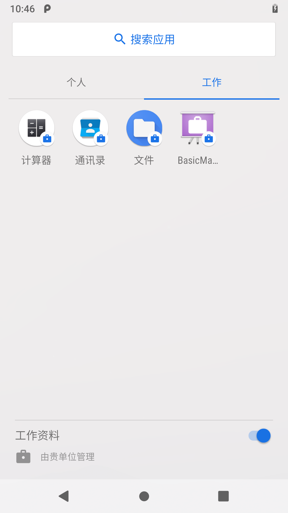

# **ManagerProvisiong实现应用双开**
# 一，概述

Android for Work 是协议企业使用 Android 的方案，包括 Android 的产品功能，Google Play for Work 及其他生产力工具. Android for Work 主要透过 API 发布，可让企业行动管理服务（EMM）供应商和企业应用程式开发商为客户员工提供安全，有效率而多元化的行动环境。 以 Android for Work 为基础所建立的解决方案具有以下优点： 资料安全性：公司资料是独立储存在工作管理化装置上的工作设定档中，在装置层级受保护 IT 人员也可以套用资料外泄防范政策。 应用程式安全性：透过 Google Play for Work 部署工作应用程式 IT 人员可禁止使用者安装不明来源的应用程式和套用应用程式设定。 装置安全性：Android for Work装置具备各项保护机制，包括磁碟加密，萤幕锁定，远端认证服务与硬碟支持金钥库（如果有的话）。
# 二，企业空间方案实现
## 2.1 相关模块说明

google针对企业的解决方案，在Android的packages/apps目录下内置ManagedProvisioning应用，责工作资料空间的创建和配置。同时，提供了demo：BasicManagedProfile，用来演示工作空间的创建。当然，整个过程肯定需要framework的支持，比如：UserManagerService，PackageManagerService，DevicePolicyManagerService。其中DevicePolicyManagerService主要实现对设备的管理。他们三者的关系如图：

当BasicManagedProfile发起的创建企业空间成功后，BasicManagedProfile应用也被设置为Device admin apps，具有如下权限，如图。

除此之外，BasicManagedProfile还可以设置那些应用在企业空间出现。具体的效果如下图，这种其实就是实现的应用双开。

## 2.2 企业用户空间创建流程图

