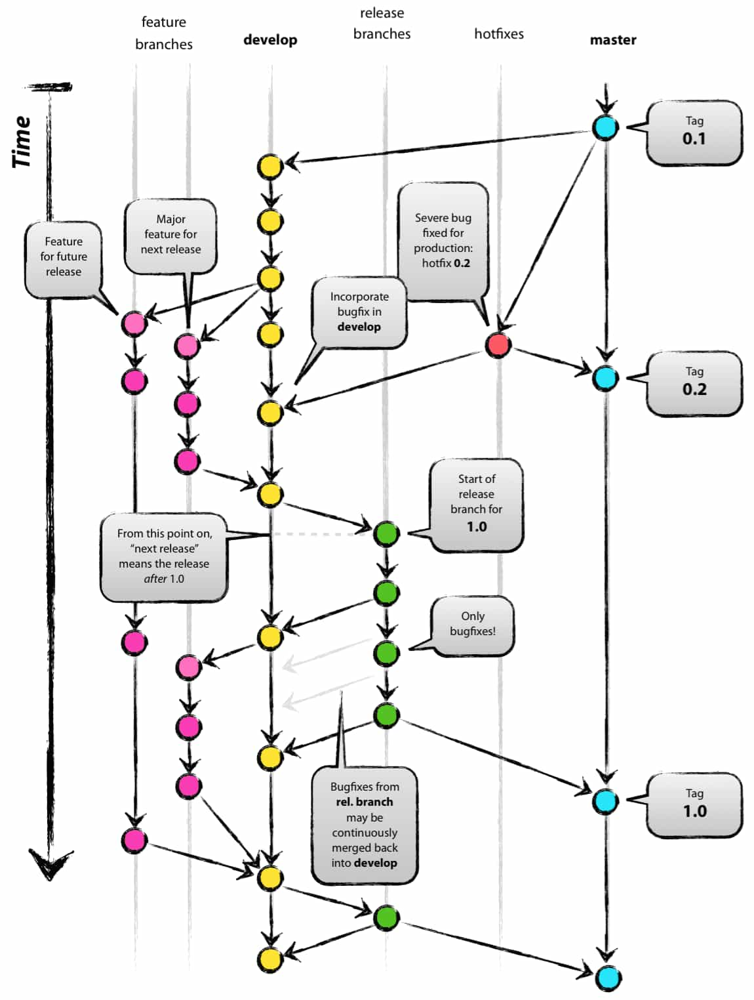
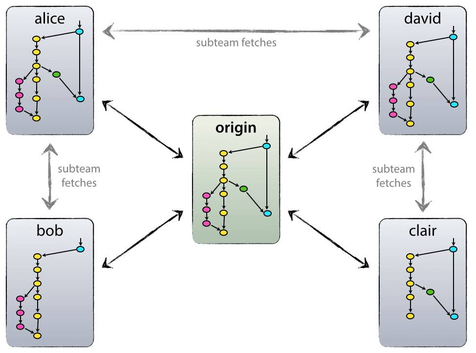
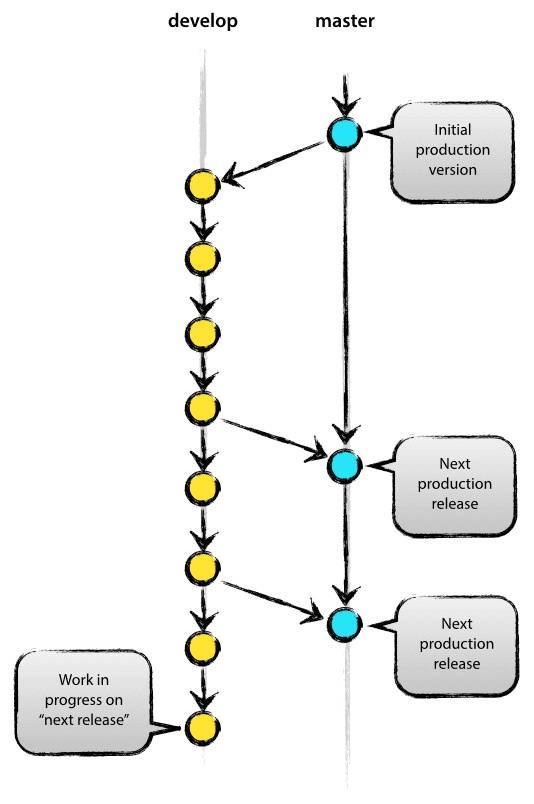
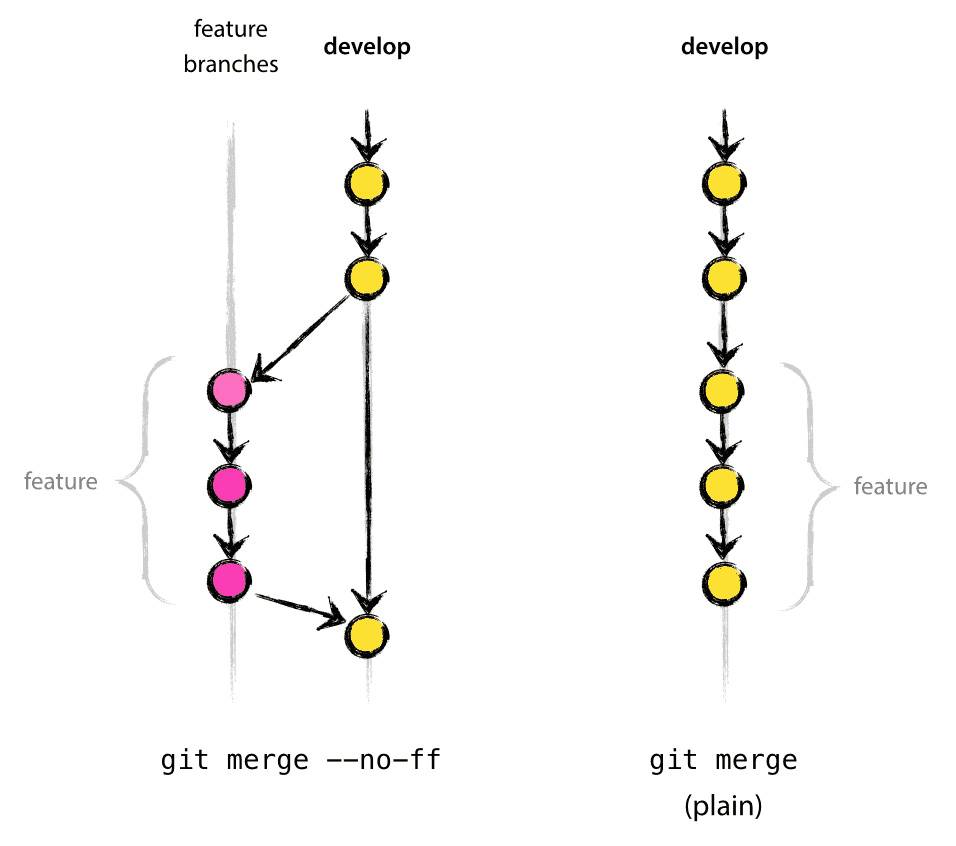
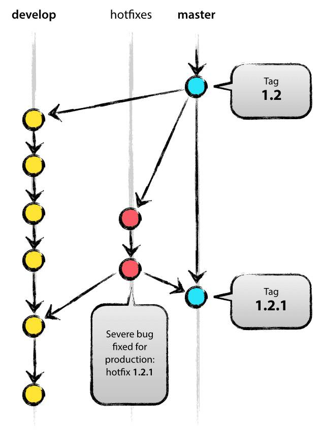

# A successful Git branching model\(译\)

In this post I present the development model that I’ve introduced for some of my projects \(both at work and private\) about a year ago, and which has turned out to be very successful. I’ve been meaning to write about it for a while now, but I’ve never really found the time to do so thoroughly, until now. I won’t talk about any of the projects’ details, merely about the branching strategy and release management.

> 在这篇文章中我介绍了一个大概一年前引入到我的开发项目（工作项目和个人项目）中的事实证明非常成功的开发模型。一直以来我都想写一篇关于它的文章，直到现在才真正有一个充分的时间来写它。我不会谈论任何的项目细节，仅仅是关于分支的策略和分支发布的管理。



It focuses around Git as the tool for the versioning of all of our source code. \(By the way, if you’re interested in Git, our company GitPrime provides some awesome realtime data analytics on software engineering performance.\)

> 这张图集中描述了围绕git做为所有源码的版本控制工具的流程。（同时，如果你对git感兴趣，欢迎使用我们公司GitPrime 提供的软件性能实时分析工具）

## Why git?

> 为什么使用Git？

For a thorough discussion on the pros and cons of Git compared to centralized source code control systems, see the web. There are plenty of flame wars going on there. As a developer, I prefer Git above all other tools around today. Git really changed the way developers think of merging and branching. From the classic CVS/Subversion world I came from, merging/branching has always been considered a bit scary \(“beware of merge conflicts, they bite you!”\) and something you only do every once in a while.

> 关于git和集中式版本控制系统的优缺点的深入探讨，请在网上查看，那里有大量的热火朝天的讨论。作为一个开发者，现在我喜欢git更胜于其他所有版本控制工具。git真正的改变了开发者对于分支合并的思维方式。来自传统 CVS/Subversion 世界的我，其实对于分支合并的操作总是有一种恐惧（害怕合并冲突引起的各种麻烦）。

But with Git, these actions are extremely cheap and simple, and they are considered one of the core parts of your daily workflow, really. For example, in CVS/Subversion books, branching and merging is first discussed in the later chapters \(for advanced users\), while in every Git book, it’s already covered in chapter 3 \(basics\).

> 但是有了git以后，这些被看做我们每天核心工作一部分的操作变的非常的低成本和简单。举个例子，在CVS/Subversion 书中，分支合并技术一般都放在后面的章节（高级用户使用）来讨论，而在git的书中一般都在前3章就会讨论这个问题。

As a consequence of its simplicity and repetitive nature, branching and merging are no longer something to be afraid of. Version control tools are supposed to assist in branching/merging more than anything else.

> 具有复用和简洁的特性的结果就是，分支合并不再是令人害怕的了。而版本控制工具更多的用来帮助做分支和合并的事了。

Enough about the tools, let’s head onto the development model. The model that I’m going to present here is essentially no more than a set of procedures that every team member has to follow in order to come to a managed software development process.

> 关于工具的问题就先说到这，让我们把话题转到开发模型上来。其实我引入的这个模型本质上来说只是每个团队成员需要遵守的用来管理软件开发进度的一系列的操作流程。

## Decentralized but centralized

> 分散但集中

The repository setup that we use and that works well with this branching model, is that with a central “truth” repo. Note that this repo is only considered to be the central one \(since Git is a DVCS, there is no such thing as a central repo at a technical level\). We will refer to this repo as origin, since this name is familiar to all Git users.

> 我们建立的这个仓库，使用的正是这个运行良好的分支模型，是一个集中式的仓库。注意，这个仓库我们认为它是一个集中式的仓库（git 是分布式的，从技术上来说没有集中仓库这一说）。我们把这个仓库称作origin，这个名字对于所有的git使用者来说都很熟悉。



Each developer pulls and pushes to origin. But besides the centralized push-pull relationships, each developer may also pull changes from other peers to form sub teams. For example, this might be useful to work together with two or more developers on a big new feature, before pushing the work in progress to origin prematurely. In the figure above, there are subteams of Alice and Bob, Alice and David, and Clair and David.

> 每一个开发人员都从origin进行pull和push操作。但是除了集中式的pull和push操作以外，每个开发者也需要从其他子团队的节点pull到差异化的代码。比如，对于可能有2个或者更多的开发者共同开发一个大的功能，在贸然把代码push到origin来同步工作进度前的这种情况下这么做是有用的。在上图中，Alice 和Bob在一个子团队中，Alice和David在一个子团队中，Clair和David在一个子团队中。

Technically, this means nothing more than that Alice has defined a Git remote, named bob, pointing to Bob’s repository, and vice versa.

> 从技术上说，这意味着，只不过相当于Alice 定义了一个git的远程仓储叫Bob，并指向它，反之亦然。

## The main branches

> 主分支

At the core, the development model is greatly inspired by existing models out there. The central repo holds two main branches with an infinite lifetime: master develop The master branch at origin should be familiar to every Git user. Parallel to the master branch, another branch exists called develop.

> 其实，这个开发模型很大程度上是受到现有模型的启发。集中式仓库持有2个主要的长生命周期的分支： master develop origin上的master分支对于每个git开发者来说都很熟悉。平行于master的另一分支是develop。



We consider origin/master to be the main branch where the source code of HEAD always reflects a production-ready state.

> 我们把代码HEAD指向的origin/master作为反映产品就绪状态的主要分支。

We consider origin/develop to be the main branch where the source code of HEAD always reflects a state with the latest delivered development changes for the next release. Some would call this the “integration branch”. This is where any automatic nightly builds are built from.

> 我们把代码HEAD指向的origin/develop作为准备为下次发版反映了最新提交的开发进度的主要分支。有些人又管他叫”集成分支“。这也是自动夜间构建的分支。

When the source code in the develop branch reaches a stable point and is ready to be released, all of the changes should be merged back into master somehow and then tagged with a release number. How this is done in detail will be discussed further on.

> 当develop分支的代码到了一个稳定的节点准备发版的时候，所有的差异都应该被合并回master，加上tag标签和release号。具体的细节稍后再做讨论。

Therefore, each time when changes are merged back into master, this is a new production release by definition. We tend to be very strict at this, so that theoretically, we could use a Git hook script to automatically build and roll-out our software to our production servers everytime there was a commit on master.

> 因此，每次差异合并回master分支的时候，显然会定义一个新的产品发布分支。我们常常严格遵守这种操作，所以理论上，每次有master的提交我们应该用一个git hook 脚本来自动构建并迁出一个软件产品到我们的产品服务器。

## Supporting branches

> 支持分支

Next to the main branches master and develop, our development model uses a variety of supporting branches to aid parallel development between team members, ease tracking of features, prepare for production releases and to assist in quickly fixing live production problems. Unlike the main branches, these branches always have a limited life time, since they will be removed eventually.

> 紧跟着master和develop的主分支，我们的开发模型使用了多样化的支持分支来帮助团队成员间来平行化的开发和跟踪新开发的功能以及产品的发布和快速修改线上产品的bug。和主分支不一样的是，这些分支的生命周期是有限的，因此他们最终会被删掉。

The different types of branches we may use are:

> 我们可能用到的不同类型的分支如下：

Feature branches Release branches Hotfix branches

Each of these branches have a specific purpose and are bound to strict rules as to which branches may be their originating branch and which branches must be their merge targets. We will walk through them in a minute.

> 这些特性分支，每一个分支都有特定的目的和严格的操作规则，从哪个分支checkout，合并到哪个分支，都有限制，我们一会儿会走一遍整个流程。

By no means are these branches “special” from a technical perspective. The branch types are categorized by how we use them. They are of course plain old Git branches.

> 但是从技术角度来看这些特殊分支不意味着“特殊”。分支的类型取决于我们怎么定义和使用它。他们当然也和旧的分支一样。

### Feature branches

> 特性分支

May branch off from: develop Must merge back into: develop Branch naming convention: anything except master, develop, release-\*, or hotfix-\*

```text
从哪里branch出: develop
必须合并回哪里: develop
分支命名公约:
除了 master, develop, release-*, or hotfix-* 任意名字都可
```


Feature branches \(or sometimes called topic branches\) are used to develop new features for the upcoming or a distant future release. When starting development of a feature, the target release in which this feature will be incorporated may well be unknown at that point. The essence of a feature branch is that it exists as long as the feature is in development, but will eventually be merged back into develop \(to definitely add the new feature to the upcoming release\) or discarded \(in case of a disappointing experiment\). Feature branches typically exist in developer repos only, not in origin.

> 特性分支（又叫主题分支）用来为即将或一阵子之后的产品发布来开发新特性。当开了一个特性分支的时候，未来要发的版是否将合并这个特性是不知道的。本质上来说只要特性还在开发，特性分支就会一直存在，最终合并回develop分支\(确定的添加新特性到即将到来的发版\)或者丢弃（在不太理想的尝试的情况下）。 特性分支通常只存在于开发者的仓库中，不在origin里。

#### Creating a feature branch

> 建立特性分支

When starting work on a new feature, branch off from the develop branch.

```text
$ git checkout -b myfeature develop
Switched to a new branch "myfeature"
```

#### Incorporating a finished feature on develop

> 合并回完成的特性分支到develop分支

Finished features may be merged into the develop branch to definitely add them to the upcoming release:

> 如果确定要把特性加到新的发版中去，完成的特性分支要合并到develop分支

```text
$ git checkout develop
Switched to branch 'develop'
$ git merge --no-ff myfeature
Updating ea1b82a..05e9557
(Summary of changes)
$ git branch -d myfeature
Deleted branch myfeature (was 05e9557).
$ git push origin develop
```

The --no-ff flag causes the merge to always create a new commit object, even if the merge could be performed with a fast-forward. This avoids losing information about the historical existence of a feature branch and groups together all commits that together added the feature. Compare:

> --no-ff 将会创建新的提交点，即使是一个快进的提交。这会避免丢失特性分支的所有提交的历史信息，对比如下：



In the latter case, it is impossible to see from the Git history which of the commit objects together have implemented a feature—you would have to manually read all the log messages. Reverting a whole feature \(i.e. a group of commits\), is a true headache in the latter situation, whereas it is easily done if the --no-ff flag was used. Yes, it will create a few more \(empty\) commit objects, but the gain is much bigger than the cost.

> 后一种情况，不能看出提交对象实现特性git历史记录 -- 你得手动的读所有的log信息。后一种情况中回滚整个的特性，确实是挺头疼的，而使用了--no-ff 参数后，一切就变的简单了。 是的，这将会多创建出一些提交对象，但是得到的方便却远大于成本。

### Release branches

> 发布分支

May branch off from: develop Must merge back into: develop and master Branch naming convention: release-\*

```text
从哪个分支检出: develop
必须合并回哪个分支: develop and master
分支命名公约:
release-*
```

Release branches support preparation of a new production release. They allow for last-minute dotting of i’s and crossing t’s. Furthermore, they allow for minor bug fixes and preparing meta-data for a release \(version number, build dates, etc.\). By doing all of this work on a release branch, the develop branch is cleared to receive features for the next big release.

> release分支为了支持新版本的发布。这个分支允许为发版而进行的小bug修改和准备元数据（version number，build dates，等等）。在release分支做完这些工作之后，会使develop分支下一次大的发版接受其他新特性显得更清晰。

The key moment to branch off a new release branch from develop is when develop \(almost\) reflects the desired state of the new release. At least all features that are targeted for the release-to-be-built must be merged in to develop at this point in time. All features targeted at future releases may not—they must wait until after the release branch is branched off.

> 建立release分支的时机在于 develop分支到了我们期待的要发布的节点的时候。至少是所有的准备发版的特性功能都合并到了develop的时候。所有未来计划要发版的目标特性必须等到release分支建立之后再合并到develop分支。

It is exactly at the start of a release branch that the upcoming release gets assigned a version number—not any earlier. Up until that moment, the develop branch reflected changes for the “next release”, but it is unclear whether that “next release” will eventually become 0.3 or 1.0, until the release branch is started. That decision is made on the start of the release branch and is carried out by the project’s rules on version number bumping.

> 即将发版的release分支的开始点必须签上版本号，这个是确定的。develop分支反应的是下一次发版的变化，但是不明确最后会变成0.3还是1.0，直到release分支开始的那个点，才明确下来。在release分支创建并且在执行项目规则打上version号的时候才真正确定下来。

#### Creating a release branch

> 创建发版分支

Release branches are created from the develop branch. For example, say version 1.1.5 is the current production release and we have a big release coming up. The state of develop is ready for the “next release” and we have decided that this will become version 1.2 \(rather than 1.1.6 or 2.0\). So we branch off and give the release branch a name reflecting the new version number:

```text
$ git checkout -b release-1.2 develop
Switched to a new branch "release-1.2"
$ ./bump-version.sh 1.2
Files modified successfully, version bumped to 1.2.
$ git commit -a -m "Bumped version number to 1.2"
[release-1.2 74d9424] Bumped version number to 1.2
1 files changed, 1 insertions(+), 1 deletions(-)
```

> 发布分支创建自develop分支。例如，1.1.5版本是当前的版本号，我们接下来要发一个新的大版。develop分支准备好了下一个发版，我们确定下来这次发版是1.2（比1.1.6或者2.0都大）。所以我们新建一个发版分支，起名对应新的版本号：

After creating a new branch and switching to it, we bump the version number. Here, bump-version.sh is a fictional shell script that changes some files in the working copy to reflect the new version. \(This can of course be a manual change—the point being that some files change.\) Then, the bumped version number is committed.

> 创建并切换到他后，我们打上版本号。这里，bump-version.sh 是一个虚拟的用来修改文件并copyversion对应副本的shell脚本。（这里当然也可以是手动的修改）然后，打的版本号就提交了。

This new branch may exist there for a while, until the release may be rolled out definitely. During that time, bug fixes may be applied in this branch \(rather than on the develop branch\). Adding large new features here is strictly prohibited. They must be merged into develop, and therefore, wait for the next big release.

> 这个新版本可能会存在一段时间，直到release发版结束。在这段时间内，可以在这个分支上而不是develop分支上修改bug。加入新的特性功能在这个分支上是严格禁止的。release分支合并到develop分支上，然后可以等待下次大的版本发布。

#### Finishing a release branch

> 结束版本发布分支

When the state of the release branch is ready to become a real release, some actions need to be carried out. First, the release branch is merged into master \(since every commit on master is a new release by definition, remember\). Next, that commit on master must be tagged for easy future reference to this historical version. Finally, the changes made on the release branch need to be merged back into develop, so that future releases also contain these bug fixes. The first two steps in Git:

> 当发布分支真的可以发布的时候，需要做一些操作。首先，release分支合并到master（每次提交到master上的节点都是一个明确的版本发布）。然后，master的提交必须打上这个历史版本号对应的tag。最后，release分支上的修改要合并回develop分支，不然以后的发版可能包含着未修改的bug。 开始2步的操作：

```text
$ git checkout master
Switched to branch 'master'
$ git merge --no-ff release-1.2
Merge made by recursive.
(Summary of changes)
$ git tag -a 1.2
```

The release is now done, and tagged for future reference.

> release 分支完成了，并且打好了tag到master上

Edit: You might as well want to use the -s or -u  flags to sign your tag cryptographically.

> 注：你也可以使用-s 或 -u  参数来给你的tag加密

To keep the changes made in the release branch, we need to merge those back into develop, though. In Git:

```text
$ git checkout develop
Switched to branch 'develop'
$ git merge --no-ff release-1.2
Merge made by recursive.
(Summary of changes)
```

> 为了保证release分支的改变和develop同步，我们需要合并回develop分支

This step may well lead to a merge conflict \(probably even, since we have changed the version number\). If so, fix it and commit. Now we are really done and the release branch may be removed, since we don’t need it anymore:

```text
$ git branch -d release-1.2
Deleted branch release-1.2 (was ff452fe).
```

> 这一步有可能会导致合并冲突（有可能是，是我们改了版本号之后的冲突）。如果是这样，解决好冲突然后提交。现在我们搞定了release分支，release分支可以删除了。

### Hotfix branches

> 紧急bug修复分支



May branch off from: master Must merge back into: develop and master Branch naming convention: hotfix-\*

```text
从哪创建分支: master
最终合并到哪个分支: develop ,master
分支命名公约:
hotfix-*
```

Hotfix branches are very much like release branches in that they are also meant to prepare for a new production release, albeit unplanned. They arise from the necessity to act immediately upon an undesired state of a live production version. When a critical bug in a production version must be resolved immediately, a hotfix branch may be branched off from the corresponding tag on the master branch that marks the production version. The essence is that work of team members \(on the develop branch\) can continue, while another person is preparing a quick production fix.

> hotfix分支和release分支很像，他们都是为了准备新版本的发布，虽然是以外的。这个分支根据线上产品产生的突然的异常的需要而创建。当线上版本产生了一个危险的bug，必须马上解决的时候，就需要从master相对应的产品版本号对应的tag点创建一个hotfix分支了。 事实上，团队的一些成员在develop分支上继续工作，而其他成员则准备快速修复bug了。

#### Creating the hotfix branch

> 创建紧急bug修复分支

Hotfix branches are created from the master branch. For example, say version 1.2 is the current production release running live and causing troubles due to a severe bug. But changes on develop are yet unstable. We may then branch off a hotfix branch and start fixing the problem:

```text
$ git checkout -b hotfix-1.2.1 master
Switched to a new branch "hotfix-1.2.1"
$ ./bump-version.sh 1.2.1
Files modified successfully, version bumped to 1.2.1.
$ git commit -a -m "Bumped version number to 1.2.1"
[hotfix-1.2.1 41e61bb] Bumped version number to 1.2.1
1 files changed, 1 insertions(+), 1 deletions(-)
```

> 紧急bug修复分支从master分支创建。例如，1.2版本是当前线上的发布产品，由于服务器的bug这个版本出现了一些问题。但是develop分支还处于不稳定状态。所以我们需要开一个hotfix分支来修改这个问题。

Don’t forget to bump the version number after branching off! Then, fix the bug and commit the fix in one or more separate commits.

```text
$ git commit -m "Fixed severe production problem"
[hotfix-1.2.1 abbe5d6] Fixed severe production problem
5 files changed, 32 insertions(+), 17 deletions(-)
```

> 在创建分支之后，不要忘了打上新的版本号！ 然后，修改好bug，提交。

#### Finishing a hotfix branch

> 完成紧急bug修复分支

When finished, the bugfix needs to be merged back into master, but also needs to be merged back into develop, in order to safeguard that the bugfix is included in the next release as well. This is completely similar to how release branches are finished.

> 完成紧急bug修复后，为了保证修复的bug也在以后的发版中，需要合并到master分支和develop分支。这和release分支完成后的操作一样。

First, update master and tag the release.

> 首先，合并到master并打上tag

```text
$ git checkout master
Switched to branch 'master'
$ git merge --no-ff hotfix-1.2.1
Merge made by recursive.
(Summary of changes)
$ git tag -a 1.2.1
```

Edit: You might as well want to use the -s or -u  flags to sign your tag cryptographically.

> 注：如果需要加密的话可以使用 -s 或 -u  参数

Next, include the bugfix in develop, too:

> 其次，合并到develop分支

```text
$ git checkout develop
Switched to branch 'develop'
$ git merge --no-ff hotfix-1.2.1
Merge made by recursive.
(Summary of changes)
```

The one exception to the rule here is that, when a release branch currently exists, the hotfix changes need to be merged into that release branch, instead of develop. Back-merging the bugfix into the release branch will eventually result in the bugfix being merged into develop too, when the release branch is finished. \(If work in develop immediately requires this bugfix and cannot wait for the release branch to be finished, you may safely merge the bugfix into develop now already as well.\)

> 对于开发模型的规则的规则有异议的点是， 当release分支已经存在，hotfix分支需要合并到release分支，而不是develop。其实合并了修复的bug到release分支，当release分支结束后最终也会合并到develop分支。（如果develop分支等不到release分支完成就急需这个修复的bug，那么可以把hotfix分支合并到develop分支）

Finally, remove the temporary branch:

> 最后，删除掉hotfix这个临时分支

```text
$ git branch -d hotfix-1.2.1
Deleted branch hotfix-1.2.1 (was abbe5d6).
```

## Summary

> 总结

While there is nothing really shocking new to this branching model, the “big picture” figure that this post began with has turned out to be tremendously useful in our projects. It forms an elegant mental model that is easy to comprehend and allows team members to develop a shared understanding of the branching and releasing processes.

> 其实这个分支管理模型没有什么令人震惊的新东西，文章开始的大图在我们的项目开发中非常的实用。它定义了一个优雅的思维模型。这个模型其实是一个使团队成员间协作和共享变的更好的分支发布的流程。

[_英文原文_](http://nvie.com/posts/a-successful-git-branching-model/)

