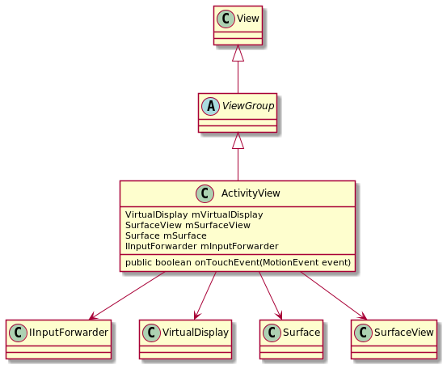

# **Android ActivityView实现逻辑梳理**
ActivityView是android的一个隐藏组件，支持在View中显示其他activity的内容。这和android 3.0UI主框架的设计需求极吻合，我们有必要将此处的逻辑深入梳理一下，
既可以做为3.0UI主框架的备份优化方案，同也可以扩展我们对跨进程GUI融合绘制的技术思路。

uml类图如下：

# 一. 绘制相关的逻辑
我们知道所有的View都是绘制到Surface上的，一个Activity对应WMS的一个Window即一个Surface，ActivityView是如何做到跨进程将View绘制到另一个进程的Surface上的呢
## 1.创建SurfaceView，并将SurfaceView添加成ActivityView的子View
```
public ActivityView(Context context, AttributeSet attrs, int defStyle) {
    super(context, attrs, defStyle);
 
    mActivityManager = ActivityManager.getService();
    mSurfaceView = new SurfaceView(context);
    mSurfaceCallback = new SurfaceCallback();
    mSurfaceView.getHolder().addCallback(mSurfaceCallback);
    addView(mSurfaceView); // 添加SurfaceView作为子View
 
    mOpened = true;
    mGuard.open("release");
}
```
## 2.创建虚拟屏幕，并将SurfaceView的Surface做为虚拟屏幕内容的载体
```
private void initVirtualDisplay() {
    if (mVirtualDisplay != null) {
        throw new IllegalStateException("Trying to initialize for the second time.");
    }
 
    final int width = mSurfaceView.getWidth();
    final int height = mSurfaceView.getHeight();
    final DisplayManager displayManager = mContext.getSystemService(DisplayManager.class);
 
    // 创建虚拟屏幕
    mVirtualDisplay = displayManager.createVirtualDisplay(
            DISPLAY_NAME + "@" + System.identityHashCode(this),
            width, height, getBaseDisplayDensity(), mSurface,
            DisplayManager.VIRTUAL_DISPLAY_FLAG_PUBLIC
                    | DisplayManager.VIRTUAL_DISPLAY_FLAG_OWN_CONTENT_ONLY);
    if (mVirtualDisplay == null) {
        Log.e(TAG, "Failed to initialize ActivityView");
        return;
    }
 
    final int displayId = mVirtualDisplay.getDisplay().getDisplayId();
    final IWindowManager wm = WindowManagerGlobal.getWindowManagerService();
    try {
        wm.dontOverrideDisplayInfo(displayId);
    } catch (RemoteException e) {
        e.rethrowAsRuntimeException();
    }
    mInputForwarder = InputManager.getInstance().createInputForwarder(displayId);
    mTaskStackListener = new TaskStackListenerImpl();
    try {
        mActivityManager.registerTaskStackListener(mTaskStackListener);
    } catch (RemoteException e) {
        Log.e(TAG, "Failed to register task stack listener", e);
    }
```

## 3. 更新TapExcludeRegion
在initVirtualDisplay之后做了更新WMS 的TapExcludeRegion，由此可见activityView也是支持多窗口的。
```
private void updateLocation() {
    try {
        getLocationOnScreen(mLocationOnScreen);
        WindowManagerGlobal.getWindowSession().updateTapExcludeRegion(getWindow(), hashCode(),
                mLocationOnScreen[0], mLocationOnScreen[1], getWidth(), getHeight());
    } catch (RemoteException e) {
        e.rethrowAsRuntimeException();
    }
}
```

## 4. 虚拟屏幕及Surface的释放
可在view被移除或activity destory时主动调用
```
private void performRelease() {
    if (!mOpened) {
        return;
    }
 
    mSurfaceView.getHolder().removeCallback(mSurfaceCallback);
 
    if (mInputForwarder != null) {
        mInputForwarder = null;
    }
    cleanTapExcludeRegion();
 
    if (mTaskStackListener != null) {
        try {
            mActivityManager.unregisterTaskStackListener(mTaskStackListener);
        } catch (RemoteException e) {
            Log.e(TAG, "Failed to unregister task stack listener", e);
        }
        mTaskStackListener = null;
    }
 
    final boolean displayReleased;
    if (mVirtualDisplay != null) {
        mVirtualDisplay.release();
        mVirtualDisplay = null;
        displayReleased = true;
    } else {
        displayReleased = false;
    }
 
    if (mSurface != null) {
        mSurface.release();
        mSurface = null;
    }
 
    if (displayReleased && mActivityViewCallback != null) {
        mActivityViewCallback.onActivityViewDestroyed(this);
    }
 
    mGuard.close();
    mOpened = false;
}
```

# 二.事件传递相关逻辑
ActivityView使用InputForwarder进行输入事件转发
## 1.初始化InputForwarder
```
private void initVirtualDisplay() {
    ...
    mInputForwarder = InputManager.getInstance().createInputForwarder(displayId);
    ...
}
```
## 2.事件处理
```
@Override
public boolean onTouchEvent(MotionEvent event) {
    return injectInputEvent(event) || super.onTouchEvent(event);
}
```
## 3.转发input event给IMS
```
private boolean injectInputEvent(InputEvent event) {
    if (mInputForwarder != null) {
        try {
            return mInputForwarder.forwardEvent(event);
        } catch (RemoteException e) {
            e.rethrowAsRuntimeException();
        }
    }
    return false;
}
```
# 三.调试

可以使用如下命令查看虚拟屏相关信息
```
adb shell dumpsys display

Logical Displays: size=4
  ...
  Display 2:
    mDisplayId=2
    mLayerStack=2
    mHasContent=true
    mRequestedMode=0
    mRequestedColorMode=0
    mDisplayOffset=(0, 0)
    mPrimaryDisplayDevice=ActivityViewVirtualDisplay@63131093
    mBaseDisplayInfo=DisplayInfo{"ActivityViewVirtualDisplay@63131093", uniqueId "virtual:com.xx.xx30unittest,10138,ActivityViewVirtualDisplay@63131093,0", app 700 x 500, real 700 x 500, largest app 700 x 500, smallest app 700 x 500, mode 3, defaultMode 3, modes [{id=3, width=700, height=500, fps=60.0}], colorMode 0, supportedColorModes [0], hdrCapabilities null, rotation 0, density 160 (160.0 x 160.0) dpi, layerStack 2, appVsyncOff 0, presDeadline 16666666, type VIRTUAL, state ON, owner com.xx.xx30unittest (uid 10138), removeMode 0}
    mOverrideDisplayInfo=null
  Display 3:
    mDisplayId=3
    mLayerStack=3
    mHasContent=true
    mRequestedMode=0
    mRequestedColorMode=0
    mDisplayOffset=(0, 0)
    mPrimaryDisplayDevice=ActivityViewVirtualDisplay@239311736
    mBaseDisplayInfo=DisplayInfo{"ActivityViewVirtualDisplay@239311736", uniqueId "virtual:com.xx.xx30unittest,10138,ActivityViewVirtualDisplay@239311736,0", app 700 x 500, real 700 x 500, largest app 700 x 500, smallest app 700 x 500, mode 5, defaultMode 5, modes [{id=5, width=700, height=500, fps=60.0}], colorMode 0, supportedColorModes [0], hdrCapabilities null, rotation 0, density 160 (160.0 x 160.0) dpi, layerStack 3, appVsyncOff 0, presDeadline 16666666, type VIRTUAL, state ON, owner com.xx.xx30unittest (uid 10138), removeMode 0}
    mOverrideDisplayInfo=null
```    