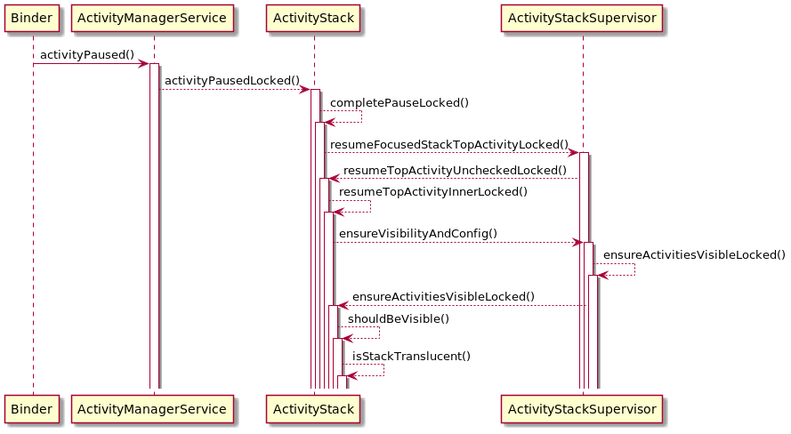

# **AMS中stack的可见性**
在设置了透明主题的情况下，AMS中stack的可见性对activity的生命周期有很大的影响，而生命周期问题又会进一步影响程序的执行效率，所以我们有必要对stack的可见性逻辑进行梳理总结，

类图如下：


# 一.stack可见：
1.当前stack是焦点stack

2.stack上面的stack都是半透明的
# 二.stack不可见：
1.stack未添加到display中

2.stack被强制隐藏了

3.stack无top activity

4.其它分屏情况

stack的可见性逻辑在frameworks/base/services/core/java/com/android/server/am/ActivityStack.java
```
/**
 * Returns true if the stack should be visible.
 *
 * @param starting The currently starting activity or null if there is none.
 */
boolean shouldBeVisible(ActivityRecord starting) {
 
    // 1.未添加到display中，或强制隐藏
    if (!isAttached() || mForceHidden) {
        return false;
    }
 
    // 2.是焦点stack
    if (mStackSupervisor.isFocusedStack(this)) {
        return true;
    }
 
    // 3. 无top activity
    final ActivityRecord top = topRunningActivityLocked();
    if (top == null && isInStackLocked(starting) == null && !isTopStackOnDisplay()) {
        // Shouldn't be visible if you don't have any running activities, not starting one, and
        // not the top stack on display.
        return false;
    }
 
    final ActivityDisplay display = getDisplay();
    boolean gotSplitScreenStack = false;
    boolean gotOpaqueSplitScreenPrimary = false;
    boolean gotOpaqueSplitScreenSecondary = false;
    final int windowingMode = getWindowingMode();
    final boolean isAssistantType = isActivityTypeAssistant();
    for (int i = display.getChildCount() - 1; i >= 0; --i) {
        final ActivityStack other = display.getChildAt(i);
        if (other == this) {
            // Should be visible if there is no other stack occluding it.
            return true;
        }
 
        final int otherWindowingMode = other.getWindowingMode();
 
        if (otherWindowingMode == WINDOWING_MODE_FULLSCREEN) {
            // In this case the home stack isn't resizeable even though we are in split-screen
            // mode. We still want the primary splitscreen stack to be visible as there will be
            // a slight hint of it in the status bar area above the non-resizeable home
            // activity. In addition, if the fullscreen assistant is over primary splitscreen
            // stack, the stack should still be visible in the background as long as the recents
            // animation is running.
            final int activityType = other.getActivityType();
            if (windowingMode == WINDOWING_MODE_SPLIT_SCREEN_PRIMARY) {
                if (activityType == ACTIVITY_TYPE_HOME
                        || (activityType == ACTIVITY_TYPE_ASSISTANT
                                && mWindowManager.getRecentsAnimationController() != null)) {
                   return true;
                }
            }
            // 4.盖在当前stack上面的stack是全屏模式，并且是半透明的
            if (other.isStackTranslucent(starting)) {
                // Can be visible behind a translucent fullscreen stack.
                continue;
            }
            return false;
        }
        ...
    }
 
    // Well, nothing is stopping you from being visible...
    return true;
}
```

# 三. stack是否半透明
stack是否半透明通过遍历stack中的activityRecord的状态来判断

1.activityRecord fullscreen = false

2.activityRecord hasWallpaper = false
```
boolean isStackTranslucent(ActivityRecord starting) {
    if (!isAttached() || mForceHidden) {
        return true;
    }
    for (int taskNdx = mTaskHistory.size() - 1; taskNdx >= 0; --taskNdx) {
        final TaskRecord task = mTaskHistory.get(taskNdx);
        final ArrayList<ActivityRecord> activities = task.mActivities;
        for (int activityNdx = activities.size() - 1; activityNdx >= 0; --activityNdx) {
            final ActivityRecord r = activities.get(activityNdx);
 
            if (r.finishing) {
                // We don't factor in finishing activities when determining translucency since
                // they will be gone soon.
                continue;
            }
 
            if (!r.visibleIgnoringKeyguard && r != starting) {
                // Also ignore invisible activities that are not the currently starting
                // activity (about to be visible).
                continue;
            }
            // 不透明
            if (r.fullscreen || r.hasWallpaper) {
                // Stack isn't translucent if it has at least one fullscreen activity
                // that is visible.
                return false;
            }
        }
    }
    return true;
}
```
# 四.Activityrecord 是否透明的判断逻辑 fullscreen
主要逻辑在frameworks/base/core/java/android/content/pm/ActivityInfo.java

1.window style是否配置windowIsTranslucent = true

2.window style 是否配置windowSwipeToDismiss = true

3.window style 是否配置windowIsFloating = true
```
public static boolean isTranslucentOrFloating(TypedArray attributes) {
    final boolean isTranslucent =
            attributes.getBoolean(com.android.internal.R.styleable.Window_windowIsTranslucent,
                    false);
    final boolean isSwipeToDismiss = !attributes.hasValue(
            com.android.internal.R.styleable.Window_windowIsTranslucent)
            && attributes.getBoolean(
                    com.android.internal.R.styleable.Window_windowSwipeToDismiss, false);
    final boolean isFloating =
            attributes.getBoolean(com.android.internal.R.styleable.Window_windowIsFloating,
                    false);
 
    return isFloating || isTranslucent || isSwipeToDismiss;
}
```

# 五.ActivityRecord是否有壁纸hasWallpaper
window style是否配置windowShowWallpaper = true

# 六.调试
```
adb shell am stack list
```
通过visible字段判断stack是否可见
```
 
Stack id=9 bounds=[0,0][1920,720] displayId=0 userId=0
 configuration={1.0 ?mcc?mnc1theme [zh_CN] ldltr sw720dp w1920dp h720dp 160dpi xlrg long land car night finger -keyb/v/h -nav/h winConfig={ mBounds=Rect(0, 0 - 1920, 720) mAppBounds=Rect(0, 0 - 1920, 720) mWindowingMode=fullscreen mActivityType=standard} s.4}
  taskId=74: com.autopai.system.settings/com.autopai.system.settings.IndexActivity bounds=[0,0][1920,720] userId=0 visible=false topActivity=ComponentInfo{com.autopai.system.settings/com.autopai.system.settings.IndexActivity}
 
Stack id=10 bounds=[0,0][1920,720] displayId=0 userId=0
 configuration={1.0 ?mcc?mnc1theme [zh_CN] ldltr sw720dp w1920dp h720dp 160dpi xlrg long land car night finger -keyb/v/h -nav/h winConfig={ mBounds=Rect(0, 0 - 1920, 720) mAppBounds=Rect(0, 0 - 1920, 720) mWindowingMode=freeform mActivityType=standard} s.4}
  taskId=75: com.wt.multimedia.platform3/com.wt.multimedia.platform3.audio.view.AudioPlayerWidgetActivity bounds=[40,100][632,620] userId=0 visible=false topActivity=ComponentInfo{com.wt.multimedia.platform3/com.wt.multimedia.platform3.audio.view.AudioPlayerWidgetActivity}
 
Stack id=7 bounds=[0,0][1920,720] displayId=0 userId=0
 configuration={1.0 ?mcc?mnc1theme [zh_CN] ldltr sw720dp w1920dp h720dp 160dpi xlrg long land car night finger -keyb/v/h -nav/h winConfig={ mBounds=Rect(0, 0 - 1920, 720) mAppBounds=Rect(0, 0 - 1920, 720) mWindowingMode=fullscreen mActivityType=standard} s.4}
  taskId=72: com.wt.multimedia.platform3/com.wt.multimedia.platform3.search.view.SearchActivity bounds=[0,0][1920,720] userId=0 visible=false topActivity=ComponentInfo{com.wt.multimedia.platform3/com.wt.multimedia.platform3.search.view.SearchActivity}
 
Stack id=14 bounds=[0,0][1920,720] displayId=0 userId=0
 configuration={1.0 ?mcc?mnc1theme [zh_CN] ldltr sw720dp w1920dp h720dp 160dpi xlrg long land car night finger -keyb/v/h -nav/h winConfig={ mBounds=Rect(0, 0 - 1920, 720) mAppBounds=Rect(0, 0 - 1920, 720) mWindowingMode=fullscreen mActivityType=standard} s.4}
  taskId=79: com.wt.launcher3/com.wt.launcher3.AppWidgetListActivity bounds=[0,0][1920,720] userId=0 visible=false topActivity=ComponentInfo{com.wt.launcher3/com.wt.launcher3.AppWidgetListActivity}
```