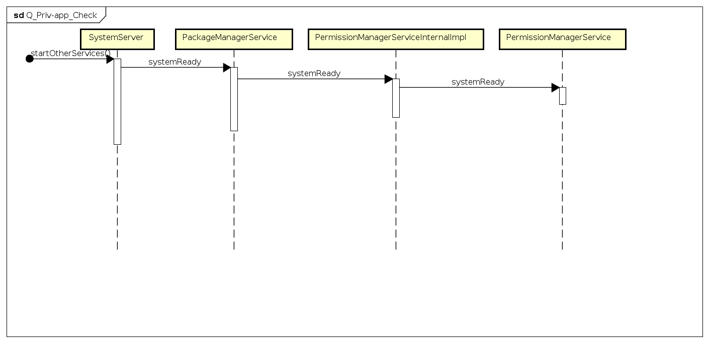
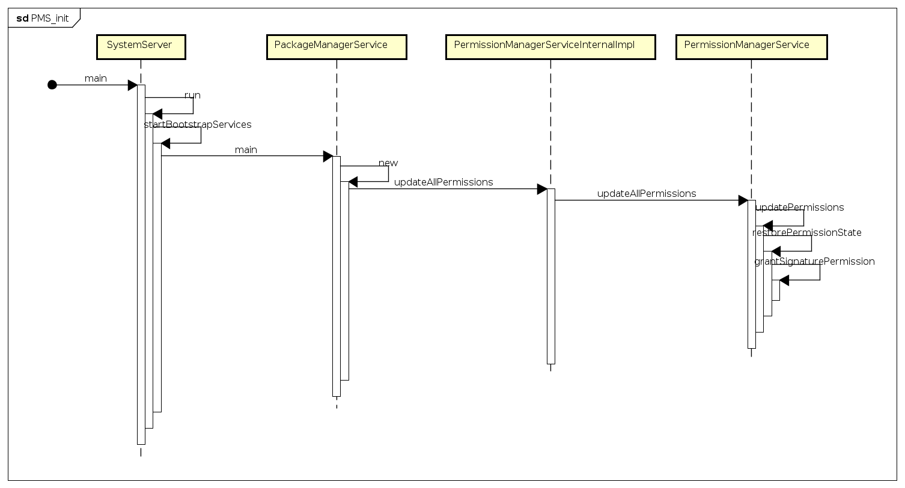

# **Android Q Priv-App 权限检查**
# 问题背景

最近在移植android Q的时候，发现导入xx应用之后，出现无法开机的情况，报错原因是由于priv-app 权限不在白名单中导致的系统进程崩溃。报错log如下：
```
05-28 10:48:41.958  2640  2640 D AndroidRuntime: Shutting down VM
05-28 10:48:41.958  2640  2640 E AndroidRuntime: *** FATAL EXCEPTION IN SYSTEM PROCESS: main
05-28 10:48:41.958  2640  2640 E AndroidRuntime: java.lang.IllegalStateException: Signature|privileged permissions not in privapp-permissions whitelist: {com.wt.media: android.permission.MODIFY_AUDIO_ROUTING}
05-28 10:48:41.958  2640  2640 E AndroidRuntime:        at com.android.server.pm.permission.PermissionManagerService.systemReady(PermissionManagerService.java:2946)
05-28 10:48:41.958  2640  2640 E AndroidRuntime:        at com.android.server.pm.permission.PermissionManagerService.access$100(PermissionManagerService.java:123)
05-28 10:48:41.958  2640  2640 E AndroidRuntime:        at com.android.server.pm.permission.PermissionManagerService$PermissionManagerServiceInternalImpl.systemReady(PermissionManagerService.java:3007)
05-28 10:48:41.958  2640  2640 E AndroidRuntime:        at com.android.server.pm.PackageManagerService.systemReady(PackageManagerService.java:21945)
05-28 10:48:41.958  2640  2640 E AndroidRuntime:        at com.android.server.SystemServer.startOtherServices(SystemServer.java:2019)
05-28 10:48:41.958  2640  2640 E AndroidRuntime:        at com.android.server.SystemServer.run(SystemServer.java:524)
05-28 10:48:41.958  2640  2640 E AndroidRuntime:        at com.android.server.SystemServer.main(SystemServer.java:354)
05-28 10:48:41.958  2640  2640 E AndroidRuntime:        at java.lang.reflect.Method.invoke(Native Method)
05-28 10:48:41.958  2640  2640 E AndroidRuntime:        at com.android.internal.os.RuntimeInit$MethodAndArgsCaller.run(RuntimeInit.java:492)
05-28 10:48:41.958  2640  2640 E AndroidRuntime:        at com.android.internal.os.ZygoteInit.main(ZygoteInit.java:952)
```
# 分析

下面我们就根据上面崩溃trace来跟进下代码，看看这种问题如何解决。 从trace上看就是开机启动的时候，在执行PMS的systemReady函数的时候发生了崩溃，我们直接看崩溃的地方：


```
    private void systemReady() {
        mSystemReady = true;
        if (mPrivappPermissionsViolations != null) {
            throw new IllegalStateException("Signature|privileged permissions not in "
                    + "privapp-permissions whitelist: " + mPrivappPermissionsViolations);
        }


        mPermissionControllerManager = mContext.getSystemService(PermissionControllerManager.class);
        mPermissionPolicyInternal = LocalServices.getService(PermissionPolicyInternal.class);
    }
```

如果mPrivappPermissionsViolations 不等于null则直接抛出exception导致系统进程崩溃，我们跟一下这个mPrivappPermissionsViolations的赋值过程,整个调用流程是从PMS的构造函数中发起的，PMS的构造函数中会遍历每个应用的权限：


根据这个权限是不是Signature权限，如果是Signature权限，但是没有在白名单中，就会出现异常
```
private void restorePermissionState(@NonNull PackageParser.Package pkg, boolean replace,
            @Nullable String packageOfInterest, @Nullable PermissionCallback callback) {


                //省略部分代码
               if (bp.isNormal()) {
                    // For all apps normal permissions are install time ones.
                    grant = GRANT_INSTALL;
                } else if (bp.isRuntime()) {
                    if (origPermissions.hasInstallPermission(bp.getName())
                            || upgradedActivityRecognitionPermission != null) {
                        // Before Q we represented some runtime permissions as install permissions,
                        // in Q we cannot do this anymore. Hence upgrade them all.
                        grant = GRANT_UPGRADE;
                    } else {
                        // For modern apps keep runtime permissions unchanged.
                        grant = GRANT_RUNTIME;
                    }
                } else if (bp.isSignature()) {
                    // For all apps signature permissions are install time ones.
                    allowedSig = grantSignaturePermission(perm, pkg, bp, origPermissions);
                    if (allowedSig) {
                        grant = GRANT_INSTALL;
                    }
                }
                //省略部分代码
            }
```

我们看下grantSignaturePermission，也就是最终mPrivappPermissionsViolations赋值的地方：
```
private boolean grantSignaturePermission(String perm, PackageParser.Package pkg,
            BasePermission bp, PermissionsState origPermissions) {
        boolean oemPermission = bp.isOEM();
        boolean vendorPrivilegedPermission = bp.isVendorPrivileged();
        boolean privilegedPermission = bp.isPrivileged() || bp.isVendorPrivileged();
        boolean privappPermissionsDisable =
                RoSystemProperties.CONTROL_PRIVAPP_PERMISSIONS_DISABLE;
        boolean platformPermission = PLATFORM_PACKAGE_NAME.equals(bp.getSourcePackageName());
        boolean platformPackage = PLATFORM_PACKAGE_NAME.equals(pkg.packageName);
        if (!privappPermissionsDisable && privilegedPermission && pkg.isPrivileged()
                && !platformPackage && platformPermission) {
            if (!hasPrivappWhitelistEntry(perm, pkg)) {
                // Only report violations for apps on system image
                if (!mSystemReady && !pkg.isUpdatedSystemApp()) {
                    // it's only a reportable violation if the permission isn't explicitly denied
                    ArraySet<String> deniedPermissions = null;
                    if (pkg.isVendor()) {
                        deniedPermissions = SystemConfig.getInstance()
                                .getVendorPrivAppDenyPermissions(pkg.packageName);
                    } else if (pkg.isProduct()) {
                        deniedPermissions = SystemConfig.getInstance()
                                .getProductPrivAppDenyPermissions(pkg.packageName);
                    } else if (pkg.isProductServices()) {
                        deniedPermissions = SystemConfig.getInstance()
                                .getProductServicesPrivAppDenyPermissions(pkg.packageName);
                    } else {
                        deniedPermissions = SystemConfig.getInstance()
                                .getPrivAppDenyPermissions(pkg.packageName);
                    }
                    final boolean permissionViolation =
                            deniedPermissions == null || !deniedPermissions.contains(perm);
                    if (permissionViolation) {
                        Slog.w(TAG, "Privileged permission " + perm + " for package "
                                + pkg.packageName + " - not in privapp-permissions whitelist");

                        if (RoSystemProperties.CONTROL_PRIVAPP_PERMISSIONS_ENFORCE) {
                            if (mPrivappPermissionsViolations == null) {
                                mPrivappPermissionsViolations = new ArraySet<>();
                            }
                            mPrivappPermissionsViolations.add(pkg.packageName + ": " + perm);
                        }
                    } else {
                        return false;
                    }
                }
                if (RoSystemProperties.CONTROL_PRIVAPP_PERMISSIONS_ENFORCE) {
                    return false;
                }
            }
        }
        // 省略部分代码
    }
```

首先检查这应用在不在对应的权限XML中：
```
 /**
     * Determines whether a package is whitelisted for a particular privapp permission.
     *
     * <p>Does NOT check whether the package is a privapp, just whether it's whitelisted.
     *
     * <p>This handles parent/child apps.
     */
    private boolean hasPrivappWhitelistEntry(String perm, PackageParser.Package pkg) {
        ArraySet<String> wlPermissions = null;
        if (pkg.isVendor()) {
            wlPermissions =
                    SystemConfig.getInstance().getVendorPrivAppPermissions(pkg.packageName);
        } else if (pkg.isProduct()) {
            wlPermissions =
                    SystemConfig.getInstance().getProductPrivAppPermissions(pkg.packageName);
        } else if (pkg.isProductServices()) {
            wlPermissions =
                    SystemConfig.getInstance().getProductServicesPrivAppPermissions(
                            pkg.packageName);
        } else {
            wlPermissions = SystemConfig.getInstance().getPrivAppPermissions(pkg.packageName);
        }
        // Let's check if this package is whitelisted...
        boolean whitelisted = wlPermissions != null && wlPermissions.contains(perm);
        // If it's not, we'll also tail-recurse to the parent.
        return whitelisted ||
                pkg.parentPackage != null && hasPrivappWhitelistEntry(perm, pkg.parentPackage);
    }
```

如果是priv应用并且这个权限没有在whitelist中的话，我们看上面的grantSignaturePermission函数可以得知，如果RoSystemProperties.CONTROL_PRIVAPP_PERMISSIONS_ENFORCE为true，就会写入mPrivappPermissionsViolations中，从而导致问题发生

