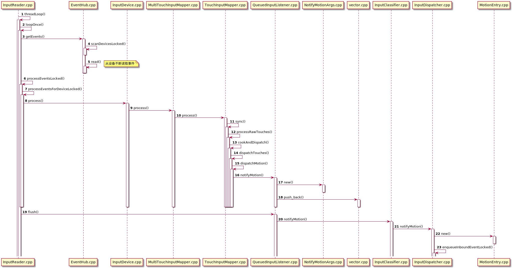

# **Android四大组件ANR控制逻辑梳理及思考**
anr是android中常见的一种异常提示，它的出现代表了进程的性能及稳定性出现了严重的问题，无论systemServer及app程序均可能出现此类问题，因此我们有必要对Anr的控制逻辑进行梳理，并总结出背后的设计思想，进而帮助我们快速定位相关问题。
# 一.Service
## 1.startService时序图
ams在调用app的service onCreate前加入定时启动anr逻辑，在收到onCreate完成消息后删除定时启动anr逻辑。

## 2.bindNewService时序图

ams在调用app的service onCreate前加入定时启动anr逻辑，在收到onCreate完成消息后删除定时启动anr逻辑。

注：这种case情况下 onbind函数超时不会触发anr

## 3.bindExistService时序图

ams在调用app的service onBind前加入定时启动anr逻辑，在收到onBind完成消息后删除定时启动anr逻辑。

## 4.手动解绑服务时序图

ams在调用app的service onUnBind前加入定时启动anr逻辑，在收到onUnBind完成消息后删除定时启动anr逻辑。

## 5.自动解绑服务时序图

ams在调用app的service onUnBind前加入定时启动anr逻辑，在收到onUnBind完成消息后删除定时启动anr逻辑。

# 二.BroadcastReceiver时序图

ams在调用app的BroadcastReceiver onReceive前加入定时启动anr逻辑，在收到onReceive完成消息后删除定时启动anr逻辑。

同时ams有单个有序广播总耗时的触发逻辑，公式为：2*单个广播超时时间*receiver总数。

# 三.ContentProvider时序图

ams在调用app的ContentProvider onCreate前加入定时启动anr逻辑，在收到onCreate完成消息后删除定时启动anr逻辑。

# 四.Activity

交互类ANR主要涉及InputReader.cpp  InputDispatcher.cpp这两个类
## 1.InputReader

从eventHub读取event并解析成Entry 添加进mInboundQueue队列

## 2.InputDispatcher

1) 从mInboundQueue队列读取event，并重置ANR时间

2) 将事件加入outBoundQueue

3) 将事件发送给Client端

4) 将事件从outBoundQueue中移除

5) 将事件加入waitQueue，等待Client端反馈

6) 收到Client反馈后，将事件从waitQueue中移除

# 五.总结及思考

非交互类ANR总结：

非交互类ANR，逻辑比较简单，要求不是很严格都是10s以上，此类anr不是很常见。

|组件 |类型 |引起anr的回调方法 |时间限制(前台) |时间限制(后台) |时间显示(无前后台之分)|
| --------   | :-----  | :----  |:----  |:----  |:----  |
|Service	|start启动	|onCreate()	|20s	|200s	|x|
|Service	|bind启动	|onCreate()	|20s	|200s	|x|
|Service	|bind存在的Service	|onBind()	|20s	|200s	|x|
|Service	|unBind	|onUnbind()	|20s	|200s	|x|
|BroadcastReceiver	|单个有序广播接收者	|onReceive()	|10s	|60s	|x|
|BroadcastReceiver	|有序广播总耗时	|onReceive()	|$> 2*10*number$	|$>2*60*number$	|x
|BroadcastReceiver	|无序广播	|x	|x	|x	|x|
|BroadcastReceiver	|粘性广播	|x	|x	|x	|x|
|ContentProvider	|启动	|onCreate()|x	|x	|10s|
|Activity	|交互	|x	|x	|x	|5S|