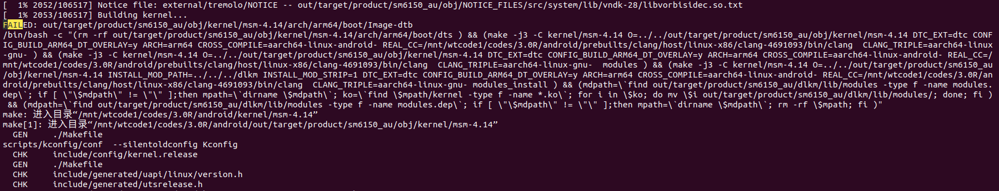

# **编译报错解决方法汇总**

# 1.**FAILED:** out/target/common/obj/JAVA_LIBRARIES/xx-servers_intermediates/classes-full-debug.jar

主要原因是app中存在编写错误,导致无法生成app

# 2.

产生原因/mnt/xxcode1/codes/3.0R/android/kernel/msm-4.14/scripts/sign-file.c:25:10: fatal error: openssl/opensslv.h:
解决方法
```
sudo apt-get install libssl-dev
```
# 3. **error:** 'device/xx/android.software.activities_on_secondary_displays.xml', needed by 'out/target/product/sm6150_au/system/etc/permissions/android.software.activities_on_secondary_displays.xml', missing and no known rule to make it
解决方法：
aosp/device/xx/xx30R/**xx30R.mk**文件配置路径写错，重新改。

# 4. xx3.0报错

FAILED: out/target/product/sm6150_au/dex_bootjars/system/framework/arm/boot.art
 Error was: Failed to mmap at expected address, mapped at 0x7fada6918000 instead of 0x70e7a000 : Requested region 0x70e7a000-0x70e7e000 overlaps with existing map 0x70e7a000-0x70e7e000 (/home/data/MAIN_GIT_REPO_CODE/xx3.0R/android/out/target/product/sm6150_au/dex_bootjars/system/framework/arm/boot-com.xx.media.art

解决方法
```
aosp/device/xx/xx30R/xx30R.mk

注释

#PRODUCT_BOOT_JARS +=com.xx.media
#PRODUCT_BOOT_JARS +=com.xx.media.impl
```

# 5.xx3.0R在Ubuntu20上编译需要额外安装的包
```
sudo apt-get install libncurses5
sudo apt-get install libssl-dev
sudo apt-get install python3-pip
sudo apt-get install cmake
sudo apt-get install gperf
sudo apt-get install ccache

sudo dpkg-reconfigure dash
```
# 6.xxOFrameWork编译报错
```
internal error: panic in VisitDirectDeps(module "xx-plugs" variant "android_common", android/soong/android.(*androidModuleContext).VisitDirectDeps.func1) for dependency module "prebuilt_xx-plugs" variant "android_common" in GenerateBuildActions for module "xx-plugs" variant "android_common"
unknown dependency "prebuilt_xx-plugs" for "xx-plugs
```

解决方法

删除 wutong/release下的所有文件，原因是冲突

# 7.xx3.0R编译报错
```
internal error: panic in VisitDirectDeps(module "xx-plugs" variant "android_common", android/soong/android.(*androidModuleContext).VisitDirectDeps.func1) for dependency module "prebuilt_xx-plugs" variant "android_common" in GenerateBuildActions for module "xx-plugs" variant "android_common"
unknown dependency "prebuilt_xx-plugs" for "xx-plugs"
```
原因，从网络下载的jar包和源码冲突，删除android/vendor/xx/build/prebuilt下的文件即可，如过还是不行就删除Android同目录下的模块

# 8.OPENOS编译报错

原因：PRODUCT_PROPERTY_OVERRIDES += \ro.config.ringtone=DreamTheme.ogg 中 ”+=“写成了 “：=”，导致后面的变量覆盖前面的变量。

# 9.XX70_Market3编译报错
```
Out of space? the tree size of out/target/product/sm6150_au/system is (MB): 
3980	out/target/product/sm6150_au/system
The max is 4096 MB.
```
原因：system分区过小，需要修改system分区大小