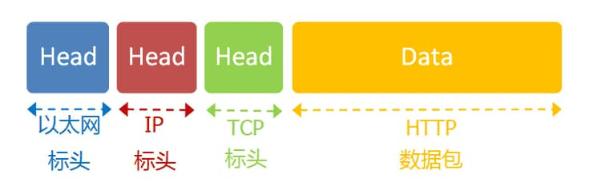
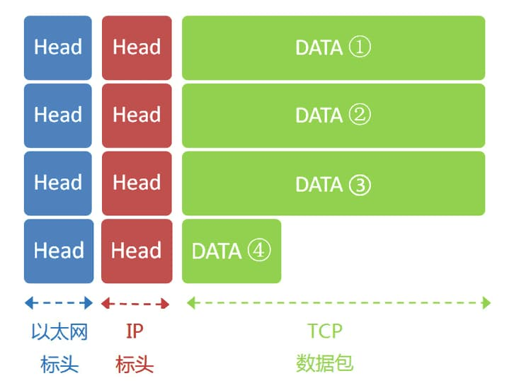

# 访问网页过程

## 通过DNS获取ip

DNS （Domain Name System 的缩写）的作用非常简单，就是根据域名查出IP地址。你可以把它想象成一本巨大的电话本。[DNS 原理入门](http://www.ruanyifeng.com/blog/2016/06/dns.html)

[DNS协议](http://en.wikipedia.org/wiki/Domain_Name_System)可以帮助我们，将这个网址转换成IP地址。已知DNS服务器为8.8.8.8，于是我们向这个地址发送一个DNS数据包（53端口）。然后，DNS服务器做出响应，告诉我们Google的IP地址是172.194.72.105。于是，我们知道了对方的IP地址。

## **子网掩码**

接下来，我们要判断，这个IP地址是不是在同一个子网络，这就要用到子网掩码。

已知子网掩码是255.255.255.0，本机用它对自己的IP地址192.168.1.100，做一个二进制的AND运算（两个数位都为1，结果为1，否则为0），计算结果为192.168.1.0；然后对Google的IP地址172.194.72.105也做一个AND运算，计算结果为172.194.72.0。这两个结果不相等，所以结论是，Google与本机不在同一个子网络。

因此，我们要向Google发送数据包，必须通过网关192.168.1.1转发，也就是说，接收方的MAC地址将是网关的MAC地址。

## **应用层协议**



### HTTP

我们假定这个部分的长度为4960字节，它会被嵌在TCP数据包之中。

```text
　　GET / HTTP/1.1
　　Host: www.google.com
　　Connection: keep-alive
　　User-Agent: Mozilla/5.0 (Windows NT 6.1) ......
　　Accept: text/html,application/xhtml+xml,application/xml;q=0.9,*/*;q=0.8
　　Accept-Encoding: gzip,deflate,sdch
　　Accept-Language: zh-CN,zh;q=0.8
　　Accept-Charset: GBK,utf-8;q=0.7,*;q=0.3
　　Cookie: ... ...
```

### **TCP协议**

TCP数据包需要设置端口，接收方（Google）的HTTP端口默认是80，发送方（本机）的端口是一个随机生成的1024-65535之间的整数，假定为51775。

TCP数据包的标头长度为20字节，加上嵌入HTTP的数据包，总长度变为4980字节。

### **IP协议**

然后，TCP数据包再嵌入IP数据包。IP数据包需要设置双方的IP地址，这是已知的，发送方是192.168.1.100（本机），接收方是172.194.72.105（Google）。

IP数据包的标头长度为20字节，加上嵌入的TCP数据包，总长度变为5000字节。

### **以太网协议**

最后，IP数据包嵌入以太网数据包。以太网数据包需要设置双方的MAC地址，发送方为本机的网卡MAC地址，接收方为网关192.168.1.1的MAC地址（通过ARP协议得到）。

以太网数据包的数据部分，最大长度为1500字节，而现在的IP数据包长度为5000字节。因此，IP数据包必须分割成四个包。因为每个包都有自己的IP标头（20字节），所以四个包的IP数据包的长度分别为1500、1500、1500、560。



## **服务器端响应**

经过多个网关的转发，Google的服务器172.194.72.105，收到了这四个以太网数据包。

根据IP标头的序号，Google将四个包拼起来，取出完整的TCP数据包，然后读出里面的"HTTP请求"，接着做出"HTTP响应"，再用TCP协议发回来。

本机收到HTTP响应以后，就可以将网页显示出来，完成一次网络通信。


[互联网协议入门（一）](http://www.ruanyifeng.com/blog/2012/05/internet_protocol_suite_part_i.html)

[互联网协议入门（二）](http://www.ruanyifeng.com/blog/2012/06/internet_protocol_suite_part_ii.html)



