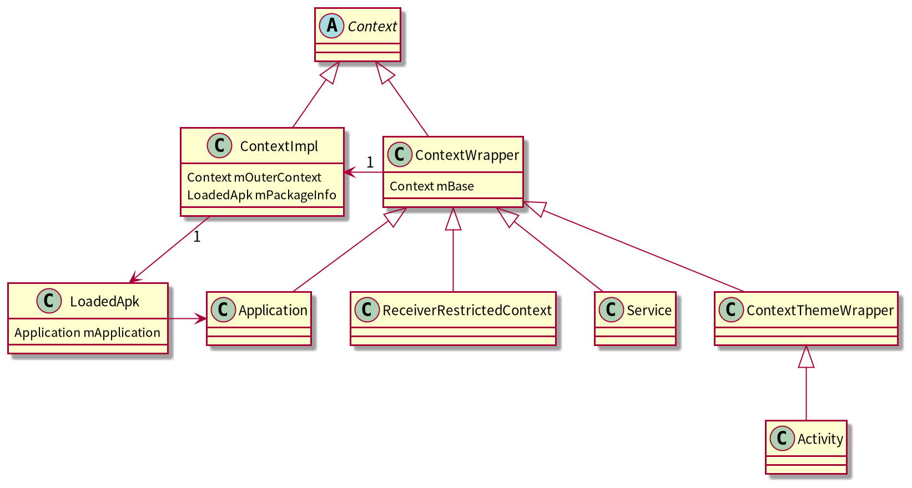
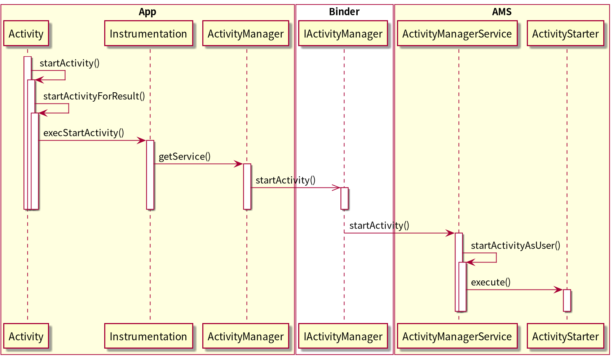
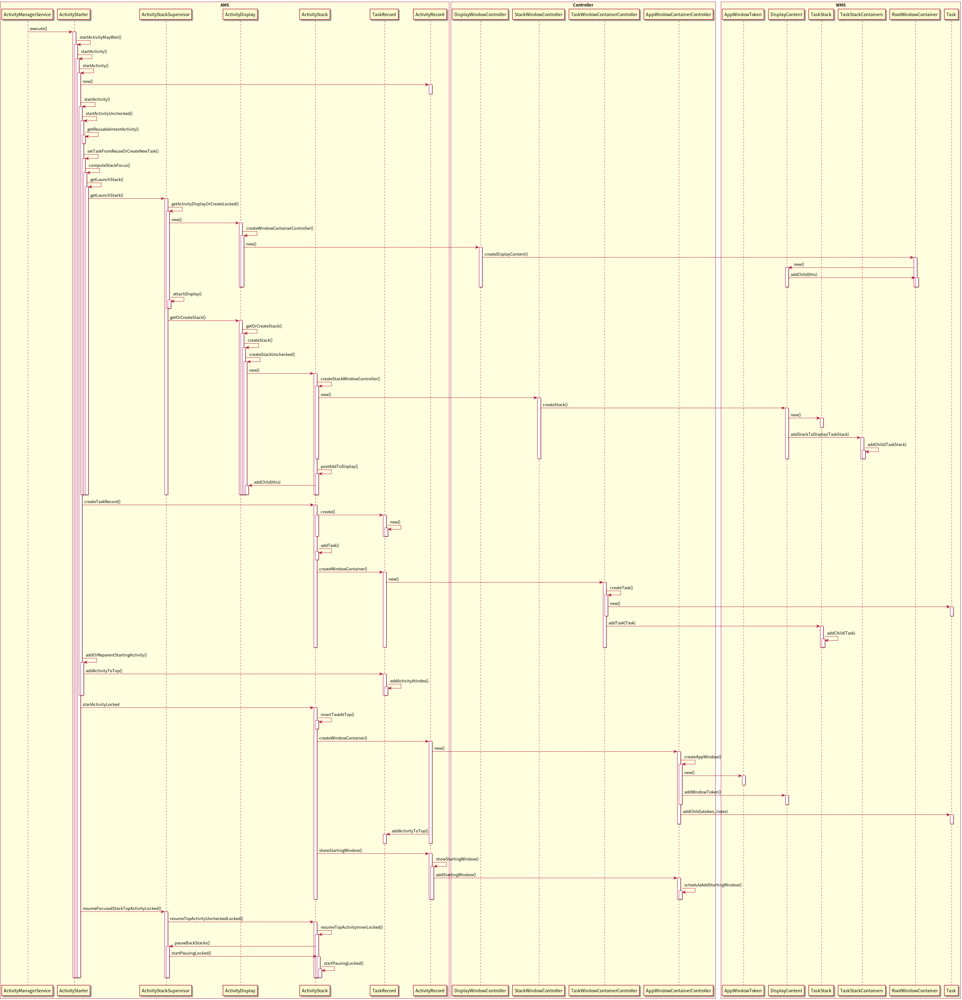
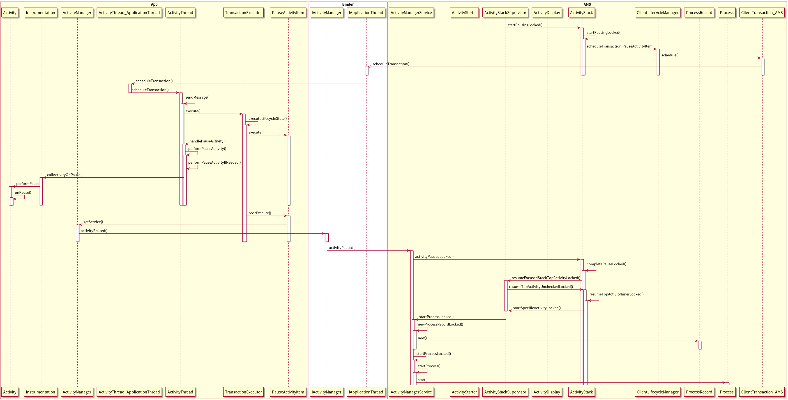
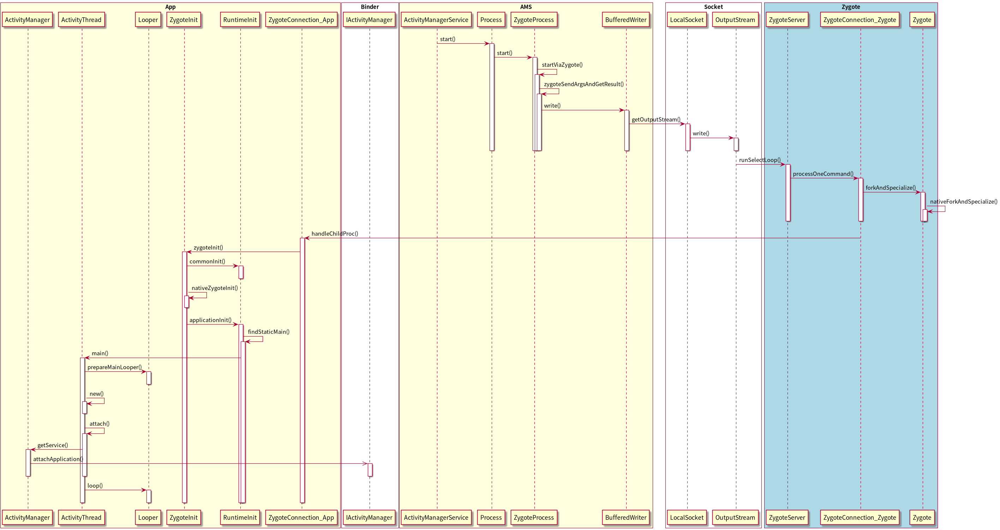
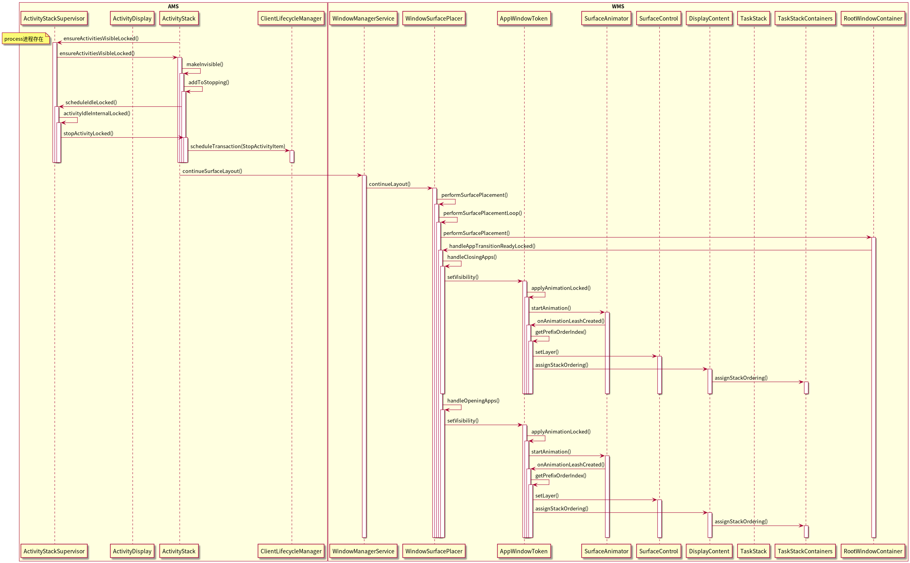
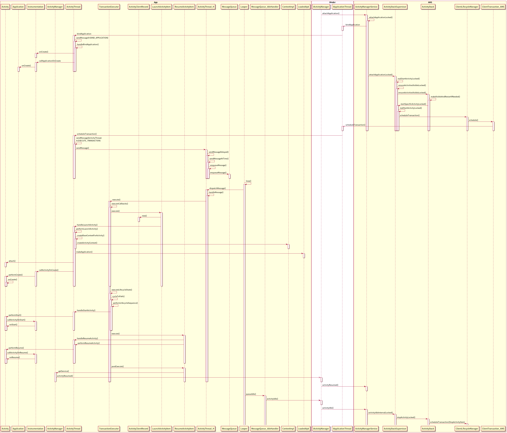

# Framework - AMS

## android9.0 Context
使用了装饰器模式

## android9.0 启动activity
### 1. startActivity

### 2. ams对wms的控制

### 3. pause back stack

### 4.1 如果进程不存在则创建进程 fork process

### 4.2 如果进程存在则使用这个进程 

### 5. attach
