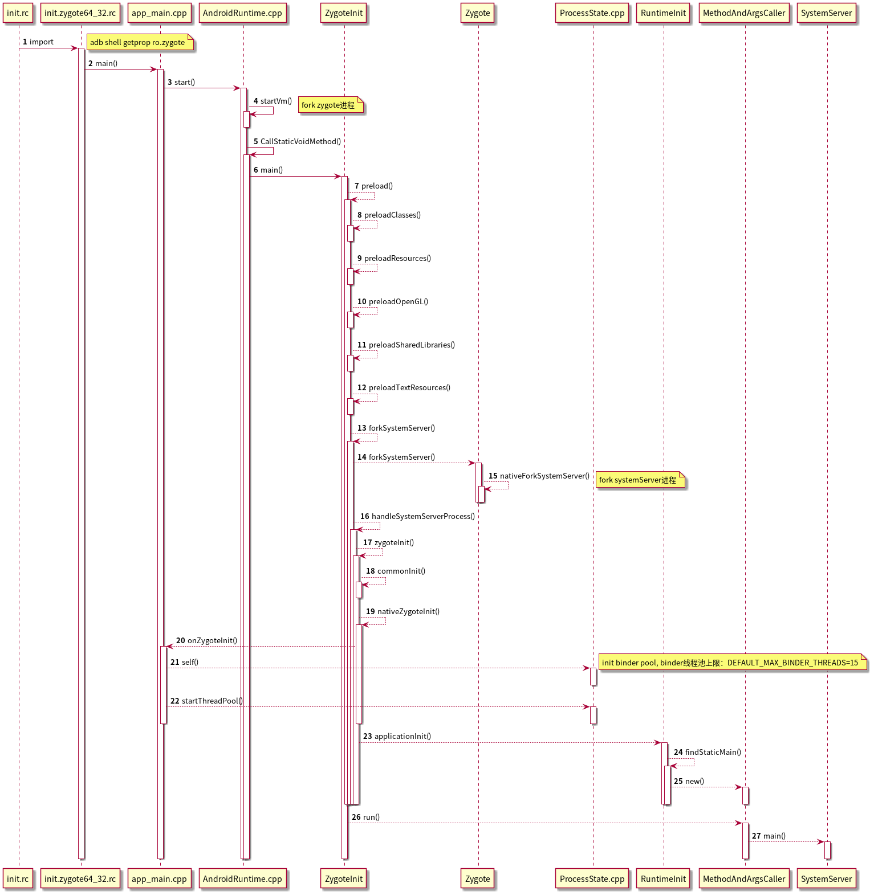
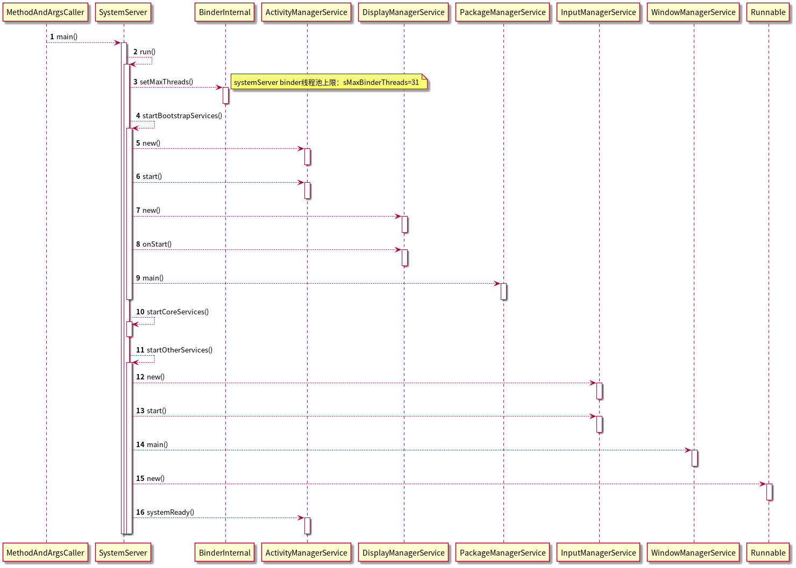
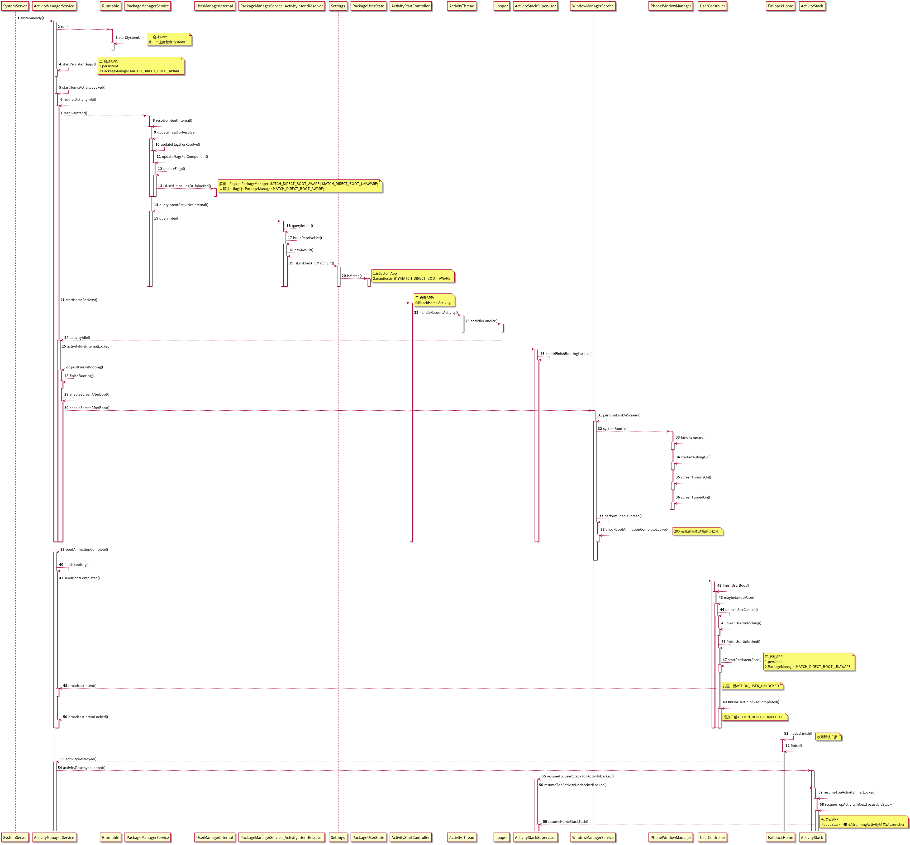

# Framework - 启动
## Android9.0
### 一. SystemServer启动
1. 开机上电后引导芯片将bootloader加载到内存中，开始拉起linux，并启动init进程

2. init进程启动VM进程即fork zygote进程，然后加载相关的资源
 
3. zygote进程fork systemserver进程，然后进程初始化，如binder线程池大小的初始化(默认15)

### 二. Service启动
1. 修改binder线程池上限到31

2. 启动引导服务 bootstrapService AMS，DMS，PKMS等12个

3. 启动核心服务 coreService DropBoxManagerService，BatteryService等4个

4. 启动其他服务 otherService WMS，InputManagerService等70+个
   
### 3. MainApp启动
1. AMS systemReady后启动systemui

2. 启动有加密感知的persistent App

3. 启动FallbackHome activity并注册监听ACTION_USER_UNLOCKED广播, Ams在FallbackHome idle之后调用userController等进行解锁操作

4. Ams启动无加密感知的persistent App, Ams发送ACTION_USER_UNLOCKED广播

5. FallbackHome接收到广播后finish掉自己, AMS resumeFocusedStackTopActivity时启动HomeStack task launcher
   
