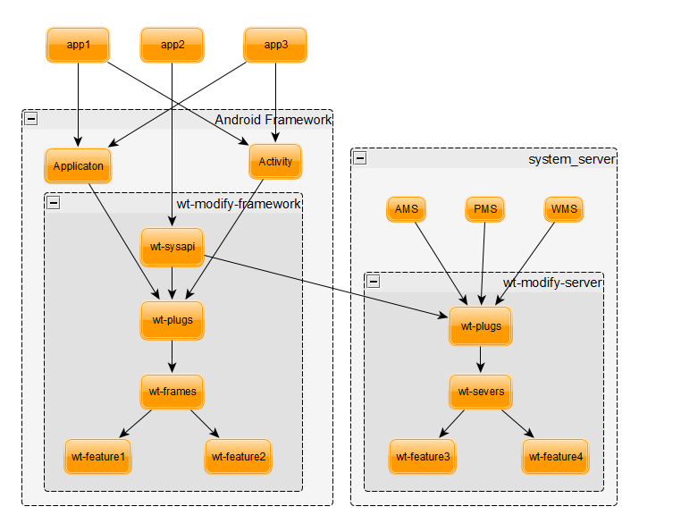

# **系统主线平台化方案**
# 1 背景
## 1.1 现状

没有平台化主线开发模式，工作量随项目成比例上升，底版本升级冲突多周期长，与第三方合作开发可能会泄漏私有源码。

比如现对frameworks的修改有三个地方，大家也比较随意选择，项目间重复拷贝多。
xxxx/aosp/frameworks
xxxx/project/pp/frameworks
xxxx/xxFramework/xxframework/frameworks
## 1.2 思路

* 从Google的单代码库模式看Google工程文化
* Google在开发流程中选择的不是在版本控制上用分支，而是在代码逻辑中用分支。
* 制度一：严格的Code Review（+2严格把关）
* 制度二：严格的测试（自测验证）
* 制度三：Trunk Based Development(主线开发)
* 制度四：逻辑更改可配置化(动态FEATURE)

# 2. 目标
## 2.1 快速升级底版本

对AOSP修改最小化，合并升级冲突少。不同项目共用一条主线，只定制开关配置，快速移植、升级大小底版本。

对原生的修改只加一行  Plugs.aCall(Plugs.AID_xxx, this, arg_count, args);

```
diff --git a/core/java/android/app/Application.java b/core/java/android/app/Application.java
@@ -233,6 +240,9 @@ public class Application extends ContextWrapper implements ComponentCallbacks2 {
     }
     /* package */ void dispatchActivityResumed(Activity activity) {
+        /* xx begin */
+        Plugs.aCall(Plugs.AID_Application_dispatchActivityResumed, this, 1, activity);
+        /* xx end */
         Object[] callbacks = collectActivityLifecycleCallbacks();
         if (callbacks != null) {
```             
## 2.2 便于同第三方合作开发

可只集成APK、SO、JAR包，利于私有源码保护
```
/build/prebuilts$ tree
    ├── Android.mk
    ├── xx_frames
    │   ├── Android.mk
    │   ├── xx-frames-debug.jar
    │   └── xx-frames.jar
    ├── xx_servers
    │   ├── Android.mk
    │   ├── xx-severs-debug.jar
    │   └── xx-severs.jar
```
## 2.3 规范底版本修改

统一只使用两个接口，aCall用于修改应用框架，sCall用于修改系统进程（system_server）服务
```
public interface IFun {
    /* run in app for modify android framework */
    int aCall(int id, Object who, int argsCount, Object... args);
 
    /* run in system_server for modify system_server  */
    int sCall(int id, Object who, int argsCount, Object... args);
}
```
## 2.4 为应用统一提供新增接口


不用修改AOSP的API定义，可新增API， 也可引出系统级的SystemApi （但要验证相应权限）。

```
/* run in app to export SystemApi as xxApi */
Object wCall(int id, int argsCount, Object... args);
```
暂不更新上面定义给应用使用的接口了


现xxManager.java实现,   可跨进程调用到system_server中的服务

### 2.4.1  给应用的新增接口统一定义xxManager
```
aosp/vendor/xx/opensource/xx_frames/java/com/xx/utils/xxManager.java

```
跨进程调用到system_server中的服务接口定义

aosp/vendor/xx/opensource/xx_frames/java/com/xx/utils/IxxServer.aidl 

system_server回调到应用的回调接口定义

aosp/vendor/xx/opensource/xx_frames/java/com/xx/utils/ICallback.aidl


如下通过服务xxManager注册ICallback后,就可收到MotionEvent
```
public class TestxxServer {
    private static final String TAG = TestxxServer.class.getSimpleName();
 
    private ICallback.Stub mCallback = new ICallback.Stub() {
        @Override
        public void onMotionEvent(MotionEvent motionEvent) throws RemoteException {
            Log.d(TAG, motionEvent.toString());
        }
    };
 
 
    public void testMain(Context context) throws RemoteException {
        xxManager xxManager = (xxManager)
                context.getSystemService(xxManager.SERVICE);
 
        xxManager.registerCallback(mCallback);
    }
}
```


## 2.5  功能FEATURE修改可控
每个功能FEATURE可开关

public static boolean featureOn(int id)
```
/* Feature id begin */
public final static int FID_BEGIN = 1000;
public final static int FID_INS_THIRD_APK = FID_BEGIN + 1;   //install third apk
......
```
每个对AOSP的修改点也可开关

public static boolean plugOn(int id, Object who) 
```
/* Framework Plugs id run in app begin */
public final static int AID_InitFramework = AID_BEGIN + 1;
public final static int AID_Editor_startInsertionActionMode = AID_BEGIN + 2;
......
 
/* Service Plugs id run in system_server begin */
public final static int SID_InitService = SID_BEGIN + 1;
public final static int SID_SystemServiceManager_startService = SID_BEGIN + 2;
......
```
为后序兼容，上面ID按顺序递增，避免重复。
# 3. 平台化方法
## 3.1 总体框图

如上单向依赖，避免循环。


注意上面xx-sysapi由xxManager来实现了,不直接用xx-sysapi


### 3.1.1. 代码组织

各模块、FEATURE分目录存放，在自身目录下存放所有相关文件（APK、SO、源码、SELIUX、RC文件等）。

xxxx/aosp只放Android源码同目录下要修改的同名文件(除了device/xx 和 vendor/xx两个目录)。

```
xxxx/aosp$ tree -L 3  
├── bionic
│   └── libc
│       └── system_properties
├── build
│   └── make
│       ├── core
│       └── target
├── device
│   └── xx          项目定制部分，只存放项目的差异配置
│       └── xx15R  
│       └── SxxxR  
├── frameworks
│   └── base
│       ├── Android.bp   只加xx_plugs的依赖
│       ├── core
│       └── services
├── system
│   └── core
│       └── rootdir
└── vendor
    └── xx          所有xxxx新增文件都放入vendor/xx目录下
        ├── init.xx.rc
        ├── opensource
        ├── proprietary
        └── xx.mk
```

所有新增文件都放入xxxx/aosp/vendor/xx目录下
```
xxxx/aosp/vendor
└── xx
    │── init.xx.rc
    │── xx.mk                      编译入口  
    ├── opensource                     开放源码（最小化）尽量放在下面proprietary目录中
    │   ├── xx_xxx                     其它模块、FEATURE开源部分
    │   ├── xx_frames                  应用框架修改
    │   ├── xx_overlays                
    │   ├── xx_plugs                   框架和服务统一接口（只存放接口定义）
    │   │   ├── Android.mk
    │   │   └── java
    │   │       └── com
    │   └── xx_servers                 系统服务修改   
    │       ├── init_rc                实现此模块、FEATURE的init.rc配置
    │       │   └── init.xx.service.rc
    │       └── sepolicy               实现此模块、FEATURE的SELIUX配置
    │           └── service.te
    └── proprietary                    专有源码（放可编译成APK/JAR/SO的私有源码）  需要单独一个库
        ├── Android.mk.rm
        ├── xx_xxx                     其它模块、FEATURE实现
        ├── xx_frames                  应用框架修改
        │   ├── Android.mk
        │   ├── aosp
        │   │   └── frameworks
        │   ├── java
        │   │   └── com
        │   └── proguard.flags
        ├── xx_plugs                   框架和服务统一接口
        │   ├── Android.bp
        │   ├── Android.mk
        │   └── java
        │       └── com
        └── xx_servers                 系统服务修改   
            ├── Android.mk
            ├── aosp
            │   └── frameworks
            ├── java
            │   └── com
            └── proguard.flags
```

### 3.1.2 修改位置

每个修改，要按是否开源，是否是AOSP的源文件，来存放对应目录：

xxxx/aosp 只放AOSP的源文件（底版本）的修改（因有统一修改，升级和移植的冲突近于0）；

xxxx/aosp/vendor/xx/opensource  只放开源的接口和文件；

xxxx/aosp/vendor/xx/proprietary   存放所有私有源码文件；

## 3.2 分级抽象
### 3.2.1 模块分级

逻辑和策略尽量上移（内核空间->用户空间）（高权限进程->普通应用 ）

 kernel->init-> zygote->system_server->platfom_app-> app
C2b. 剥离抽象顺序

1. features/xxx优先做成APK

2. features/xxx可独立编译为JAR和库，并运行在新增的服务/进程中

3. features/xxx可独立编译为JAR和库，运行在原生的服务/进程中

4. features/xxx不可独立编译为JAR和库，则最后直接在AOSP源码中按统一的方法加修改。

## 3.3 MK修改集成

统一在xx.mk中增加、集成模块。
```
PRODUCT_PACKAGES += \
    xx-plugs \
    xx-frames \
    xx-servers \
 
PRODUCT_BOOT_JARS += xx-plugs xx-frames
PRODUCT_SYSTEM_SERVER_JARS += xx-servers
 
# add for overlays, only for add  new res, modify origin res by RRO(runtime-resource-overlay)
PRODUCT_PACKAGE_OVERLAYS := \
    vendor/xx/opensource/xx_overlays \
    $(PRODUCT_PACKAGE_OVERLAYS)
 
# add for init.xx.rc */
PRODUCT_COPY_FILES +=  vendor/xx/build/init.xx.rc:root/init.xx.rc
 
# add seplicy for xx_servers
BOARD_SEPOLICY_DIRS += vendor/xx/opensource/xx_servers/sepolicy
PRODUCT_COPY_FILES +=  vendor/xx/opensource/xx_servers/init_rc/init.xx.servers.rc:root/init.xx.servers.rc
```

## 3.4 init.xxx.rc修改集成

在/system/core/rootdir/init.rc中添加入口
```
import /init.xx.rc
```

在init.xx.rc中添加每个模块的引入
```
xx/build$ more init.xx.rc
import /init.xx.servers.rc
import /init.xx.xxx.rc
```

每个模块目录下新建init_rc目录存放
```
├── opensource
│   └── xx_servers
│       ├── init_rc
│       │   └── init.xx.service.rc
```

## 3.5 SELINUX权限修改集成

每个模块目录下新建sepolicy目录存放。

```
├── opensource
│   └── xx_servers
│       └── sepolicy
│           └── service.te
```

在xx/build/xx.mk中为每个模块加BOARD_SEPOLICY_DIRS的目录定义
```
# add seplicy for xx_servers
BOARD_SEPOLICY_DIRS += vendor/xx/opensource/xx_servers/sepolicy
```
## 3.6. 新加资源集成

opensource下新建xx_overlays目录存放。

```
xx/opensource/xx_overlays$ tree
└── frameworks
    └── base
        └── core
            └── res
                └── res
                    └── values
                        ├── config.xml
                        ├── strings.xml
                        └── symbols.xml
```

在xx.mk中已统一加了PRODUCT_PACKAGE_OVERLAYS的目录定义
```
# add for overlays, only for add  new res, modify origin res by RRO(runtime-resource-overlay)
PRODUCT_PACKAGE_OVERLAYS := \
    vendor/xx/opensource/xx_overlays \
    $(PRODUCT_PACKAGE_OVERLAYS)
```

## 3.7 项目定制
### 3.7.1 项目定制差异

不同项目的不同配置，放在各自目录下。
```
xxxx/aosp/device/xx$ tree
├── SxxxR
│   ├── AndroidProducts.mk
│   ├── SxxxR.mk
│   └── vendorsetup.sh
├── xx15R
│   ├── AndroidProducts.mk
│   ├── vendorsetup.sh
│   └── xx15R.mk
└── xxOSFramework
     ├── AndroidProducts.mk
     ├── vendorsetup.sh
     └── xxOSFramework.mk
```


### 3.7.2  使用inherit-product方式新建项目

```
xxxx/aosp/device/xx/xx15R$ more xx15R.mk
 
$(call inherit-product, device/fsl/imx8q/mek_8q/mek_8q_car2.mk)
$(call inherit-product, vendor/xx/xx.mk)
```
不直接修改device/fsl/imx8q/mek_8q/目录下的文件 ，减少移植工作量。

### 3.7.3  在各项目目录下加项目差异配置


在各项目目录下加项目差异配置

xxxx/aosp/device/xx$ tree 
```
├── SxxxR
├── xx15R
└── xxOSFramework
```

### 3.7.4  统一xx平台化的项目配置

在vendor/xx/xx.mk文件中统一加xxxx平台化的项目配置
xxxx/aosp/vendor/xx$ more xx.mk
``` 
PRODUCT_PACKAGES += \
    xx-plugs \
    xx-frames \
    xx-servers \

PRODUCT_BOOT_JARS += xx-plugs xx-frames
PRODUCT_SYSTEM_SERVER_JARS += xx-servers
```

### 3.7.5  新加项目示例

xxOS03_google/xxxx/aosp/device/xx/xxOSFramework/AndroidProducts.mk

```
PRODUCT_MAKEFILES := \
  $(LOCAL_DIR)/xxOSFramework.mk

```
aosp/device/xx/xxOSFramework/xxOSFramework.mk
```

$(call inherit-product, device/google/marlin/aosp_sailfish.mk)

$(call inherit-product, vendor/xx/xx.mk)


# Overrides
PRODUCT_NAME := xxOSFramework
PRODUCT_BRAND := TINNOVE
PRODUCT_MODEL := xxOSFramework
PRODUCT_MANUFACTURER := WUTONG


#    public final static int FID_INS_THIRD_APK = FID_BEGIN + 1;   //install third apk
PRODUCT_PROPERTY_OVERRIDES +=  sys.xx.feature.1.0.0.1=1
#    public final static int FID_SKIP_EDITOR_ACTION = FID_BEGIN + 2;   //skip show editor action mode
PRODUCT_PROPERTY_OVERRIDES +=  sys.xx.feature.1.0.0.2=1

```

aosp/device/xx/xxOSFramework/vendorsetup.sh
```
add_lunch_combo xxOSFramework-eng
add_lunch_combo xxOSFramework-user
add_lunch_combo xxOSFramework-userdebug

```

xxOS03_google/xxxx/config/xxOSFramework/xxOSFramework.mk
```
# --------- 项目配置信息 ------- start
# --------对内信息----- start
xx_TARGET=xxOSFramework //add
# 内部项目名
xx_PROJECT_NAME=xxOSFramework
# 代码平台版本
xx_PLATFORM_VER=GOOGLE
# 方案提供商
xx_SOLUTION_PROVIDER=xx
# Rom 版本
#xx_ROM_VER=ALL
# 适配车厂
#xx_CAR_FACTORY=ALL
```


## 3.8 加修改点示例
### 3.8.1 先提交AOSP源文件(未修改的)
```
xx$ git show 00fe677
commit 00fe67731e7d610ce2e6bd65e96e32264e3df8b8
Author: p_123 <p_123@456.com>
Date:   Thu Sep 12 19:48:31 2019 +0800
 
    Editor.java
     
    Signed-off-by: p_123 <p_123@456.com>
 
diff --git a/aosp/frameworks/base/core/java/android/widget/Editor.java b/aosp/frameworks/base/core/java/android/widget/Editor.java
new file mode 100644
index 0000000..d07721a
--- /dev/null
+++ b/aosp/frameworks/base/core/java/android/widget/Editor.java
@@ -0,0 +1,6993 @@
+/*
+ * Copyright (C) 2012 The Android Open Source Project
+ *
+ * Licensed under the Apache License, Version 2.0 (the "License");


```
### 3.8.2 再提交对应修改的PATCH
```
xx$ git show 7724593
diff --git a/aosp/frameworks/base/core/java/android/widget/Editor.java b/aosp/frameworks/base/core/java/android/widget/Editor.java
index d07721a..393903f 100644
--- a/aosp/frameworks/base/core/java/android/widget/Editor.java
+++ b/aosp/frameworks/base/core/java/android/widget/Editor.java
@@ -16,6 +16,11 @@
  
 package android.widget;
  
+/* xx begin */
+import com.xx.plug.Plugs;
+/* xx end */
+
+
 import android.R;
 import android.animation.ValueAnimator;
 import android.annotation.IntDef;
@@ -2101,6 +2106,12 @@ public class Editor {
         }
         stopTextActionMode();
  
+        /* xx begin */
+        if (!Plugs.aCall(Plugs.AID_Editor_startInsertionActionMode, this, 0, this)) {
+            return ;
+        }
+        /* xx end */
 
diff --git a/xx/proprietary/xx_plugs/java/com/xx/Plugs.java b/xx/proprietary/xx_plugs/java/com/xx/Plugs.java
index c35dc5a..076d943 100755
--- a/xx/proprietary/xx_plugs/java/com/xx/Plugs.java
+++ b/xx/proprietary/xx_plugs/java/com/xx/Plugs.java
@@ -35,6 +35,7 @@ public class Plugs {
     public final static int AID_Application_Application = AID_BEGIN + 2;
     public final static int AID_Application_dispatchActivityResumed = AID_BEGIN + 3;
     public final static int AID_Application_dispatchActivityPaused = AID_BEGIN + 4;
+    public final static int AID_Editor_startInsertionActionMode = AID_BEGIN + 5;
 
 
diff --git a/xx/proprietary/xx_frames/java/com/xx/Frames.java b/xx/proprietary/xx_frames/java/com/xx/Frames.java
index 966f237..3e84874 100755
--- a/xx/proprietary/xx_frames/java/com/xx/Frames.java
+++ b/xx/proprietary/xx_frames/java/com/xx/Frames.java
@@ -7,6 +7,7 @@ package com.xx;
  
  
 import android.app.ApplicationPlugs;
+import android.widget.EditorPlugs;
  
 import static com.xx.Plugs.*;
  
@@ -40,6 +41,9 @@ public class Frames implements IFun {
             case AID_Application_dispatchActivityPaused:
                 ret = ApplicationPlugs.aCall(id, who, argsCount, args);
                 break;
+            case AID_Editor_startInsertionActionMode:
+                ret = EditorPlugs.aCall(id, who, argsCount, args);
+                break;
             default:
 
 
diff --git a/xx/proprietary/xx_frames/aosp/frameworks/base/core/java/android/widget/EditorPlugs.java b/xx/proprietary/xx_frames/aosp/frameworks/base/core/java/android/widget/EditorPlugs.java
new file mode 100755
index 0000000..30afdbe
--- /dev/null
+++ b/xx/proprietary/xx_frames/aosp/frameworks/base/core/java/android/widget/EditorPlugs.java
@@ -0,0 +1,38 @@
+package android.widget;
+/*
+ * Copyright (C) 2019 xxxx TINNOVE OS, All rights reserved.
+ * Author: p_123
+ */
+
+
+import com.xx.Plugs;
+import com.xx.Logs;
+
+import static com.xx.Plugs.*;
+
+
+public class EditorPlugs {
+
+    private static final String TAG = "EditorPlugs";
+
+    private static boolean startInsertionActionMode(Object who) {
```

## 3.9 替换原生类的方法

### 3.9.1 替换ActivityManagerService
```
    public static final class Lifecycle extends SystemService {
        private final ActivityManagerService mService;

        public Lifecycle(Context context) {
            super(context);
            /* xx begin */
            //mService = new ActivityManagerService(context);
            ArrayList<ActivityManagerService> pRet = new ArrayList<>();
            if (Plugs.R_TRUE == Plugs.sCall(Plugs.SID_ActivityManagerService_Lifecycle, null, 2, pRet, context)) {
                mService = pRet.get(0);
            } else {
                mService = new ActivityManagerService(context);
            }
            /* xx end */
        }
```
### 3.9.2 实现ActivityManagerServicexxEx

ActivityManagerServicexxEx私有源码、是可混淆的
```
public class ActivityManagerServiceExxx extends ActivityManagerService {
    private static final String TAG = "ActivityManagerServiceExxx";

```
### 3.9.3 引出ActivityManagerService的方法

可解决可访问性等问题
```
    public boolean removeProcessxx(ProcessRecord app,
                                   boolean callerWillRestart, boolean allowRestart, String reason) {
        synchronized (this) {
            return removeProcessLocked(app, callerWillRestart, allowRestart, reason);
        }
    }
```
不直接调用removeProcessLocked也有更好可移植性

## 3.10 JAR包的封装和混淆

每个JAR包用外观模式，默认只引出一个对外的类Facade.java
在proguard.flags中定义
```
-keep class com.xx.frame.Facade {
public *;
}
```
# 4. 性能验证

在Allwinner’ s T7平台验证如下：
## 4.1 连续调用1K次总耗时（ 43ms ）

应用框架接口（同进程中）

2019-09-05 23:51:27.689 28652-28726/com.xx.xxftest E/PerformanceTest: operation: 43ms so far, now at Plugs.aCall count: 1000
## 4.2 连续调用1K次CPU占用（9.6%）

PID USER PR NI VIRT RES SHR S[%CPU] %MEM TIME+ THREAD PROCESS
28652 u0_a67 20 0 840M 89M 74M S 9.6 12133 0:29.05 Thread-3 com.xx.xxftest

# 5. FEATURE开关
## 5.1 命名原则

FEATURE不能用xx/UI/项目名/等大集合取名，要细分到具体功能，每个项目可开关，定制差异配置。

如下按不能再细分的功能来命名FEATURE

public final static int FID_INS_THIRD_APK = FID_BEGIN + 1; //install third apk

按FEATURE来开发验证，各项目再用开关组合来选择不同的FEATURE就好，所有项目共用同一个FEATURE


## 5.2 默认值
### 5.2.1  FEATURE默认值

在featureOn源码中，最新源码默认值为false
```
    static boolean featureOn(int id) {
        boolean ret = false;
        if ((id > FID_END) || (id < FID_BEGIN)) {
            return ret;
        }
 
        String name = getName(xx_FEATURE, id);
        boolean defaultOn = SystemProperties.getBoolean("persist." + name, false);
        ret = SystemProperties.getBoolean(name, defaultOn);
 
//        if (!ret) {
//            Logs.d(TAG, "feature id:" + id + " is off");
//        }
        return ret;
    }
```

### 5.2.2  AOSP修改点默认值

在plugOn源码中，默认值为true如下（以最新源码为准）。
```
    static boolean plugOn(int id) {
        boolean ret = true;
 
        ret = SystemProperties.getBoolean(getName(xx_PLUG, id), true);
 
//        if (!ret) {
//            Logs.d(TAG, "plug id:" + id + " is off");
//        }
        return ret;
    }
```

## 5.3 动态开关调试

不用修改源码、不用重新编译、下载，可动态控制FEATURE和AOSP修改点的开关。
### 5.3.1   默认实现

如FID_SKIP_EDITOR_ACTION， 默认为去掉全选、复制、粘贴、剪切、分享之类全部操作。
```
public final static int FID_SKIP_EDITOR_ACTION = FID_BEGIN + 2; //skip show editor action mode
```

相关日志输出：
```
t7-p1:/ # logcat -b system|grep xxL_
09-19 15:40:00.292 4410 4410 D xxL_EditorPlugs: skip startSelectionActionModeAsync(),android.widget.Editor@b071732
09-19 15:40:04.964 4410 4410 D xxL_EditorPlugs: skip startInsertionActionMode(),android.widget.Editor@b071732
```

### 5.3.2   动态关闭修改

动态修改对应属性后，效果如下，恢复原生样式。
```
t7-p1:/ # setprop sys.xx.feature.1.0.0.2 0
t7-p1:/ #
t7-p1:/ # getprop sys.xx.feature.1.0.0.2
0
```

# 6. 系统优化平台化策略
## 6.1 系统稳定性策略

曾经出现的性能、稳定性等共性问题，找到根本原因后，可加平台化的解决、打点、预警等措施，避免以后重复出现类似问题。

如音乐widget不刷新稳定性问题的案例，在系统层可加平台化的措施，比如根据我们系统的需求，可设置添加10个widget(阀值可调)的上限，也可设置超过8个widget的打点预警。
## 6.2 系统性能策略

后序补充。


# 7. 权限控制

后序补充。

如有提供给应用接口要依赖系统服务实现时，再加权限控制。


# 8. 云端策略

后序补充。

可实现相关FEATURE、修改点的开关控制。


# 9. 调试验证
## 9.1 统一日志输出

所有日志统一加前缀xxL_
```
t7-p1:/ # logcat -b system|grep xxL_
09-12 04:14:00.839 4544 4544 D xxL_ApplicationPlugs: Application(),android.app.Application@9c85e24
09-12 04:14:02.884 4761 4761 D xxL_ApplicationPlugs: Application(),android.app.Application@9c85e24
09-12 04:14:04.801 4909 4909 D xxL_ApplicationPlugs: Application(),android.app.Application@9c85e24
I2. dumpsys输出
```
后序补充。

# 10. 注意事项

不要用project目录下项目名区分，只有在AOSP下一份源码。

对底版本修改先提交源文件再提交我们的修改，方便不同分支CHERRY-PICK。

底版本不同，才拉分支；相同底版本不同项目，差异配置在/device/xx/项目名下。

不得修改原生文件的格式和缩进风格。

不得删除原生文件和目录。

不得提交多余的空格。

对底版本文件引入的修改位置直接在包名下，减少冲突。

名称空间、系统属性等命名应以xx开头区分。

包名应以com.xx.模块名  开头。

注释中必须有修改人姓名。
```
package com.xx.plug;
 
/*
 * Copyright (C) 2019 xxxx TINNOVE OS, All rights reserved.
 * Author: p_123
 */

```
# 11. AOSP源码修改的封装、混淆梳理步骤

## 11.1  在真机上验证修改（Fxxx机器）

干净的 xx1.5R 代码环境：
```
下载命令：repo init -u gerritserver:manifest -m xx1.5R_debug.xml  

repo sync -j4
```

提交分支： code_main_debug

保证在真机上验证通过。
## 11.2 另外也可在任何一个项目上开发验证

### 11.2.1 从ANDROID原生环境拷贝两个xx目录。
```
repo init -u gerritserver:manifest -m xxOSFramework.xml

也可只下载：git clone   gerritserver:xxOS03_google/xxxx

xxxx/aosp$ tree -L 2
├── device
│   └── xx
└── vendor
     └── xx
```
### 11.2.2  初始环境搭建， 只用同步这个PATCH

aosp/bionic/libc/system_properties/prop_area.cpp
```
#include <sys/cdefs.h>
#include <sys/stat.h>
#include <sys/types.h>
#include <sys/xattr.h>
#include <unistd.h>

#include <new>

#include <async_safe/log.h>

/* xx begin */
constexpr size_t PA_SIZE = 128 * 1024 * 10;
/* xx end */
constexpr uint32_t PROP_AREA_MAGIC = 0x504f5250;
constexpr uint32_t PROP_AREA_VERSION = 0xfc6ed0ab;

size_t prop_area::pa_size_ = 0;
size_t prop_area::pa_data_size_ = 0;

```
aosp/build/make/core/tasks/check_boot_jars/package_whitelist.txt
```
com\.android\..*


###################################################
# android.test.base.jar
junit\.extensions
junit\.framework
android\.test
android\.test\.suitebuilder\.annotation

# xxxx plug add
com\.xx\.frame
com\.xx\.frame\..*
com\.xx\.plug
com\.xx\.plug\..*

###################################################
```

aosp/frameworks/base/Android.bp
```
    no_framework_libs: true,
    libs: [
        "conscrypt",
        "okhttp",
        "bouncycastle",
        "ext",
    ],

    static_libs: [
        "framework-protos",
        "xx-plugs", // add
        "android.hidl.base-V1.0-java",
        "android.hardware.cas-V1.0-java",
        "android.hardware.contexthub-V1.0-java",
        "android.hardware.health-V1.0-java-constants",
        "android.hardware.thermal-V1.0-java-constants",
        "android.hardware.tv.input-V1.0-java-constants",
        "android.hardware.usb-V1.0-java-constants",
        "android.hardware.usb-V1.1-java-constants",
```

aosp/system/core/rootdir/init.rc
```
# IMPORTANT: Do not create world writable files or directories.
# This is a common source of Android security bugs.
#

import /init.environ.rc
import /init.usb.rc
import /init.${ro.hardware}.rc
import /vendor/etc/init/hw/init.${ro.hardware}.rc
import /init.usb.configfs.rc
import /init.${ro.zygote}.rc
# xx begin
import /init.xx.rc
# xx end

on early-init
```


先拷贝原生文件后，再打PATCH

### 11.2.3.  SxxxR源码开发和JAR集成两种方式参考
[xx_plug_v1.tar.gz](.gitbook/asserts/wt_plug_v1.tar.gz)


## 11.2 同步到ANDROID原生环境出版本

ANDROID原生环境:
```
下载命令：repo init -u gerritserver:manifest -m xxOSFramework.xml

repo sync -j4
```

默认推送分支：code_main_dev

xx28_xxFramework（xxxx/aosp/vendor/xx/proprietary）推送分支：code_dev

保证编译通过，并生成对AOSP的修改PATCH(保证能同步到所有项目和平台)并记录在下面表格中。


同步在真机上验证过的修改，配置会在这个ANDROID原生环境中编译出JAR、APK/SO等来发布版本给其它项目使用。

## 11.3 在其它项目上使用


配置会直接集成在ANDROID原生环境中编译出JAR、APK/SO到项目。

每个FEATURE责任人，负责移植到其它项目。


### 11.3.1 从原生目录拷贝文件到xxxx的脚本

先提交底版本，可用下面脚本批量拷贝，注意修改get_project_dir下项目的根目录和要拷贝的文件列表

* all_copy_list_file.txt
```
bionic/libc/system_properties/prop_area.cpp
build/make/core/tasks/check_boot_jars/package_whitelist.txt
frameworks/base/Android.bp
frameworks/base/core/java/android/widget/Editor.java
frameworks/base/core/java/com/android/internal/os/ZygoteInit.java
frameworks/base/services/core/java/com/android/server/SystemServiceManager.java
frameworks/base/services/java/com/android/server/SystemServer.java
system/core/rootdir/init.rc
```


* all_copy_list_file.py
```
#!/usr/bin/env python

import os, string, sys, time, re, math, fileinput, glob, shutil, codecs
import threading, platform


VERSION = (0, 1)


#--------------------------------------------------------------------------------------------------
def get_project_dir() :	
	ret = "/home/alex/w/a/z_project/X70/"
	return ret

#--------------------------------------------------------------------------------------------------

def copy_files(src_dir, dst_dir, file_list):	
	print("src: " + src_dir)
	print("dst: " + dst_dir)
	print("list: " + file_list)
	if os.access(file_list, os.R_OK) == 0:
		print("no list file:"+ file_list  + "\n")
		return
	fp = codecs.open(file_list, 'r', 'utf-8', errors='ignore')
	lines = fp.readlines()
	fp.close()

	for line in lines:
		line = line.rstrip()
		print("try copy:"+ line  + "\n")
		if os.access(dst_dir + line, os.R_OK) == 1:
			print("file is exit:"+ line  + "\n")
			continue
		
		dir_for_this_file = os.path.dirname(dst_dir + line)
		if os.access(dir_for_this_file, os.R_OK) == 0:			
			print("make dirs:"+ dir_for_this_file  + "\n")
			os.makedirs(dir_for_this_file)
		
		print("copy file:"+ line  + "\n")
		shutil.copy(src_dir + line, dst_dir + line)
	return


#--------------------------------------------------------------------------------------------------
def main(argv):
        root_dir = get_project_dir() 
	in_dir = root_dir + "/android/"	
	out_dir = root_dir + "/wutong/aosp/"
	
	file_list = root_dir + "/all_copy_list.txt"
			
	copy_files(in_dir, out_dir, file_list)

	

	return

if __name__ == '__main__':
	main(sys.argv)


```