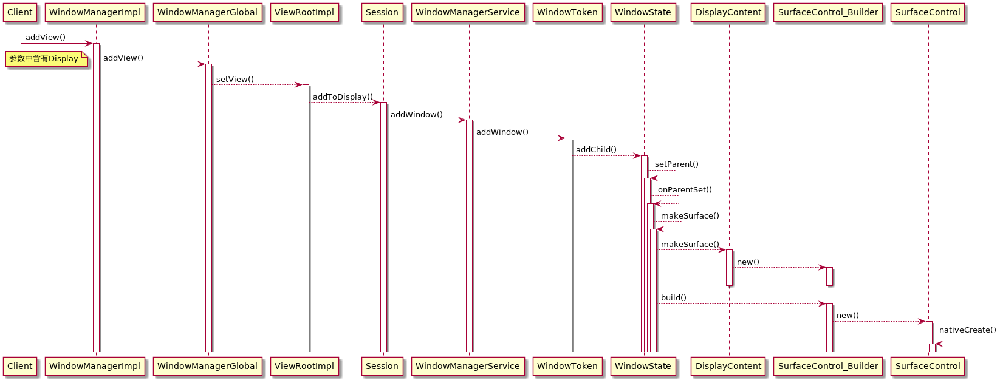
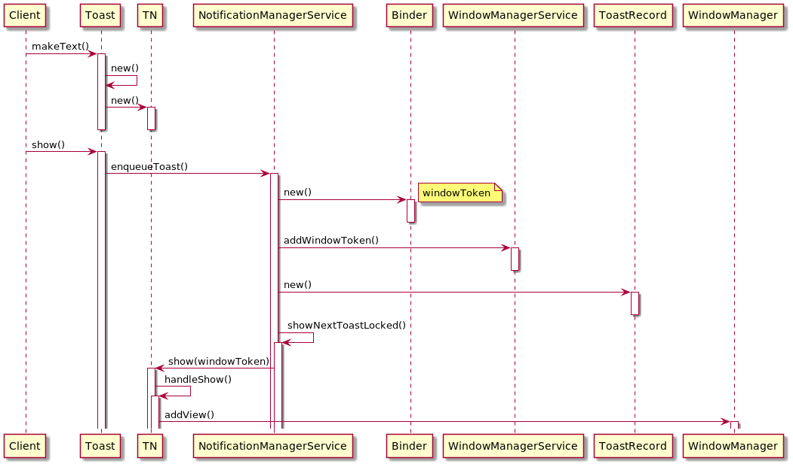

# **多屏幕环境下，Activity/Window/Toast/Dialog指定屏幕显示功能**
# Window/Toast/Dialog多屏显示的详细设计思路
## android系统添加window的逻辑

由时序图可知从addView到surface创建的整个过程中在windowmanagerImpl的addView调用处开始含有display的参数用于区分屏幕，我们只要在此处进行逻辑插入即可

具体传入屏幕参数逻辑如下：

1.在接口处的params的titile数据中加入//@DisplayId=？字段。

2.在windowmanagerImpl插入点处解析params的titile数据找到displayId，并将title数据还原。

3.通过displayId找到display对象。

4.调用WindowManagerGlobal方法并传入display对象达到window显示到不同屏幕上的需求。

原生代码插入点入口：frameworks/base/core/java/android/view/WindowManagerImpl.java
```
@Override
public void addView(@NonNull View view, @NonNull ViewGroup.LayoutParams params) {
    applyDefaultToken(params);
 
    /* xx begin */
    int ret = Plugs.aCall(Plugs.AID_WindowManagerImpl_addView, this, 4, mGlobal, view, params, mParentWindow);
    if (ret == Plugs.R_SKIP) {
        return;
    }
    /* xx end */
 
    mGlobal.addView(view, params, mContext.getDisplay(), mParentWindow);
}
```
插入点具体代码逻辑如下：vendor/xx/proprietary/xx_frames/aosp/frameworks/base/core/java/android/view/WindowManagerImplPlugs.java
```
private static int addView(WindowManagerGlobal global, View view, ViewGroup.LayoutParams params, Window mParentWindow) {
    if (!Facade.featureOn(FID_ADD_WINDOW_WITH_DISPLAY_ID)) {
        return R_FALSE;
    }
    // 解析出displayID，并还原title数据
    int displayId = getDisplayId((WindowManager.LayoutParams) params);
    if (displayId > -1) {
        // 获取display
        Display display = getDisplay(view.getContext().getApplicationContext(), displayId);
        if (display != null) {
            global.addView(view, params, display, mParentWindow);
            return R_SKIP;
        }
    }
    return R_FALSE;
}
 
// 获取display
private static Display getDisplay(Context context, int displayId) {
    DisplayManager mDm = (DisplayManager) context.getSystemService(Context.DISPLAY_SERVICE);
    Display[] displays = mDm.getDisplays();
    for (Display display : displays) {
        if (display.getDisplayId() == displayId) {
            return display;
        }
    }
    return null;
}
 
// 解析出displayID，并还原title数据
private static int getDisplayId(WindowManager.LayoutParams wparams) {
    String title = wparams.getTitle().toString();
    int index = title.indexOf(Plugs.KEY_DISPLAY_ID);
    if (index != -1) {
        String displayInfoStr = title.substring(index);
        title = title.substring(0, index);
        wparams.setTitle(title);
        index = displayInfoStr.lastIndexOf("=");
        String displayIdStr = displayInfoStr.substring(index + 1);
        if (TextUtils.isDigitsOnly(displayIdStr)) {
            int displayId = Integer.parseInt(displayIdStr);
            if (displayId > -1) {
                return displayId;
            }
        }
    }
    return -1;
}
```

# Dialog显示到不同屏幕上的逻辑
由于Dialog本质上是window，我们可以沿用5.1的逻辑添加他们到不同屏幕。

接口逻辑如下：vendor/xx/proprietary/xx_frames/src/com/xx/utils/xxManager.java
```
public static void showDisplayDialog(Dialog dialog, int displayId) {
    Window window = dialog.getWindow();
    if (window != null) {
        WindowManager.LayoutParams params = window.getAttributes();
        CharSequence title = params.getTitle();
        params.setTitle(title + Plugs.KEY_DISPLAY_ID + displayId);
        dialog.show();
    }
}
```
# Toast显示到不同屏幕上
Toast本质上也是window，我们仍然沿用5.1的逻辑添加他们到不同屏幕。但是原生接口没有可以插入titile信息的位置，我们使用text内容来插入title信息。

接口逻辑如下：vendor/xx/proprietary/xx_frames/src/com/xx/utils/xxManager.java
```
public static Toast makeDisplayToast(Context context, CharSequence text, @Toast.Duration int duration, int displayId) {
    text = text + Plugs.KEY_DISPLAY_ID + displayId;
    return Toast.makeText(context, text, duration);
}
```

原生代码插入点入口：frameworks/base/core/java/android/widget/Toast.java
```
public static Toast makeText(@NonNull Context context, @Nullable Looper looper,
        @NonNull CharSequence text, @Duration int duration) {
    Toast result = new Toast(context, looper);
 
    /* xx begin */
    ArrayList<CharSequence> list = Lists.newArrayList(text);
    int ret = Plugs.aCall(Plugs.AID_Toast_makeText, result, 2, result.mTN.mParams, list);
    if (ret == Plugs.R_TRUE) {
        text = list.get(0);
    }
    /* xx end */
 
    ...
 
    return result;
}
```
插入点具体代码逻辑如下：vendor/xx/proprietary/xx_frames/aosp/frameworks/base/core/java/android/widget/ToastPlugs.java
```
private static int makeText(WindowManager.LayoutParams params, ArrayList<CharSequence> list) {
    if (!Facade.featureOn(FID_SHOW_TOAST_WITH_DISPLAY_ID)) {
        return R_FALSE;
    }
 
    String textStr = list.get(0).toString();
    int index = textStr.indexOf(Plugs.KEY_DISPLAY_ID);
    if (index != -1) {
        // 插入displayID信息到title，并还原Toast的text内容
        String displayInfoStr = textStr.substring(index);
        params.setTitle(params.getTitle() + displayInfoStr);
        list.set(0, textStr.substring(0, index));
        return R_TRUE;
    }
 
    return R_FALSE;
}
```
我们发现dialog是可以显示到指定屏幕的，但是Toast没有起作用。

Toast从创建到显示的逻辑如下

我们发现toast最终也是调用的windowmanager的addview方法。这一切都没有问题，问题出在了windowmanagerservice的addWindow中的token检查中未在默认屏幕找到token，返回了ADD_BAD_APP_TOKEN。我们在doesAddToastWindowRequireToken()加入插入点解决这个问题。

原生代码插入点入口：frameworks/base/services/core/java/com/android/server/wm/WindowManagerService.java
```
public int addWindow(Session session, IWindow client, int seq,
        LayoutParams attrs, int viewVisibility, int displayId, Rect outFrame,
        Rect outContentInsets, Rect outStableInsets, Rect outOutsets,
        DisplayCutout.ParcelableWrapper outDisplayCutout, InputChannel outInputChannel) {
...
if (token == null) {
...
if (type == TYPE_TOAST) {
// Apps targeting SDK above N MR1 cannot arbitrary add toast windows.
addToastWindowRequiresToken = doesAddToastWindowRequireToken(attrs.packageName,
        callingUid, parentWindow);
if (addToastWindowRequiresToken && token.windowType != TYPE_TOAST) {
    Slog.w(TAG_WM, "Attempted to add a toast window with bad token "
            + attrs.token + ".  Aborting.");
    return WindowManagerGlobal.ADD_BAD_APP_TOKEN;
}
...
}
// 检测token
private boolean doesAddToastWindowRequireToken(String packageName, int callingUid,
        WindowState attachedWindow) {
    // Try using the target SDK of the root window
    if (attachedWindow != null) {
        return attachedWindow.mAppToken != null
                && attachedWindow.mAppToken.mTargetSdk >= Build.VERSION_CODES.O;
    } else {
        // Otherwise, look at the package
        try {
            ApplicationInfo appInfo = mContext.getPackageManager()
                    .getApplicationInfoAsUser(packageName, 0,
                            UserHandle.getUserId(callingUid));
            if (appInfo.uid != callingUid) {
                throw new SecurityException("Package " + packageName + " not in UID "
                        + callingUid);
            }
 
            /* xx begin */
            int ret = Plugs.sCall(Plugs.SID_WindowManagerService_doesAddToastWindowRequireToken, this, 0);
            if (ret == Plugs.R_SKIP) {
                return false;
            }
            /* xx end */
 
            // android8以后显示Toast必须提供token参数
            if (appInfo.targetSdkVersion >= Build.VERSION_CODES.O) {
                return true;
            }
 
        } catch (PackageManager.NameNotFoundException e) {
            /* ignore */
        }
    }
    return false;
}
```

插入点具体代码逻辑如下：vendor/xx/proprietary/xx_servers/aosp/frameworks/base/services/core/java/com/android/server/wm/WindowManagerServicePlugs.java
```
private static int doesAddToastWindowRequireToken() {
    if (Facade.featureOn(FID_SHOW_TOAST_WITH_DISPLAY_ID)) {
        return R_SKIP;
    }
    return R_FALSE;
}
```
# Activity多屏显示的详细设计思路
使用原生接口启动activity到不同屏幕，我们发现，Activity是可以显示到指定屏幕，但是却总是以全屏方式显示，即使我们设置了多窗口模式的相关参数来启动，也仍然不起作用，这和我们的需求有很大的差异。

通过adb调试我们发现启动activity到不同屏幕，在非主屏无论我们启动多少个Activity，他们始终在一个栈中，并且windowmode是fullscreen的
```
adb shell am stack list
 
 
Stack id=10 bounds=[0,0][1920,720] displayId=1 userId=0
 configuration={1.0 ?mcc?mnc1theme [zh_CN] ldltr sw540dp w1442dp h540dp 213dpi lrg long land car night finger -keyb/v/h -nav/h winConfig={ mBounds=Rect(0, 0 - 1920, 720) mAppBounds=Rect(0, 0 - 1920, 720) mWindowingMode=fullscreen mActivityType=standard} s.4}
  taskId=91: com.xx.xx30demo/com.xx.xx30demo.Freemode2Activity bounds=[0,0][1920,720] userId=0 visible=true topActivity=ComponentInfo{com.android.settings/com.android.settings.Settings}
  taskId=92: com.android.settings/com.android.settings.Settings bounds=[0,0][1920,720] userId=0 visible=true topActivity=ComponentInfo{com.android.settings/com.android.settings.Settings}
```
根据上面Activity的启动逻辑的时序图，我们定位到是getLaunchStack()方法出了问题。

原生代码插入点入口：frameworks/base/services/core/java/com/android/server/am/ActivityStackSupervisor.java
```
<T extends ActivityStack> T getLaunchStack(@Nullable ActivityRecord r,
        @Nullable ActivityOptions options, @Nullable TaskRecord candidateTask, boolean onTop,
        int candidateDisplayId) {
...
// We give preference to the launch preference in activity options.
if (options != null) {
    taskId = options.getLaunchTaskId();
    displayId = options.getLaunchDisplayId();
    // TODO: Need to work this into the equation...
    //bounds = options.getLaunchBounds();
}
...
// options设置了displayid会走进下面的逻辑
if (displayId != INVALID_DISPLAY && canLaunchOnDisplay(r, displayId)) {
 
    /* xx begin */
    ArrayList<T> list = new ArrayList<>();
    int ret = Plugs.sCall(Plugs.SID_ActivityStackSupervisor_getLaunchStack, this, 7,
        displayId, r, options, candidateTask, activityType, onTop, list);
    if (ret == Plugs.R_TRUE) {
        return list.get(0);
    }
    /* xx end */
 
    if (r != null) {
    // TODO: This should also take in the windowing mode and activity type into account.
    // 返回该屏幕的top Stack，如果没有则创建fullscreen的stack
    stack = (T) getValidLaunchStackOnDisplay(displayId, r);
        if (stack != null) {
            return stack;
        }
    }
...
}
 
/**
 * Get a topmost stack on the display, that is a valid launch stack for specified activity.
 * If there is no such stack, new dynamic stack can be created.
 * @param displayId Target display.
 * @param r Activity that should be launched there.
 * @return Existing stack if there is a valid one, new dynamic stack if it is valid or null.
 */
ActivityStack getValidLaunchStackOnDisplay(int displayId, @NonNull ActivityRecord r) {
...
}
```

我们在getLaunchStack方法的获取displayid屏幕stack逻辑处加入插入点。通过displayId和ActivityOptions控制返回的Stack。需要注意options设置了displayID都会走此逻辑（默认displayID为-1）。另外需要控制区分全屏 windowmode及freemode windowmode所在的stack，以支持他们之间的切换。

插入点具体代码逻辑如下：vendor/xx/proprietary/xx_servers/aosp/frameworks/base/services/core/java/com/android/server/am/ActivityStackSupervisorPlugs.java

```
public static int getLaunchStack(ActivityStackSupervisor activityStackSupervisor, int displayId, ActivityRecord r,
                                 ActivityOptions options, TaskRecord candidateTask, int activityType, boolean onTop, ArrayList list) {
    if (!Facade.featureOn(FID_SHOW_FREE_MODE_ACTIVITY_WITH_DISPLAY_ID)) {
        return R_FALSE;
    }
    int windowingMode = (options != null) ? options.getLaunchWindowingMode() : WINDOWING_MODE_UNDEFINED;
    if ((windowingMode == WindowConfiguration.WINDOWING_MODE_FREEFORM || windowingMode == WINDOWING_MODE_UNDEFINED)) {
        final ActivityDisplay display = activityStackSupervisor.getActivityDisplayOrCreateLocked(displayId);
        if (display != null) {
            // getOrCreateStack逻辑
            ActivityStack<?> stack = display.getOrCreateStack(r, options, candidateTask, activityType, onTop);
            if (stack != null) {
                list.add(0, stack);
                return R_TRUE;
            }
        }
    }
    return R_FALSE;
}
```
另外，我们发现在startActivity的最后执行handleNonResizableTaskIfNeeded()时，强制的把task的windowmode修改了为WINDOWING_MODE_FULLSCREEN_OR_SPLIT_SCREEN_SECONDARY，这导致我们的多窗口一直全屏显示。

原生代码插入点入口：frameworks/base/services/core/java/com/android/server/am/ActivityStackSupervisor.java
```
void handleNonResizableTaskIfNeeded(TaskRecord task, int preferredWindowingMode,
        int preferredDisplayId, ActivityStack actualStack, boolean forceNonResizable) {
...
// Handle incorrect launch/move to secondary display if needed.
if (isSecondaryDisplayPreferred) {
    final int actualDisplayId = task.getStack().mDisplayId;
    if (!task.canBeLaunchedOnDisplay(actualDisplayId)) {
        throw new IllegalStateException("Task resolved to incompatible display");
    }
    // The task might have landed on a display different from requested.
    // TODO(multi-display): Find proper stack for the task on the default display.
 
    /* xx begin */
    int ret = Plugs.sCall(Plugs.SID_ActivityStackSupervisor_handleNonResizableTaskIfNeeded, this, 2, preferredWindowingMode, task.taskId);
    if (ret == Plugs.R_FALSE) {
        // 此处强制修改了windowmode
        mService.setTaskWindowingMode(task.taskId,
            WINDOWING_MODE_FULLSCREEN_OR_SPLIT_SCREEN_SECONDARY, true /* toTop */);
    }
    /* xx end */
 
    /* xx begin */
    // mService.setTaskWindowingMode(task.taskId,
        WINDOWING_MODE_FULLSCREEN_OR_SPLIT_SCREEN_SECONDARY, true /* toTop */);
    /* xx end */
...
}
```

我们在刷新task window的方法上进行逻辑插入，通过displayId和ActivityOptions进行windowmode的修改。

插入点具体代码逻辑如下：vendor/xx/proprietary/xx_servers/aosp/frameworks/base/services/core/java/com/android/server/am/ActivityStackSupervisorPlugs.java
```
public static int handleNonResizableTaskIfNeeded(ActivityStackSupervisor activityStackSupervisor, int preferredWindowingMode, int taskId) {
    if (!Facade.featureOn(FID_SHOW_FREE_MODE_ACTIVITY_WITH_DISPLAY_ID)) {
        return R_FALSE;
    }
    if (preferredWindowingMode == WindowConfiguration.WINDOWING_MODE_FREEFORM) {
        activityStackSupervisor.mService.setTaskWindowingMode(taskId,
                WindowConfiguration.WINDOWING_MODE_FREEFORM, true /* toTop */);
        return R_TRUE;
    }
    return R_FALSE;
}
```
# 兼容策略

Window/Toast/Dialog是以android官方通用参数形式进行多屏幕显示的解析控制，较好的进行了解偶，后续rom升级可以达到完全兼容。

Activity的多屏显示则严格控制插入点个数，通过调用原生api的方式达到兼容后续rom的升级的目的。

# 容错控制

1.将display协议信息隐藏在接口中，接口调用者是无感知的，调用者只需传递displayid参数即可达到显示在不同屏幕的目的，隐藏displayId协议信息减少了使用中出错的概率。

2.window显示传入了非法的type参数，可能引起跳出插入点继续addView异常，开放平台框架此处已经进行容错处理。

3.原生代码修改的原则为，尽量精简原生代码插入点入口逻辑，将主逻辑放入Plugs中，防止过多在原生代码处反复修改，减少aosp不同项目porting代码时出错概率。

4.原生代码的修改标注格式为 以/* xx begin */ 开始 ，以/* xx end */结束，便于快速定位修改点，减少合并代码错误概率。
```
/* xx begin */
int ret = Plugs.sCall(Plugs.SID_WindowManagerService_doesAddToastWindowRequireToken, this, 0);
if (ret == Plugs.R_SKIP) {
    return false;
}
/* xx end */
```