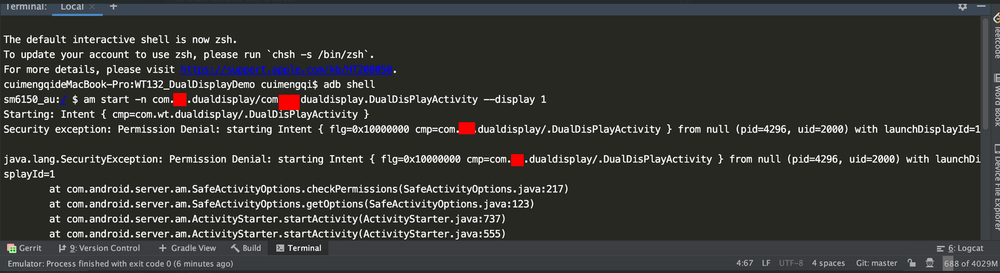

# **多屏显示情况下外屏displayId有差异化的原因**
# 一，背景
调试XX70双屏显示时，调用仪表盘app使其显示在外屏，使用adb 调试命令失效
```
am start -n com.xx.dualdisplay/com.xx.dualdisplay.DualDisPlayActivity --display 1
```
# 二，异常log


# 三，调试
调试发现通过displayid未找到Display设备

## SafeActivityOptions.java
```
private void checkPermissions(@Nullable Intent intent, @Nullable ActivityInfo aInfo,
        @Nullable ProcessRecord callerApp, ActivityStackSupervisor supervisor,
        ActivityOptions options, int callingPid, int callingUid) {
...
 
// Check if someone tries to launch an activity on a private display with a different
// owner.
final int launchDisplayId = options.getLaunchDisplayId();
if (aInfo != null && launchDisplayId != INVALID_DISPLAY
        && !supervisor.isCallerAllowedToLaunchOnDisplay(callingPid, callingUid,
                launchDisplayId, aInfo)) {
    final String msg = "Permission Denial: starting " + getIntentString(intent)
            + " from " + callerApp + " (pid=" + callingPid
            + ", uid=" + callingUid + ") with launchDisplayId="
            + launchDisplayId;
    Slog.w(TAG, msg);
    throw new SecurityException(msg); //抛出异常的点
}
...
}
```
## ActivityStackSupervisor.java
```
/** Check if caller is allowed to launch activities on specified display. */
boolean isCallerAllowedToLaunchOnDisplay(int callingPid, int callingUid, int launchDisplayId,
                                         ActivityInfo aInfo) {
...
 
final ActivityDisplay activityDisplay = getActivityDisplayOrCreateLocked(launchDisplayId);
if (activityDisplay == null) { //抛出异常的原因
    Slog.w(TAG, "Launch on display check: display not found");
    return false;
}
...
}
```
## DisplayManagerService.java
```
...
// List of all logical displays indexed by logical display id.
private final SparseArray<LogicalDisplay> mLogicalDisplays =
        new SparseArray<LogicalDisplay>();// 不含有display == 1的外接设备
 
...
```

# 四，找不到displayInfo的原因
## 1，DisplayManagerService.java中mLogicalDisplays添加屏幕设备的逻辑
```
// Adds a new logical display based on the given display device.
// Sends notifications if needed.
private LogicalDisplay addLogicalDisplayLocked(DisplayDevice device) {
...
final int displayId = assignDisplayIdLocked(isDefault, device.getPhysicalId()); //获取displayId的
...
mLogicalDisplays.put(displayId, display);
...
}
```
## 2，物理设备id 在区间[5,7]时，displayID  在4096基础上递增 
```
private int mNextBuiltInDisplayId = 4096;
/**
 * Built-in physical display id: Additional Built-in display id range.
 * HDMI display ID range will be HDMI ID to EXT_MIN ID.
 * Built-in display ID range will bee EXT_MIN ID to EXT_MAX ID.
 * Use only with {@link SurfaceControl#getBuiltInDisplay(int)}.
 */
public static final int BUILT_IN_DISPLAY_ID_EXT_MIN = 5;
public static final int BUILT_IN_DISPLAY_ID_EXT_MAX = 7;
 
private int assignDisplayIdLocked(boolean isDefault, int physicalId) { // 和物理ID有关
    if (physicalId >= SurfaceControl.BUILT_IN_DISPLAY_ID_EXT_MIN &&
        physicalId <= SurfaceControl.BUILT_IN_DISPLAY_ID_EXT_MAX) {
        return mNextBuiltInDisplayId++;
    }
 
    return assignDisplayIdLocked(isDefault);
}
```

## 3，物理设备id 不在区间[5,7]时，displayID从 DEFAULT_DISPLAY 递增
```
public static final int DEFAULT_DISPLAY = 0;
private int mNextNonDefaultDisplayId = Display.DEFAULT_DISPLAY + 1;
 
private int assignDisplayIdLocked(boolean isDefault) {
    return isDefault ? Display.DEFAULT_DISPLAY : mNextNonDefaultDisplayId++;
}
```

# 五，结论
屏幕的displayID与屏幕的物理ID有关，不总是1，（注：内屏displayID总为0）

# 六，如何快速获取外屏id 进行双屏调试
```
adb shell dumpsys display
```

```
Logical Displays: size=2
  Display 0:
    mDisplayId=0
    mLayerStack=0
    mHasContent=true
    mRequestedMode=0
    mRequestedColorMode=0
    mDisplayOffset=(0, 0)
    mPrimaryDisplayDevice=内置屏幕
    mBaseDisplayInfo=DisplayInfo{"内置屏幕", uniqueId "local:0", app 1920 x 720, real 1920 x 720, largest app 1920 x 720, smallest app 1920 x 720, mode 1, defaultMode 1, modes [{id=1, width=1920, height=720, fps=60.000004}], colorMode 0, supportedColorModes [0], hdrCapabilities android.view.Display$HdrCapabilities@40f16308, rotation 0, density 160 (320.842 x 320.842) dpi, layerStack 0, appVsyncOff 1000000, presDeadline 16666666, type BUILT_IN, state ON, FLAG_SECURE, FLAG_SUPPORTS_PROTECTED_BUFFERS, removeMode 0}
    mOverrideDisplayInfo=DisplayInfo{"内置屏幕", uniqueId "local:0", app 1920 x 608, real 1920 x 720, largest app 1920 x 1872, smallest app 720 x 608, mode 1, defaultMode 1, modes [{id=1, width=1920, height=720, fps=60.000004}], colorMode 0, supportedColorModes [0], hdrCapabilities android.view.Display$HdrCapabilities@40f16308, rotation 0, density 160 (320.842 x 320.842) dpi, layerStack 0, appVsyncOff 1000000, presDeadline 16666666, type BUILT_IN, state ON, FLAG_SECURE, FLAG_SUPPORTS_PROTECTED_BUFFERS, removeMode 0}
  Display 1:
    mDisplayId=1
    mLayerStack=1
    mHasContent=false
    mRequestedMode=0
    mRequestedColorMode=0
    mDisplayOffset=(0, 0)
    mPrimaryDisplayDevice=HDMI 屏幕
    mBaseDisplayInfo=DisplayInfo{"HDMI 屏幕", uniqueId "local:1", app 1920 x 720, real 1920 x 720, largest app 1920 x 720, smallest app 1920 x 720, mode 2, defaultMode 2, modes [{id=2, width=1920, height=720, fps=60.000004}], colorMode 0, supportedColorModes [0], hdrCapabilities android.view.Display$HdrCapabilities@40f16308, rotation 0, density 213 (213.0 x 213.0) dpi, layerStack 1, appVsyncOff 1000000, presDeadline 16666666, type HDMI, state ON, FLAG_SECURE, FLAG_SUPPORTS_PROTECTED_BUFFERS, FLAG_PRESENTATION, removeMode 0}
    mOverrideDisplayInfo=DisplayInfo{"HDMI 屏幕", uniqueId "local:1", app 1920 x 720, real 1920 x 720, largest app 1920 x 1920, smallest app 720 x 720, mode 2, defaultMode 2, modes [{id=2, width=1920, height=720, fps=60.000004}], colorMode 0, supportedColorModes [0], hdrCapabilities android.view.Display$HdrCapabilities@40f16308, rotation 0, density 213 (213.0 x 213.0) dpi, layerStack 1, appVsyncOff 1000000, presDeadline 16666666, type HDMI, state ON, FLAG_SECURE, FLAG_SUPPORTS_PROTECTED_BUFFERS, FLAG_PRESENTATION, removeMode 0}
```

## 2， 代码方式动态获取displayID并启动到第二屏
```
private void startActivityOnSecondaryDisplay(Context context) {
        int secondaryDisplayId = 0;
        DisplayManager mDm = (DisplayManager) context.getSystemService(Context.DISPLAY_SERVICE);
        Display[] displays = mDm.getDisplays();
        for (Display display : displays) {
            if (display.getDisplayId() != Display.DEFAULT_DISPLAY) {
                secondaryDisplayId = display.getDisplayId();
                break;
            }
        }
        ActivityOptions options = ActivityOptions.makeBasic();
        if (secondaryDisplayId > 0) {
            options.setLaunchDisplayId(secondaryDisplayId);
            Intent secondIntent = new Intent();
            ComponentName cn = new ComponentName("com.xx.dualdisplay", "com.xx.dualdisplay.DualDisPlayActivity");
            secondIntent.setComponent(cn);
            secondIntent.addFlags(Intent.FLAG_ACTIVITY_LAUNCH_ADJACENT | Intent.FLAG_ACTIVITY_NEW_TASK);
            context.startActivity(secondIntent, options.toBundle());
        }
    }
```
# 七，抛砖引玉

屏幕物理id的生成或定义逻辑，displaymanager对物理屏幕的管理逻辑有待深入调研。