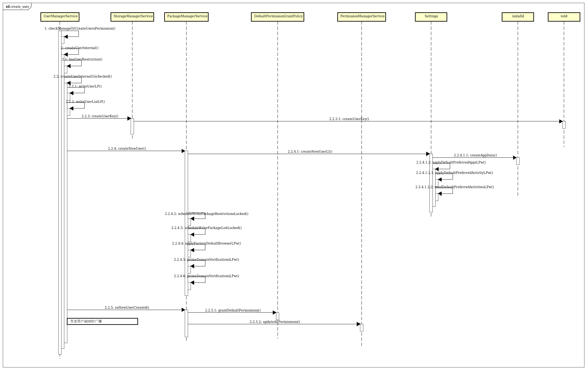
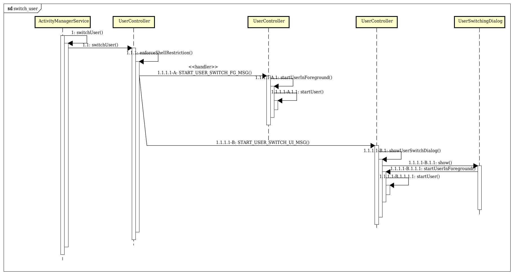
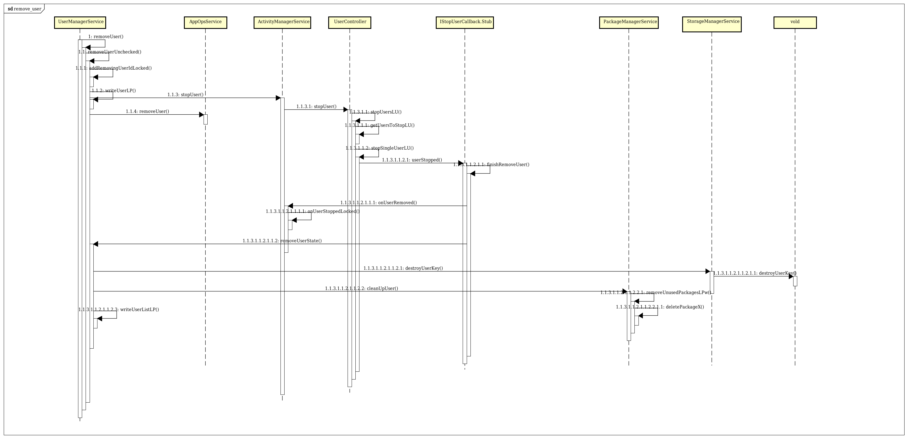

# **多用户实现应用多开**
# 一，Android和Linux下的多用户概念区别
Android是基于Linux的OS，Linux下有一套自己的账户管理体系，而Android对此有一些封装和改动。同时，Android也引进了自己的多用户功能。所以，大量的类似“uid”的概念存在于Android中
## 1.1 Linux uid/gid
Linux下的用户id（uid）和群组id（gid）。Linux是多用户系统，每个用户都拥有一个uid，这个uid由系统和用户名做映射绑定。同时，为了便于用户管理（譬如管理文档权限），Linux引入了群组的概念，可以将多个用户归于一个群组。每一个群组拥有一个群组id（gid）。 root用户：Linux下的唯一的超级用户，拥有所有的系统权限。root用户所在的组即root组。
## 1.2 Android uid/gid
在Android 4.2之前，Android不支持多用户。Android将Linux的账户管理体系用在了应用管理上。举例说明，在Android系统上安装某应用，通过adb shell查看其数据文档：
```
sailfish:/data/data/com.android.calendar # ls -ahl
total 20K
drwxr-x--x   5 u0_a49 u0_a49       4.0K 2020-09-15 04:08 .
drwxrwx--x 104 system system       4.0K 2020-09-15 04:08 ..
drwxrws--x   2 u0_a49 u0_a49_cache 4.0K 2020-09-15 04:08 cache
drwxrws--x   2 u0_a49 u0_a49_cache 4.0K 2020-09-15 04:08 code_cache
drwxrwx--x   2 u0_a49 u0_a49       4.0K 2020-09-15 04:08 shared_prefs
```
可以看到文件拥有者是u0_a49，所在群组为u0_a49。从data/system/packages.xml根据包名查看此应用信息，可以看到：userId=”10049”。 在代码中通过接口android.os.Process.myUid()来获取，也可以看到10049。 从Android源代码Process.java对于此Api的注释来看：
```
    /**
     * Returns the identifier of this process's uid.  This is the kernel uid
     * that the process is running under, which is the identity of its
     * app-specific sandbox.  It is different from {@link #myUserHandle} in that
     * a uid identifies a specific app sandbox in a specific user.
     */
    public static final int myUid() {
        return Os.getuid();
    }
```
可以看到应用进程是运行在这个Linux kernel uid下面。 在Process源代码中还能够看到一些常量定义：
```
/**
     * Defines the root UID.
     * @hide
     */
    public static final int ROOT_UID = 0;

    /**
     * Defines the UID/GID under which system code runs.
     */
    public static final int SYSTEM_UID = 1000;

    /**
     * Defines the UID/GID under which the telephony code runs.
     */
    public static final int PHONE_UID = 1001;

    /**
     * Defines the UID/GID for the user shell.
     * @hide
     */
    public static final int SHELL_UID = 2000;

    /**
     * Defines the UID/GID for the log group.
     * @hide
     */
    public static final int LOG_UID = 1007;

    /**
     * Defines the UID/GID for the WIFI supplicant process.
     * @hide
     */
    public static final int WIFI_UID = 1010;

    /**
     * Defines the UID/GID for the mediaserver process.
     * @hide
     */
    public static final int MEDIA_UID = 1013;

    /**
     * Defines the UID/GID for the DRM process.
     * @hide
     */
    public static final int DRM_UID = 1019;

    /**
     * Defines the UID/GID for the group that controls VPN services.
     * @hide
     */
    public static final int VPN_UID = 1016;

    /**
     * Defines the UID/GID for keystore.
     * @hide
     */
    public static final int KEYSTORE_UID = 1017;

    /**
     * Defines the UID/GID for the NFC service process.
     * @hide
     */
    public static final int NFC_UID = 1027;

    /**
     * Defines the UID/GID for the Bluetooth service process.
     * @hide
     */
    public static final int BLUETOOTH_UID = 1002;
```

可以看到，Android对于一些系统uid的保留定义，而且基本上每个用户自成一群组，gid与uid相同。群组的概念已经被淡化。查看某一个系统应用data/data/目录，可以看到：
```
sailfish:/data/data/com.example.usersdev # ls -ahl
total 16K
drwx------   4 system system 4.0K 2020-09-15 04:08 .
drwxrwx--x 104 system system 4.0K 2020-09-15 04:08 ..
drwxrws--x   2 system system 4.0K 2020-09-15 04:08 cache
drwxrws--x   2 system system 4.0K 2020-09-15 04:08 code_cache
```
拥有者为system，群组为system。结合上面的u0_a49，可以看到，Android会以应用为单位，分配uid/gid。这里的system、u0_a49是用户名/群组名，由android生成，与uid/gid映射匹配。 分析到这，不难理解AndroidManifest.xml中的sharedUserId属性,是Android为应用准备的uid/gid是可以共享的，其目的当然包括这样可以在不同的应用中共享数据和文件。当然，这还需要应用之间的签名匹配。 先看一下在多用户下，应用的uid怎么变化。

## 1.3 Android多用户
Android4.2开始支持多用户。Linux的uid/gid多用户体系已经被用在App管理上了，所以android重新开发了一套多用户体系，在UserManagerService中管理，PackageManagerService和ActivityManagerService中也有相关逻辑。
Android的多用户可以做到不同用户的应用的物理文件级（数据）的区分，以实现不同用户有不同的壁纸、密码，以及不同的应用等。 先看一下在多用户下，应用的uid怎么变化。 在一个有两个用户（用户id分别为0和10）的安卓设备上，在用户10下安装一个应用，此时，在0下是看不到这个应用的。 从packages.xml查看此应用的uid：userId=”10049” Process.myUid()得到uid为”1010049” Process.myUserHandle()得到”userHandle{10}” 在另一个用户0下安装此应用。 查看packages.xml，看到uid没有变化10049 Process.myUid()得到uid为”10049” Process.myUserHandle()得到”userHandle{0}” adb shell进入命令行，分别查看data/user/0和data/user/10下面此应用的数据区： 

用户0：
```
130|sailfish:/data/user/0/com.android.calendar # ls -ahl       
total 20K
drwxr-x--x   5 u0_a49 u0_a49       4.0K 2020-09-15 04:08 .
drwxrwx--x 104 system system       4.0K 2020-09-15 04:08 ..
drwxrws--x   2 u0_a49 u0_a49_cache 4.0K 2020-09-15 04:08 cache
drwxrws--x   2 u0_a49 u0_a49_cache 4.0K 2020-09-15 04:08 code_cache
drwxrwx--x   2 u0_a49 u0_a49       4.0K 2020-09-15 04:08 shared_prefs

```

用户10：
```
sailfish:/data/user/10/com.android.calendar # ls -ahl
total 20K
drwxr-x--x   5 u10_a49 u10_a49       4.0K 2020-09-22 07:24 .
drwxrwx--x 104 system  system        4.0K 2020-09-15 07:05 ..
drwxrws--x   2 u10_a49 u10_a49_cache 4.0K 2020-09-15 07:05 cache
drwxrws--x   2 u10_a49 u10_a49_cache 4.0K 2020-09-15 07:05 code_cache
drwxrwx--x   2 u10_a49 u10_a49       4.0K 2020-09-22 07:24 shared_prefs
```

可以看到，实际上应用在内部虽然有多用户，但只有一个uid，在不同的用户下，通过uid和用户id合成一个新的uid，以保证在每个用户下能够区分。 android.os.UserHandle这个类对外提供有关多用户的接口。 从里面的一些api代码可以看到uid在多用户下的处理逻辑： 多用户支持开关：
```
    /**
     * @hide Enable multi-user related side effects. Set this to false if
     * there are problems with single user use-cases.
     */
    public static final boolean MU_ENABLED = true;
```

注意一个api getUid()。这就清楚了，将用户id 10作为第一个参数， packages.xml中记录的该应用的uid 10049作为第二个参数传入，得到了这个应用在10用户下的uid——1010049！
```
    /**
     * @hide Range of uids allocated for a user.
     */
    public static final int PER_USER_RANGE = 100000;
    
    /**
     * Returns the uid that is composed from the userId and the appId.
     * @hide
     */
    public static int getUid(@UserIdInt int userId, @AppIdInt int appId) {
        if (MU_ENABLED) {
            return userId * PER_USER_RANGE + (appId % PER_USER_RANGE);
        } else {
            return appId;
        }
    }
```

通过应用的uid得到当前用户的userId，以上过程的逆过程：
```
    /**
     * Returns the user id for a given uid.
     * @hide
     */
    public static @UserIdInt int getUserId(int uid) {
        if (MU_ENABLED) {
            return uid / PER_USER_RANGE;
        } else {
            return UserHandle.USER_SYSTEM;
        }
    }
```
从另一个核心的api myUserId()更能清楚地看到应用uid和用户id的关系：

```
    /**
     * Returns the user id of the current process
     * @return user id of the current process
     * @hide
     */
    @SystemApi
    public static @UserIdInt int myUserId() {
        return getUserId(Process.myUid());
    }
```

当一个应用使用UserHandle.myUserId()来获取当前的用户id的时候，其实就是从他自己的进程得到应用的uid，然后通过上述逻辑计算出当前的用户id。 从Process.myUserHandle()也能清楚地看到这个逻辑：
```
   /**
     * Returns this process's user handle.  This is the
     * user the process is running under.  It is distinct from
     * {@link #myUid()} in that a particular user will have multiple
     * distinct apps running under it each with their own uid.
     */
    public static UserHandle myUserHandle() {
        return UserHandle.of(UserHandle.getUserId(myUid()));
    }
```
# 二，Android支持的多用户类型
## 2.1 Android设备管理使用以下用户类型：

    主要用户：添加到设备的第一个用户。除非恢复出厂设置，否则无法移除主要用户；此外，即使其他用户在前台运行，主要用户也会始终处于运行状态。该用户还拥有只有自己可以设置的特殊权限和设置。
    次要用户: 除主要用户之外添加到设备的任何用户, 次要用户可以移除（由用户自行移除或由主要用户移除），且不会影响设备上的其他用户。此类用户可以在后台运行且可以继续连接到网络。
    访客用户：临时的次要用户。访客用户设置中有明确的删除选项，当访客用户不再有用时，可快速将其删除。一次只能创建一个访客用户。

## 2.2 Android用户属性的配置
Android通过flag设置用户具备的属性，这些属性通过int数据的低16位表示，通过flag相或，可以让用户具备多个属性。flag的具体定义如下：
```
文件：frameworks/base/core/java/android/content/pm/UserInfo.java

    /**
     * *************************** NOTE ***************************
     * These flag values CAN NOT CHANGE because they are written
     * directly to storage.
     */

    /**
     * Primary user. Only one user can have this flag set. It identifies the first human user
     * on a device.
     *
     * 主用户，在设备上只有一个用户可以设置这个属性，它是设备上的第一个用户。
     */
    public static final int FLAG_PRIMARY = 0x00000001;

    /**
     * User with administrative privileges. Such a user can create and
     * delete users.
     * 具备管理权限的用户，比如具备创建和删除用户的权限
     */
    public static final int FLAG_ADMIN   = 0x00000002;

    /**
     * Indicates a guest user that may be transient.
     * 暂时存在的访客用户
     */
    public static final int FLAG_GUEST   = 0x00000004;

    /**
     * Indicates the user has restrictions in privileges, in addition to those for normal users.
     * Exact meaning TBD. For instance, maybe they can't install apps or administer WiFi access pts.
     *
     * 指明用户具有权限限制，相对普通用户，比如：这些用户不能安装应用或者是管理wifi
     */
    public static final int FLAG_RESTRICTED = 0x00000008;

    /**
     * Indicates that this user has gone through its first-time initialization.
     * 指示此用户已完成首次初始化
     */
    public static final int FLAG_INITIALIZED = 0x00000010;

    /**
     * Indicates that this user is a profile of another user, for example holding a users
     * corporate data.
     * 指示此用户是另一个用户的影子用户，例如：保存用户的企业数据
     */
    public static final int FLAG_MANAGED_PROFILE = 0x00000020;

    /**
     * Indicates that this user is disabled.
     * 指示禁用此用户
     * <p>Note: If an ephemeral user is disabled, it shouldn't be later re-enabled. Ephemeral users
     * are disabled as their removal is in progress to indicate that they shouldn't be re-entered.
     *
     * 如果临时用户被禁用，以后不应该重新启用它，临时用户被禁用，因为正在删除它们，以表明不应该重新输入它们
     */
    public static final int FLAG_DISABLED = 0x00000040;

    public static final int FLAG_QUIET_MODE = 0x00000080;

    /**
     * Indicates that this user is ephemeral. I.e. the user will be removed after leaving
     * the foreground.
     * 指示此用户是临时用户。也就是说，用户离开前台后将被删除
     */
    public static final int FLAG_EPHEMERAL = 0x00000100;

    /**
     * User is for demo purposes only and can be removed at any time.
     * 用户仅用于演示目的，是个demo, 可以在任何时候删除
     */
    public static final int FLAG_DEMO = 0x00000200;
```

# 三，创建用户的流程分析
创建用户只是创建用户相关的文件数据，不涉及到用户的切换。


# 四，切换用户的流程分析

切换用户，可以选择是否显示切换框，但是最终都会调用到startUser()方法，以开始一个用户。

# 四，删除用户的流程分析

删除用户的流程从removeUser()方法开始，中间涉及到很多流程和类，下面简单画了部分时序图。其中vold代表vold进程。


# 五，多用户实践：应用多开

通过多用户机制实现应用多开，也就是创建一个影子用户(属性设置FLAG_MANAGED_PROFILE)，影子用户开销相对较少，并且，在应用多开的场景下，在创建影子用户的时候，可以设置不安装系统应用，这样可以减少空间。以下是应用多开的demo中关于创建用户的部分。
```
package com.example.usersdev.services;

import android.app.ActivityManager;
import android.app.ActivityManagerNative;
import android.app.AppGlobals;
import android.app.IActivityManager;
import android.content.Context;
import android.content.pm.IPackageManager;
import android.content.pm.PackageManager;
import android.content.pm.UserInfo;
import android.os.Binder;
import android.os.RemoteException;
import android.os.UserHandle;
import android.os.UserManager;
import android.util.Log;

public class DoubleApp {

    public static final String TAG = "DoubleApp";
    private IPackageManager mIPackageManager;


    private int getUserIdFromUserInfo(UserInfo userInfo){
        if(userInfo == null){
            Log.i(TAG, "userInfo == null, in getUserIdFromUserInfo");
            return -1;
        }
        return userInfo.id;
    }
    private boolean startUser(int id){
        final IActivityManager am = ActivityManagerNative.getDefault();
        final long identity = Binder.clearCallingIdentity();
        try {
            return am.startUserInBackground(id);
        } catch (RemoteException re) {
            throw re.rethrowAsRuntimeException();
        } finally {
            Binder.restoreCallingIdentity(identity);
        }
    }


    /**
     * 创建一个新的用户
     * @param context
     * @param userName
     * @param flag
     * @return 返回用户id
     */
    public  int createProfile(Context context, String userName, int flag) {
        int retId = -1;
        UserManager mUserManager = (UserManager) context.getSystemService(Context.USER_SERVICE);
        UserHandle userHandle = UserHandle.getUserHandleForUid(0);
        Log.d(TAG, "userHandle = " + userHandle.toString());
        int identifier = userHandle.getIdentifier();
        Log.d(TAG, "identifier = " + identifier);
        UserInfo mUserInfo = mUserManager.createProfileForUser(userName, flag, identifier);
        if (mUserInfo == null) {
            Log.d(TAG, "get mUserInfo == null");
            return retId;
        }
        int id = getUserIdFromUserInfo(mUserInfo);
        if (id == -1) {
            Log.d(TAG, "getUserIdFromUserInfo fail");
            return retId;
        }
        if (startUser(id)) {
            return id;
        } else {
            Log.d(TAG, "startUser fail");
            return retId;
        }
    }

    /**
     * 安装已经存在的应用
     * @param packageName
     * @param userId
     * @param installFlags
     * @param installReason
     * @return
     */
    public boolean installAppAsUser(String packageName, int userId, int installFlags,
                                    int installReason){
        int ret = -1;
        Log.i(TAG, "installAppAsUser: packageName = "+packageName+", userId = "+userId+", installFlags = "+installFlags
                +", installReason= "+installReason);
        mIPackageManager = AppGlobals.getPackageManager();
        try {
            ret = mIPackageManager.installExistingPackageAsUser(packageName,userId,installFlags,installFlags);
        } catch (RemoteException e) {
            e.printStackTrace();
        }
        //PackageManager.INSTALL_SUCCEEDED is 1
        if(ret != 1){
            Log.i(TAG, "installAppAsUser error");
            return false;
        }
        Log.i(TAG, "installAppAsUser succees");
        return true;
    }


}
```