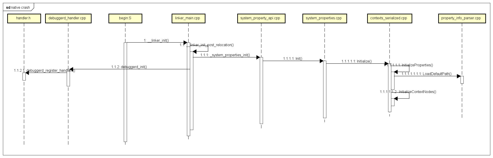
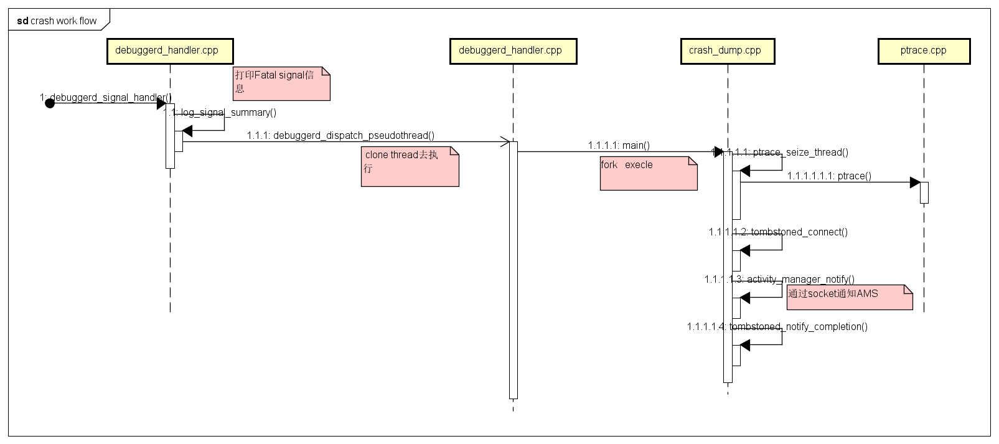
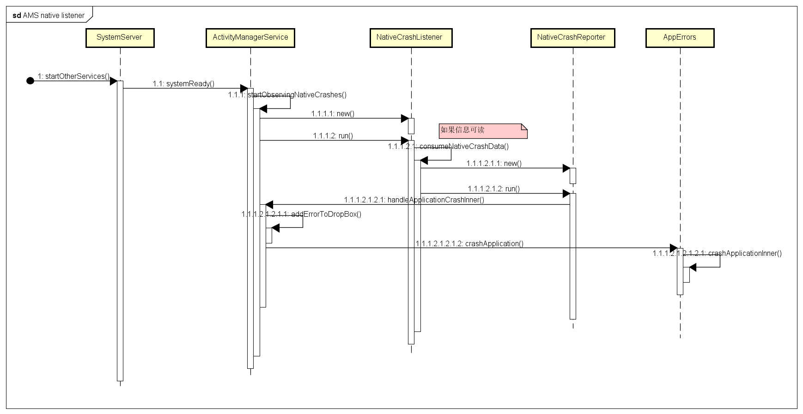

# **Native Crash 处理流程**
# signal handler的注册
Native 程序异常发生时，CPU通过异常中断的方式，触发异常处理流程。Linux kernel会将中断处理，统一为信号。应用进程在启动的时候都注册了signal handler。 Native程序的入口都在linker中，signal handler是在程序启动时注册的。 signal handler 关注如下异常信号：
```
static void __attribute__((__unused__)) debuggerd_register_handlers(struct sigaction* action) {
43    sigaction(SIGABRT, action, nullptr);
44    sigaction(SIGBUS, action, nullptr);
45    sigaction(SIGFPE, action, nullptr);
46    sigaction(SIGILL, action, nullptr);
47    sigaction(SIGSEGV, action, nullptr);
48  #if defined(SIGSTKFLT)
49    sigaction(SIGSTKFLT, action, nullptr);
50  #endif
51    sigaction(SIGSYS, action, nullptr);
52    sigaction(SIGTRAP, action, nullptr);
53    sigaction(DEBUGGER_SIGNAL, action, nullptr);
54  }

```

流程图如下：


# 发生native crash之后 底层的处理逻辑

当有异常信号发生时，signal handler 执行信号处理逻辑：

    首先打印summary 信息， "Fatal signal %d (%s), code %d (%s)%s in tid %d (%s), pid %d (%s)"
    然后fork 子进程exec去执行crash dump
    crash dump 通过ptrace 获取相关trace然后保存到tombstone
    最后crash dump通过socket通知AMS 发生native crash
流程图如下：


# AMS侧处理逻辑

    Android 开机时，AMS 就启动了native crash listener，通过监听socket 来监测native crash的发生
    当/data/system/ndebugsocket有可读信息时，触发AMS natvice crash处理流程，弹出应用崩溃对话框
