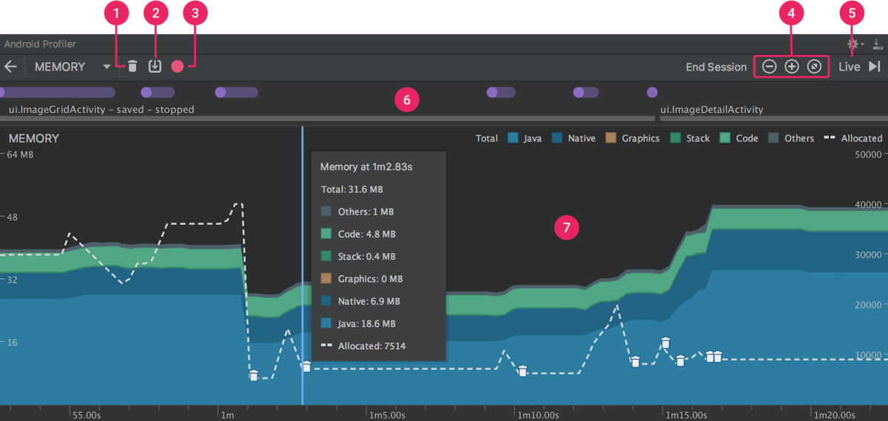
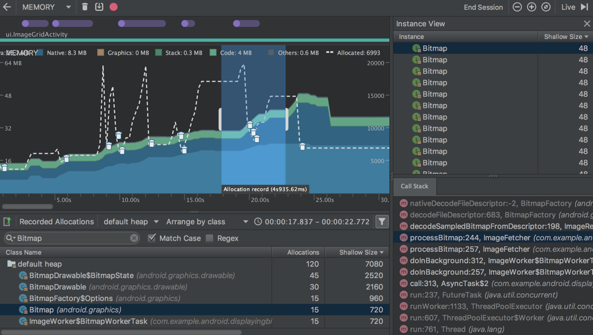
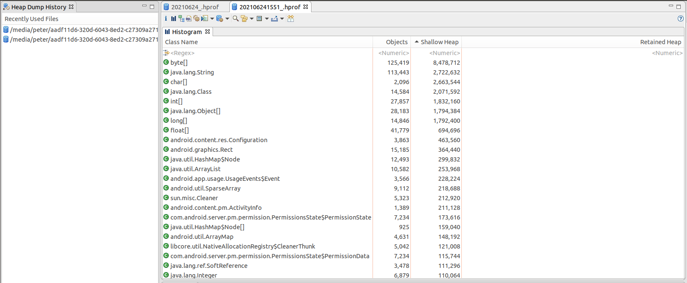
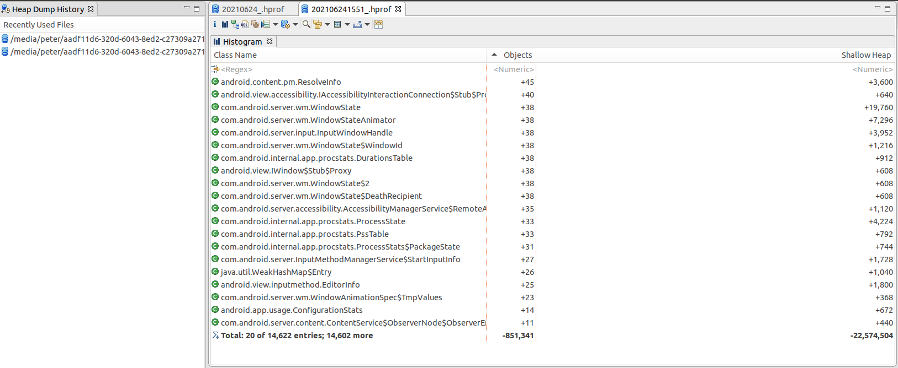
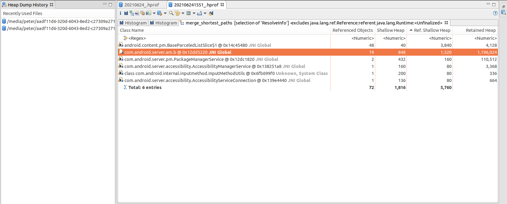

# **进程内存分析**
# 一. 宏观了解当前进程的内存分配情况

使用dumpsys meminfo可以使我们从宏观了解下当前进程的内存具体分配情况。

dumpsys meminfo是android平台AMS提供的一种获取内存信息的方法。这个命令可以帮助我们快速了解进程的内存占用情况。相关源码位置：

frameworks/base/services/core/java/com/android/server/am/ActivityManagerService.java  line18824
## 1. dumpsys meminfo相关参数说明
```
adb shell dumpsys meminfo -h

meminfo dump options: [-a] [-d] [-c] [-s] [--oom] [process]
  -a: include all available information for each process.
  -d: include dalvik details.
  -c: dump in a compact machine-parseable representation.
  -s: dump only summary of application memory usage.
  -S: dump also SwapPss.
  --oom: only show processes organized by oom adj.
  --local: only collect details locally, don't call process.
  --package: interpret process arg as package, dumping all
             processes that have loaded that package.
  --checkin: dump data for a checkin
  --proto: dump data to proto
If [process] is specified it can be the name or
pid of a specific process to dump.
```
## 2.例子
```
adb shell dumpsys meminfo 16369


Applications Memory Usage (in Kilobytes):
Uptime: 18324693 Realtime: 18324693
 
** MEMINFO in pid 16369 [com.xx.xx30unittest] **
                   Pss  Private  Private  SwapPss     Heap     Heap     Heap
                 Total    Dirty    Clean    Dirty     Size    Alloc     Free
                ------   ------   ------   ------   ------   ------   ------
  Native Heap     9408     9328        0        0    24576    11674    12901
  Dalvik Heap     1504     1388        0        0     3069     1533     1536
 Dalvik Other     4032     4012        0        0                          
        Stack       92       92        0        0                          
       Ashmem        2        0        0        0                          
      Gfx dev     1016     1016        0        0                          
    Other dev       16        0       16        0                          
     .so mmap     2145      196       68        0                          
    .apk mmap      420        0       72        0                          
    .ttf mmap      143        0       44        0                          
    .dex mmap     1996        4      496        0                          
    .oat mmap       32        0        0        0                          
    .art mmap     2673     2548        0        0                          
   Other mmap       12        4        0        0                          
   EGL mtrack    29088    29088        0        0                          
    GL mtrack     2664     2664        0        0                          
      Unknown      775      748        0        0                          
        TOTAL    56018    51088      696        0    27645    13207    14437
  
 App Summary
                       Pss(KB)
                        ------
           Java Heap:     3936
         Native Heap:     9328
                Code:      880
               Stack:       92
            Graphics:    32768
       Private Other:     4780
              System:     4234
  
               TOTAL:    56018       TOTAL SWAP PSS:        0
  
 Objects
               Views:       42         ViewRootImpl:        2
         AppContexts:        7           Activities:        2
              Assets:        2        AssetManagers:        0
       Local Binders:       33        Proxy Binders:       34
       Parcel memory:        7         Parcel count:       26
    Death Recipients:        1      OpenSSL Sockets:        0
            WebViews:        0
  
 SQL
         MEMORY_USED:        0
  PAGECACHE_OVERFLOW:        0          MALLOC_SIZE:        0
```

# 3.结果字段解析

|name|des|
|-|-|
|Uptime| 表示启动到现在的时长，不包含休眠的时间，单位毫秒(ms)|
|Realtime|表示启动到现在的时长，包含休眠的时间，单位毫秒(ms)|
|Native Heap	|c 中malloc出来的堆空间|
|Dalvik Heap	|java中new出来的java堆空间|
|Heap Size	|堆空间容量大小|
|Heap Alloc	|堆空间使用大小（虚拟内存）|
|Pss	|占用的真实的物理内存的空间|

具体参数含义在源码中

android/frameworks/base/core/java/android/app/ActivityThread.java line2251
android/frameworks/base/core/java/android/os/Debug.java line57

# 4.关于dumpsys
## 解决timeout问题
```
*** SERVICE 'meminfo' DUMP TIMEOUT (10000ms) EXPIRED ***
```

```
adb shell dumpsys -t 20 meminfo
```
## dumpsys扩展

```
adb shell dumpsys -h
usage: dumpsys
         To dump all services.
or:
       dumpsys [-t TIMEOUT] [--priority LEVEL] [--help | -l | --skip SERVICES | SERVICE [ARGS]]
         --help: shows this help
         -l: only list services, do not dump them
         -t TIMEOUT_SEC: TIMEOUT to use in seconds instead of default 10 seconds
         -T TIMEOUT_MS: TIMEOUT to use in milliseconds instead of default 10 seconds
         --proto: filter services that support dumping data in proto format. Dumps               will be in proto format.
         --priority LEVEL: filter services based on specified priority
               LEVEL must be one of CRITICAL | HIGH | NORMAL
         --skip SERVICES: dumps all services but SERVICES (comma-separated list)
         SERVICE [ARGS]: dumps only service SERVICE, optionally passing ARGS to it
```
```
adb shell dumpsys -l
 
Currently running services:
  DockObserver
  MinkBinderSvc
  SurfaceFlinger
  accessibility
  account
  activity
  alarm
  android.os.UpdateEngineService
  android.security.keystore
  android.service.gatekeeper.IGateKeeperService
  appops
  appwidget
  audio
  autofill
  battery
  batteryproperties
  batterystats
  binder_calls_stats
  bluetooth_manager
  car_service
  carrier_config
  clipboard
  cneservice
  com.android.car.procfsinspector
  commontime_management
  companiondevice
  connectivity
  connmetrics
  consumer_ir
  content
  contexthub
  country_detector
  cpuinfo
  crossprofileapps
  dbinfo
  device_identifiers
  device_policy
  deviceidle
  devicestoragemonitor
  diskstats
  display
  dpmservice
  dreams
  drm.drmManager
  dropbox
  gfxinfo
  gpu
  graphicsstats
  hardware_properties
  imms
  incident
  input
  input_method
  installd
  iphonesubinfo
  ipsec
  isms
  isub
  jobscheduler
  launcherapps
  location
  lock_settings
  media.audio_flinger
  media.audio_policy
  media.camera
  media.camera.proxy
  media.drm
  media.extractor
  media.extractor.update
  media.metrics
  media.player
  media.resource_manager
  media.sound_trigger_hw
  media_projection
  media_router
  media_session
  meminfo
  mount
  netd
  netd_listener
  netpolicy
  netstats
  network_management
  network_score
  network_time_update_service
  network_watchlist
  notification
  oem_lock
  otadexopt
  overlay
  package
  package_native
  perfprofd
  permission
  persistent_data_block
  phone
  pinner
  power
  processinfo
  procstats
  recovery
  restrictions
  scheduling_policy
  search
  sec_key_att_app_id_provider
  secure_element
  sensorservice
  serial
  servicediscovery
  settings
  shortcut
  simphonebook
  sip
  slice
  soundtrigger
  stats
  statscompanion
  statusbar
  storaged
  storaged_pri
  storagestats
  system_update
  telecom
  telephony.registry
  textclassification
  textservices
  thermalservice
  trust
  uimode
  updatelock
  usagestats
  user
  vibrator
  virtualcar_input_service
  virtualcar_service
  voiceinteraction
  vold
  vrmanager
  wallpaper
  webviewupdate
  wifi
  wificond
  wifiscanner
  window
  xx.bluetooth
  xx_service
  xxcallback
  xxtheme
```  
# 二.使用Memory Profiler查看 Java 堆和内存分配

内存性能分析器是 Android Profiler 中的一个组件，可帮助查看进程的内存情况。官网地址:https://developer.android.google.cn/studio/profile/memory-profiler.html#overview
## 1.Memory Profiler简介


1.用于强制执行垃圾回收 Event 的按钮。

2.用于保存dump heap的按钮。

3.用于记录内存分配情况的按钮。 此按钮仅在连接至运行 Android 7.1 或更低版本的设备时才会显示。

4.用于放大/缩小时间线的按钮。

5.用于跳转至实时内存数据的按钮。

6.Event 时间线，其显示 Activity 状态、用户输入 Event 和屏幕旋转 Event。

7.内存使用量时间线

## 2.查看某个时间段内存情况


可以使用dump heap的按钮或Event时间线拖动的方式查看

1.点击 Class Name 列标题以按字母顺序排序。 然后点击一个类名称。 此时在右侧将出现 Instance View 窗格，显示该类的每个实例。

2.在 Instance View 窗格中，点击一个实例。 此时下方将出现 Call Stack 标签，显示该实例被分配到何处以及哪个线程中。
# 三.内存泄漏分析工具
## 1.LeakCanary

LeakCanary是Square公司为Android开发者提供的一个自动检测内存泄漏的工具，官网地址：https://square.github.io/leakcanary/

主要原理：用引用队列监听某个对象的弱引用是否被回收，来判断对象是否有泄漏。

使用方法简单，官网说明文档比较详细，此处不再赘述。
## 2.MAT

Eclipse Memory Analyzer  Tools（MAT）是一个功能丰富且轻量的 Java 堆内存分析工具，可以用来辅助发现内存泄漏减少内存占用。官网：http://wiki.eclipse.org/MemoryAnalyzer
### 1.dumpHeap

dumpheap是android平台AMS提供的一种获取堆内存快照的方法。相关源码位置：frameworks/base/services/core/java/com/android/server/am/ActivityManagerShellCommand.java
#### 1) dumpheap相关参数说明
```
adb shell am -h | grep dumpheap -A 6

dumpheap [--user <USER_ID> current] [-n] [-g] <PROCESS> <FILE>
    Dump the heap of a process.  The given <PROCESS> argument may
      be either a process name or pid.  Options are:
    -n: dump native heap instead of managed heap
    -g: force GC before dumping the heap
    --user <USER_ID> | current: When supplying a process name,
        specify user of process to dump; uses current user if not specified.
```        
#### 2) 获取堆内存快照
```
adb shell am dumpheap -g 16369 /sdcard/peter_20210805.hprof
```
注：-g 参数可以在dumpheap前进行强制gc操作

-g 参数的主动强制内存回收代码逻辑，有一定的参考价值：frameworks/base/core/java/android/app/ActivityThread.java
```
static void handleDumpHeap(DumpHeapData dhd) {
    if (dhd.runGc) {
        System.gc();
        System.runFinalization();
        System.gc();
    }
    ...
}
```
#### 3）转换hprof文件格式

使用工具Android/Sdk/platform-tools/hprof-conv 转换成MAT能识别的hprof文件格式
```
hprof-conv peter_20210805.hprof peter_20210805_.hprof
```

### 2.抓2次hprof内存信息并导入MAT

### 3.对比分析内存占用情况。

### 4. 分析可疑对象, 找出gc root，分析内存泄漏点

