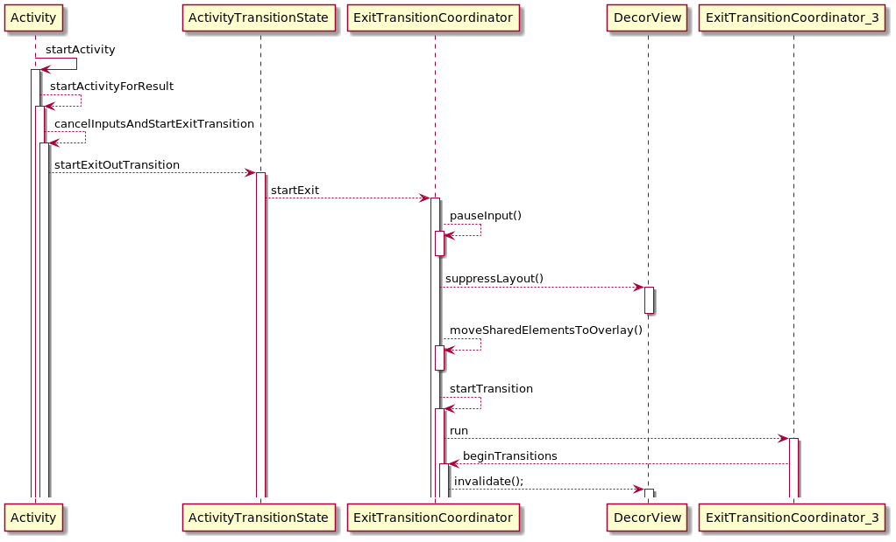
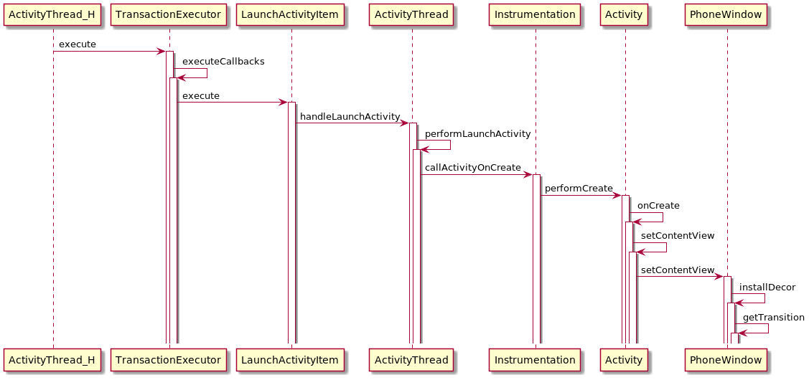
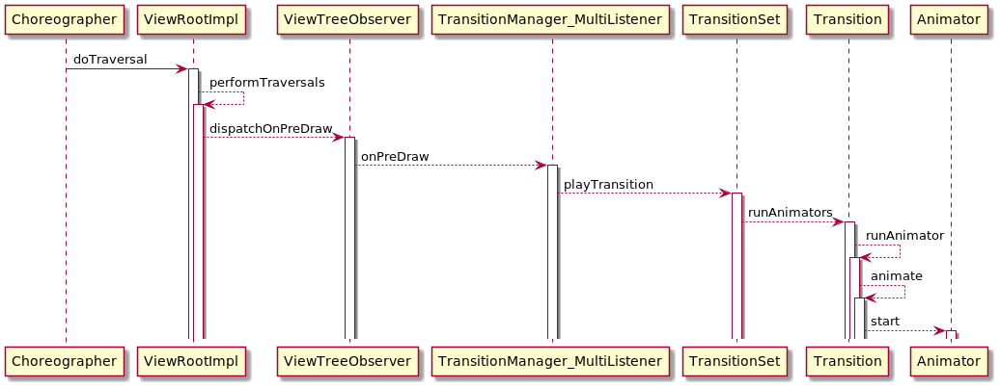

# **Framework共享元素动画逻辑**
android framework中的共享元素动画可以跨window共享view，可以做到view从一个activity非常平滑的做动画过渡到另一个activity中，显示效果非常酷炫，为了丰富系统显示效果修改及扩展系统动画有必要对此处逻辑做一个梳理。具体逻辑通过下面的一个demo做详细分析。
# 一.通用接口实现的一个共享元素动画demo：
## 场景1 
### SceneActivity1.java：
```
// 启动 SceneActivity2
startActivity(new Intent(SceneActivity1.this, SceneActivity2.class),
ActivityOptions.makeSceneTransitionAnimation(this, findViewById(R.id.img), "share").toBundle());
```
### activity_scene1.xml
```
<?xml version="1.0" encoding="utf-8"?>
<LinearLayout xmlns:android="http://schemas.android.com/apk/res/android"
    xmlns:tools="http://schemas.android.com/tools"
    android:layout_width="match_parent"
    android:layout_height="match_parent"
    android:background="@color/colorPrimaryDark"
    android:orientation="horizontal"
    android:padding="80dp"
    tools:context=".MainActivity">
 
    <ImageView
        android:id="@+id/img"
        android:layout_width="300dp"
        android:layout_height="300dp"
        android:transitionName="share" //共享元素标记
        android:background="@color/colorPrimary"
        android:src="@drawable/abc_vector_test" />
 
</LinearLayout>

```

## 场景2
### SceneActivity2.java
```
protected void onCreate(@Nullable Bundle savedInstanceState) {
    super.onCreate(savedInstanceState);
    setContentView(R.layout.activity_scene2);
    //监听共享元素动画
    getWindow().getSharedElementEnterTransition().addListener(new TransitionListenerAdapter() {
        @Override
        public void onTransitionStart(Transition transition) {
            View view = findViewById(R.id.img2);
            ObjectAnimator animator = ObjectAnimator.ofFloat(view, "rotation", 0f, 360f);
            animator.setDuration(500);
            animator.start();
        }
 
        @Override
        public void onTransitionEnd(Transition transition) {
     
        }
    });
 
}
```

### activity_scene2.xml
```
<?xml version="1.0" encoding="utf-8"?>
<LinearLayout xmlns:android="http://schemas.android.com/apk/res/android"
    xmlns:tools="http://schemas.android.com/tools"
    android:layout_width="match_parent"
    android:layout_height="match_parent"
    android:orientation="horizontal"
    android:background="@color/colorPrimaryDark"
    android:padding="80dp"
    tools:context=".MainActivity">
 
    <View
        android:id="@+id/v"
        android:background="@android:color/white"
        android:layout_width="300dp"
        android:layout_height="300dp"/>
 
    <ImageView
        android:id="@+id/img"
        android:layout_width="600dp"
        android:layout_height="600dp"
        android:transitionName="share" //共享元素标记
        android:background="@color/colorPrimary"
        android:src="@drawable/abc_vector_test" />
 
    <ImageView
        android:id="@+id/img2"
        android:layout_width="300dp"
        android:layout_height="300dp"
        android:background="@color/colorPrimary"
        android:src="@android:drawable/ic_lock_lock" />
 
</LinearLayout>
```

# 二.具体逻辑的uml图
## 1.场景1共享元素exit动画
以Activity的startActivity()作为入口，触发了ActivityTransitionState的startExit()



## 2.场景2共享元素enter动画
以Activity的onCreate()为重要标记，触发了PhoneWindow的getTransition()


## 3.具体执行动画的逻辑
场景1和场景2的动画触发逻辑一致，在编舞者触发的重绘后的第一帧为起点，触发了Transition的runAnimator()


# 三.抛砖引玉
1. 共享view动画在哪一层绘制。关键词：GhostView, ViewGroupOverlay
2. 不同activity之间动画如何信息同步。关键词：ResultReceiver