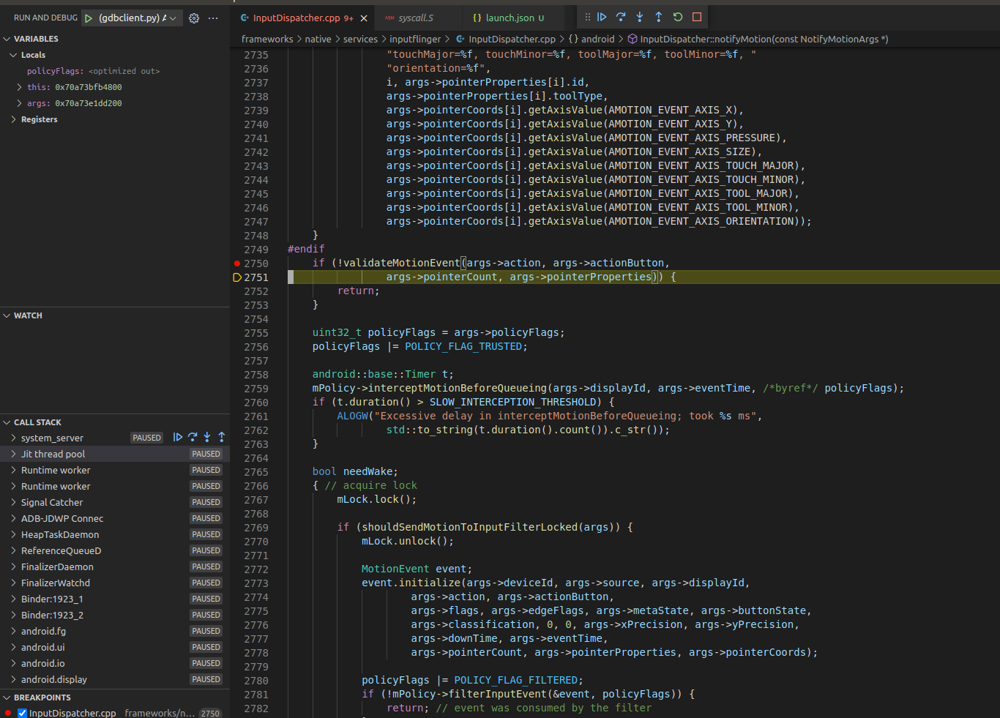

# 使用VsCode调试Android Framework C/C++源代码

AndroidStudio支持对Framework中的java源码调试，这极大方便了我们对源码逻辑的跟踪及调试。但是AndroidStudio不支持对C/C++的调试，通常我们使用gdb对C/C++源码进行跟踪调试[https://www.gnu.org/software/gdb/](https://www.gnu.org/software/gdb/)，但是使用gdb调试及为不便，效率不高。android官网推荐我们使用VsCode + gdb进行调试[https://source.android.google.cn/devices/tech/debug/gdb?hl=zh-cn](https://source.android.google.cn/devices/tech/debug/gdb?hl=zh-cn)，具体使用过程如下:

## 1.下载源码并编译

## 2.启动emulator模拟器 <a id="id-&#x4F7F;&#x7528;VsCode&#x8C03;&#x8BD5;AndroidFrameworkC/C++&#x6E90;&#x4EE3;&#x7801;-2.&#x542F;&#x52A8;emulator&#x6A21;&#x62DF;&#x5668;"></a>

## 3.查找System\_Server进程 <a id="id-&#x4F7F;&#x7528;VsCode&#x8C03;&#x8BD5;AndroidFrameworkC/C++&#x6E90;&#x4EE3;&#x7801;-3.&#x67E5;&#x627E;System_Server&#x8FDB;&#x7A0B;"></a>

```text
adb shell ps | grep system_server
system        1923  1656 4413480 206276 0                   0 S system_server
```

## 4.执行gdbclient.py <a id="id-&#x4F7F;&#x7528;VsCode&#x8C03;&#x8BD5;AndroidFrameworkC/C++&#x6E90;&#x4EE3;&#x7801;-4.&#x6267;&#x884C;gdbclient.py"></a>

```text
source build/envsetup.sh
lunch aosp_car_x86_64-userdebug
gdbclient.py -p 1923 --setup-forwarding vscode
```

输出结果如下：

```text
peter@peter:~/Documents/WTBaseOS_android10/android$ gdbclient.py -p 1923 --setup-forwarding vscode
WARNING:root:Couldn't find local unstripped executable in /home/peter/Documents/WTBaseOS_android10/android/out/target/product/generic_x86_64/symbols, symbols may not be available.
Redirecting gdbserver output to /tmp/gdbclient.log
 
{
    "miDebuggerPath": "/home/peter/Documents/WTBaseOS_android10/android/prebuilts/gdb/linux-x86/bin/gdb",
    "program": "/tmp/gdbclient-binary-8658",
    "setupCommands": [
        {
            "text": "-enable-pretty-printing",
            "description": "Enable pretty-printing for gdb",
            "ignoreFailures": true
        },
        {
            "text": "-environment-directory /home/peter/Documents/WTBaseOS_android10/android",
            "description": "gdb command: dir",
            "ignoreFailures": false
        },
        {
            "text": "-gdb-set solib-search-path /home/peter/Documents/WTBaseOS_android10/android/out/target/product/generic_x86_64/symbols/system/lib64/:/home/peter/Documents/WTBaseOS_android10/android/out/target/product/generic_x86_64/symbols/system/lib64/hw:/home/peter/Documents/WTBaseOS_android10/android/out/target/product/generic_x86_64/symbols/system/lib64/ssl/engines:/home/peter/Documents/WTBaseOS_android10/android/out/target/product/generic_x86_64/symbols/system/lib64/drm:/home/peter/Documents/WTBaseOS_android10/android/out/target/product/generic_x86_64/symbols/system/lib64/egl:/home/peter/Documents/WTBaseOS_android10/android/out/target/product/generic_x86_64/symbols/system/lib64/soundfx:/home/peter/Documents/WTBaseOS_android10/android/out/target/product/generic_x86_64/symbols/vendor/lib64/:/home/peter/Documents/WTBaseOS_android10/android/out/target/product/generic_x86_64/symbols/vendor/lib64/hw:/home/peter/Documents/WTBaseOS_android10/android/out/target/product/generic_x86_64/symbols/vendor/lib64/egl",
            "description": "gdb command: set solib-search-path",
            "ignoreFailures": false
        },
        {
            "text": "-gdb-set solib-absolute-prefix /home/peter/Documents/WTBaseOS_android10/android/out/target/product/generic_x86_64/symbols",
            "description": "gdb command: set solib-absolute-prefix",
            "ignoreFailures": false
        },
        {
            "text": "-interpreter-exec console \"source /home/peter/Documents/WTBaseOS_android10/android/development/scripts/gdb/dalvik.gdb\"",
            "description": "gdb command: source art commands",
            "ignoreFailures": false
        }
    ],
    "name": "(gdbclient.py) Attach gdbclient-binary-8658 (port: 5039)",
    "miDebuggerServerAddress": "localhost:5039",
    "request": "launch",
    "type": "cppdbg",
    "cwd": "/home/peter/Documents/WTBaseOS_android10/android",
    "MIMode": "gdb"
}
 
 
Paste the above json into .vscode/launch.json and start the debugger as
normal. Press enter in this terminal once debugging is finished to shutdown
the gdbserver and close all the ports.
 
Press enter to shutdown gdbserver
```

## 5. vscode添加配置 <a id="id-&#x4F7F;&#x7528;VsCode&#x8C03;&#x8BD5;AndroidFrameworkC/C++&#x6E90;&#x4EE3;&#x7801;-5.vscode&#x6DFB;&#x52A0;&#x914D;&#x7F6E;"></a>

在 VS Code 的“调试”标签页中，选择**添加配置**，然后选择 **LLDB：自定义启动**。这将打开一个 `launch.json` 文件，并将新的 JSON 对象添加到列表中，删除新添加的调试程序配置。复制 `lldbclient.py` 输出的 JSON 对象并将其粘贴到您刚删除的对象中。保存更改。

```text
{
    // Use IntelliSense to learn about possible attributes.
    // Hover to view descriptions of existing attributes.
    // For more information, visit: https://go.microsoft.com/fwlink/?linkid=830387
    "version": "0.2.0",
    "configurations": [
        {
            "miDebuggerPath": "/home/peter/Documents/WTBaseOS_android10/android/prebuilts/gdb/linux-x86/bin/gdb",
            "program": "/tmp/gdbclient-binary-8658",
            "setupCommands": [
                {
                    "text": "-enable-pretty-printing",
                    "description": "Enable pretty-printing for gdb",
                    "ignoreFailures": true
                },
                {
                    "text": "-environment-directory /home/peter/Documents/WTBaseOS_android10/android",
                    "description": "gdb command: dir",
                    "ignoreFailures": false
                },
                {
                    "text": "-gdb-set solib-search-path /home/peter/Documents/WTBaseOS_android10/android/out/target/product/generic_x86_64/symbols/system/lib64/:/home/peter/Documents/WTBaseOS_android10/android/out/target/product/generic_x86_64/symbols/system/lib64/hw:/home/peter/Documents/WTBaseOS_android10/android/out/target/product/generic_x86_64/symbols/system/lib64/ssl/engines:/home/peter/Documents/WTBaseOS_android10/android/out/target/product/generic_x86_64/symbols/system/lib64/drm:/home/peter/Documents/WTBaseOS_android10/android/out/target/product/generic_x86_64/symbols/system/lib64/egl:/home/peter/Documents/WTBaseOS_android10/android/out/target/product/generic_x86_64/symbols/system/lib64/soundfx:/home/peter/Documents/WTBaseOS_android10/android/out/target/product/generic_x86_64/symbols/vendor/lib64/:/home/peter/Documents/WTBaseOS_android10/android/out/target/product/generic_x86_64/symbols/vendor/lib64/hw:/home/peter/Documents/WTBaseOS_android10/android/out/target/product/generic_x86_64/symbols/vendor/lib64/egl",
                    "description": "gdb command: set solib-search-path",
                    "ignoreFailures": false
                },
                {
                    "text": "-gdb-set solib-absolute-prefix /home/peter/Documents/WTBaseOS_android10/android/out/target/product/generic_x86_64/symbols",
                    "description": "gdb command: set solib-absolute-prefix",
                    "ignoreFailures": false
                },
                {
                    "text": "-interpreter-exec console \"source /home/peter/Documents/WTBaseOS_android10/android/development/scripts/gdb/dalvik.gdb\"",
                    "description": "gdb command: source art commands",
                    "ignoreFailures": false
                }
            ],
            "name": "(gdbclient.py) Attach gdbclient-binary-8658 (port: 5039)",
            "miDebuggerServerAddress": "localhost:5039",
            "request": "launch",
            "type": "cppdbg",
            "cwd": "/home/peter/Documents/WTBaseOS_android10/android",
            "MIMode": "gdb"
        }
    ]
}
```

## 6.调试 <a id="id-&#x4F7F;&#x7528;VsCode&#x8C03;&#x8BD5;AndroidFrameworkC/C++&#x6E90;&#x4EE3;&#x7801;-6.&#x8C03;&#x8BD5;"></a>

加入断点，选择新的调试程序配置，然后按**运行**。调试程序应在 10 到 30 秒后连接。



