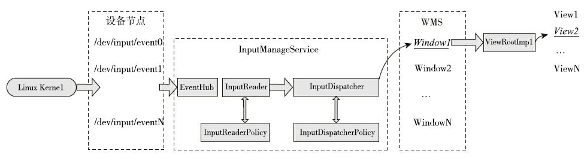
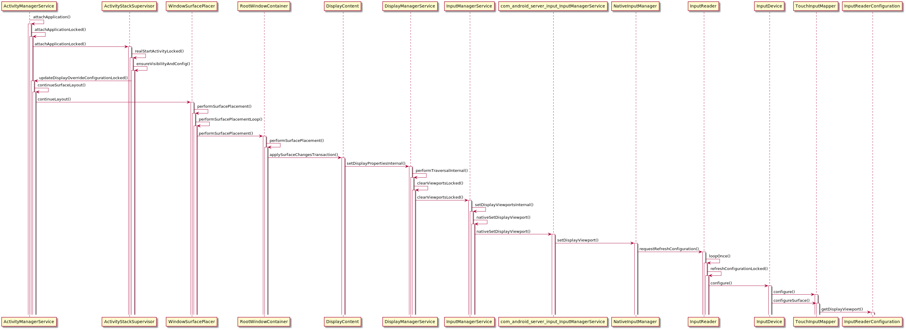

# **输入事件viewport,inputReader等相关逻辑梳理**
# 一，事件派发整体逻辑

# 二，InputanagerService初始化（cpp代码量较大，待完善）
SystemServer.java
```
private void run() {
...
 
startOtherServices();
...
inputManager = new InputManagerService(context);
inputManager.start();
...
}
```
# 三，viewport更新流程

# 四，开启第二屏后，内置屏幕触发失效问题解决方法

## 1，未开启第二屏时viewport信息
```
adb shell dumpsys display
DISPLAY MANAGER (dumpsys display)
  mOnlyCode=false
  mSafeMode=false
  mPendingTraversal=false
  mGlobalDisplayState=ON
  mNextNonDefaultDisplayId=2
  mDefaultViewport=DisplayViewport{valid=true, displayId=0, uniqueId='null', orientation=0, logicalFrame=Rect(0, 0 - 1920, 720), physicalFrame=Rect(0, 0 - 1920, 720), deviceWidth=1920, deviceHeight=720}
  mExternalTouchViewport=DisplayViewport{valid=true, displayId=0, uniqueId='null', orientation=0, logicalFrame=Rect(0, 0 - 1920, 720), physicalFrame=Rect(0, 0 - 1920, 720), deviceWidth=1920, deviceHeight=720}
  mTertiaryTouchViewport1=DisplayViewport{valid=false, displayId=0, uniqueId='null', orientation=0, logicalFrame=Rect(0, 0 - 0, 0), physicalFrame=Rect(0, 0 - 0, 0), deviceWidth=0, deviceHeight=0}
  mTertiaryTouchViewport2=DisplayViewport{valid=false, displayId=0, uniqueId='null', orientation=0, logicalFrame=Rect(0, 0 - 0, 0), physicalFrame=Rect(0, 0 - 0, 0), deviceWidth=0, deviceHeight=0}
  mVirtualTouchViewports=[]
```
## 2，开启第二屏时viewport信息
```
adb shell dumpsys display
DISPLAY MANAGER (dumpsys display)
  mOnlyCode=false
  mSafeMode=false
  mPendingTraversal=false
  mGlobalDisplayState=ON
  mNextNonDefaultDisplayId=2
  mDefaultViewport=DisplayViewport{valid=true, displayId=0, uniqueId='null', orientation=0, logicalFrame=Rect(0, 0 - 1920, 720), physicalFrame=Rect(0, 0 - 1920, 720), deviceWidth=1920, deviceHeight=720}
  mExternalTouchViewport=DisplayViewport{valid=true, displayId=1, uniqueId='null', orientation=0, logicalFrame=Rect(0, 0 - 1920, 720), physicalFrame=Rect(0, 0 - 1920, 720), deviceWidth=1920, deviceHeight=720}
  mTertiaryTouchViewport1=DisplayViewport{valid=false, displayId=0, uniqueId='null', orientation=0, logicalFrame=Rect(0, 0 - 0, 0), physicalFrame=Rect(0, 0 - 0, 0), deviceWidth=0, deviceHeight=0}
  mTertiaryTouchViewport2=DisplayViewport{valid=false, displayId=0, uniqueId='null', orientation=0, logicalFrame=Rect(0, 0 - 0, 0), physicalFrame=Rect(0, 0 - 0, 0), deviceWidth=0, deviceHeight=0}
```
## 3. 修改方案一 InputReader.CPP
```
bool InputReaderConfiguration::getDisplayViewport(ViewportType viewportType,
        const String8* uniqueDisplayId, DisplayViewport* outViewport) const {
    const DisplayViewport* viewport = NULL;
    if (viewportType == ViewportType::VIEWPORT_VIRTUAL && uniqueDisplayId != NULL) {
        for (const DisplayViewport& currentViewport : mVirtualDisplays) {
            if (currentViewport.uniqueId == *uniqueDisplayId) {
                viewport = &currentViewport;
                break;
            }
        }
    } else if (viewportType == ViewportType::VIEWPORT_EXTERNAL) {
        viewport = &mExternalDisplay;
    } else if (viewportType == ViewportType::VIEWPORT_INTERNAL) {
        viewport = &mInternalDisplay;
    } else if (viewportType == ViewportType::VIEWPORT_TERTIARY1) {
        viewport = &mTertiaryDisplay1;
    } else if (viewportType == ViewportType::VIEWPORT_TERTIARY2) {
        viewport = &mTertiaryDisplay2;
    }
 
//    viewport = &mInternalDisplay; // 强制只有主屏可控
    if (viewport != NULL && viewport->displayId >= 0) {
        *outViewport = *viewport;
        return true;
    }
    return false;
}
```
## 4. 修改方案二 DisplayManagerService.java
```
private static void setViewportLocked(DisplayViewport viewport,
        LogicalDisplay display, DisplayDevice device) {
    viewport.valid = true;
    viewport.displayId = display.getDisplayIdLocked();// displayId = 0
    device.populateViewportLocked(viewport);
}
```
# 五，为何主动将屏幕焦点设置到内置屏，内置屏幕仍然无法接收到触摸事件
```
am start -n com.wt.dualdisplay/com.wt.dualdisplay.DualDisPlayActivity --display 0
```
## 1.设置viewprot
DisplayManagerService.java
``` 
private void performTraversalLocked(SurfaceControl.Transaction t) {
    // Clear all viewports before configuring displays so that we can keep
    // track of which ones we have configured.
    clearViewportsLocked();
 
    // Configure each display device.
    final int count = mDisplayDevices.size();
    for (int i = 0; i < count; i++) {
        DisplayDevice device = mDisplayDevices.get(i);
        configureDisplayLocked(t, device);
        device.performTraversalLocked(t);
    }
 
    // Tell the input system about these new viewports.
    if (mInputManagerInternal != null) {
        mHandler.sendEmptyMessage(MSG_UPDATE_VIEWPORT);
    }
}
 
private final class DisplayManagerHandler extends Handler {
    public DisplayManagerHandler(Looper looper) {
        super(looper, null, true /*async*/);
    }
 
    @Override
    public void handleMessage(Message msg) {
        switch (msg.what) {
            ...
 
            case MSG_UPDATE_VIEWPORT: {
                synchronized (mSyncRoot) {
                    mTempDefaultViewport.copyFrom(mDefaultViewport);
                    mTempExternalTouchViewport.copyFrom(mExternalTouchViewport);
                    mTempTertiaryTouchViewport1.copyFrom(mTertiaryTouchViewport1);
                    mTempTertiaryTouchViewport2.copyFrom(mTertiaryTouchViewport2);
                    if (!mTempVirtualTouchViewports.equals(mVirtualTouchViewports)) {
                      mTempVirtualTouchViewports.clear();
                      for (DisplayViewport d : mVirtualTouchViewports) {
                          mTempVirtualTouchViewports.add(d.makeCopy());
                      }
                    }
                }
                mInputManagerInternal.setDisplayViewports(mTempDefaultViewport,
                        mTempExternalTouchViewport, mTempTertiaryTouchViewport1,
                        mTempTertiaryTouchViewport2, mTempVirtualTouchViewports);
                break;
            }
            ...
        }
    }
}
 
private void setDisplayViewportsInternal(DisplayViewport defaultViewport,
        DisplayViewport externalTouchViewport, DisplayViewport tertiaryTouchViewport1,
        DisplayViewport tertiaryTouchViewport2, List<DisplayViewport> virtualTouchViewports) {
    if (defaultViewport.valid) {
        setDisplayViewport(VIEWPORT_DEFAULT, defaultViewport);
    }
 
    if (externalTouchViewport.valid) {
        setDisplayViewport(VIEWPORT_EXTERNAL, externalTouchViewport);
    } else if (defaultViewport.valid) {
        setDisplayViewport(VIEWPORT_EXTERNAL, defaultViewport);
    }
 
    if (tertiaryTouchViewport1.valid) {
        setDisplayViewport(VIEWPORT_TERTIARY1, tertiaryTouchViewport1);
    } else if (defaultViewport.valid) {
        setDisplayViewport(VIEWPORT_TERTIARY1, defaultViewport);
    }
    if (tertiaryTouchViewport2.valid) {
        setDisplayViewport(VIEWPORT_TERTIARY2, tertiaryTouchViewport2);
    } else if (defaultViewport.valid) {
        setDisplayViewport(VIEWPORT_TERTIARY2, defaultViewport);
    }
    nativeSetVirtualDisplayViewports(mPtr,
            virtualTouchViewports.toArray(new DisplayViewport[0]));
}
```
## 2.发送事件过滤
InputDispatcher.cpp

```
void InputDispatcher::notifyMotion(const NotifyMotionArgs* args) {
...
// Just enqueue a new motion event.
MotionEntry* newEntry = new MotionEntry(args->eventTime,
        args->deviceId, args->source, policyFlags,
        args->action, args->actionButton, args->flags,
        args->metaState, args->buttonState,
        args->edgeFlags, args->xPrecision, args->yPrecision, args->downTime,
        args->displayId, // displayId
        args->pointerCount, args->pointerProperties, args->pointerCoords, 0, 0);
 
needWake = enqueueInboundEventLocked(newEntry);
...
}
 
bool InputDispatcher::enqueueInboundEventLocked(EventEntry* entry) {
...
case EventEntry::TYPE_MOTION: {
    // Optimize case where the current application is unresponsive and the user
    // decides to touch a window in a different application.
    // If the application takes too long to catch up then we drop all events preceding
    // the touch into the other window.
    MotionEntry* motionEntry = static_cast<MotionEntry*>(entry);
    if (motionEntry->action == AMOTION_EVENT_ACTION_DOWN
            && (motionEntry->source & AINPUT_SOURCE_CLASS_POINTER)
            && mInputTargetWaitCause == INPUT_TARGET_WAIT_CAUSE_APPLICATION_NOT_READY
            && mInputTargetWaitApplicationHandle != NULL) {
        int32_t displayId = motionEntry->displayId;
        int32_t x = int32_t(motionEntry->pointerCoords[0].
                getAxisValue(AMOTION_EVENT_AXIS_X));
        int32_t y = int32_t(motionEntry->pointerCoords[0].
                getAxisValue(AMOTION_EVENT_AXIS_Y));
        sp<InputWindowHandle> touchedWindowHandle = findTouchedWindowAtLocked(displayId, x, y); // displayId查找window
        if (touchedWindowHandle != NULL
                && touchedWindowHandle->inputApplicationHandle
                        != mInputTargetWaitApplicationHandle) {
            // User touched a different application than the one we are waiting on.
            // Flag the event, and start pruning the input queue.
            mNextUnblockedEvent = motionEntry;
            needWake = true;
        }
    }
    break;
}
...
 
}
```
# 六，抛砖引玉

1.inputmanagerService整理流程

2.displaymanagerService整理流程

3.epoll内部原理