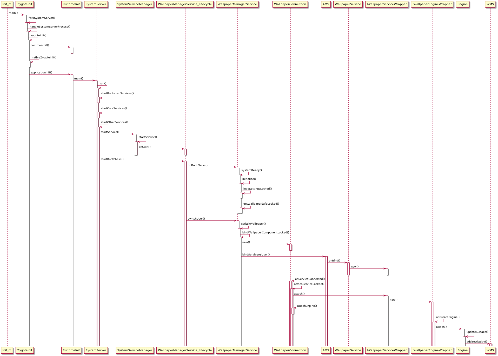
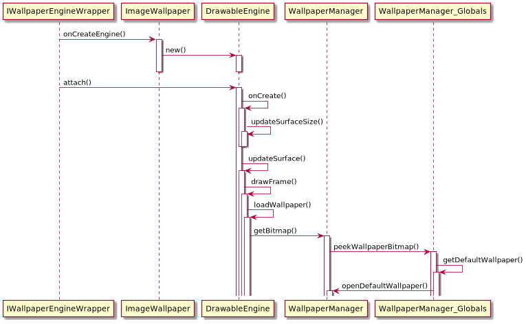
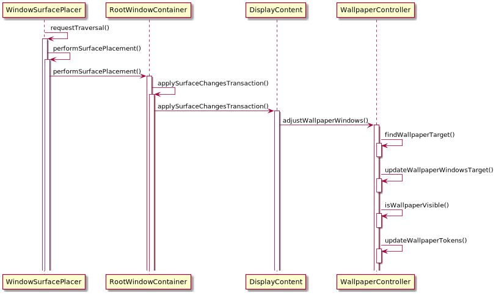

# **多窗口壁纸逻辑**
# 一.WallpaperManagerService服务启动及对默认WallpaperService的绑定逻辑

涉及到的类为：

frameworks/base/core/java/com/android/internal/os/ZygoteInit.java

frameworks/base/services/java/com/android/server/SystemServer.java

frameworks/base/services/core/java/com/android/server/SystemServiceManager.java

frameworks/base/services/core/java/com/android/server/wallpaper/WallpaperManagerService.java

frameworks/base/core/java/android/service/wallpaper/WallpaperService.java

具体启动的流程图如下：

# 二.默认壁纸资源文件的获取

涉及到的类为：

frameworks/base/packages/SystemUI/src/com/android/systemui/ImageWallpaper.java

frameworks/base/core/java/android/app/WallpaperManager.java


核心方法在frameworks/base/core/java/android/app/WallpaperManager.java的openDefaultWallpaper方法中
```
public static InputStream openDefaultWallpaper(Context context, @SetWallpaperFlags int which) {
    final String whichProp;
    final int defaultResId;
    if (which == FLAG_LOCK) {
        /* Factory-default lock wallpapers are not yet supported
        whichProp = PROP_LOCK_WALLPAPER;
        defaultResId = com.android.internal.R.drawable.default_lock_wallpaper;
        */
        return null;
    } else {
        // 默认配置文件 "ro.config.wallpaper"
        whichProp = PROP_WALLPAPER;
        // 默认资源文件
        defaultResId = com.android.internal.R.drawable.default_wallpaper;
    }
    final String path = SystemProperties.get(whichProp);
    if (!TextUtils.isEmpty(path)) {
        final File file = new File(path);
        if (file.exists()) {
            try {
                return new FileInputStream(file);
            } catch (IOException e) {
                // Ignored, fall back to platform default below
            }
        }
    }
    try {
        return context.getResources().openRawResource(defaultResId);
    } catch (NotFoundException e) {
        // no default defined for this device; this is not a failure
    }
    return null;
}
```

# 三.壁纸显示逻辑

涉及到的类为：

frameworks/base/services/core/java/com/android/server/wm/WallpaperController.java

Android9.0的壁纸控制逻辑urml图如下：

壁纸显示adjustWallpaperWindows方法代码逻辑如下：
```

void adjustWallpaperWindows(DisplayContent dc) {
    mService.mRoot.mWallpaperMayChange = false;
 
    // First find top-most window that has asked to be on top of the wallpaper;
    // all wallpapers go behind it.
    // 1.找到需要显示Wallpaper的windowstate
    findWallpaperTarget(dc);
    // 2.更新需要显示Wallpaper的windowstate
    updateWallpaperWindowsTarget(dc, mFindResults);
 
    // The window is visible to the compositor...but is it visible to the user?
    // That is what the wallpaper cares about.
    final boolean visible = mWallpaperTarget != null && isWallpaperVisible(mWallpaperTarget);
    if (DEBUG_WALLPAPER) Slog.v(TAG, "Wallpaper visibility: " + visible);
 
    if (visible) {
        if (mWallpaperTarget.mWallpaperX >= 0) {
            mLastWallpaperX = mWallpaperTarget.mWallpaperX;
            mLastWallpaperXStep = mWallpaperTarget.mWallpaperXStep;
        }
        if (mWallpaperTarget.mWallpaperY >= 0) {
            mLastWallpaperY = mWallpaperTarget.mWallpaperY;
            mLastWallpaperYStep = mWallpaperTarget.mWallpaperYStep;
        }
        if (mWallpaperTarget.mWallpaperDisplayOffsetX != Integer.MIN_VALUE) {
            mLastWallpaperDisplayOffsetX = mWallpaperTarget.mWallpaperDisplayOffsetX;
        }
        if (mWallpaperTarget.mWallpaperDisplayOffsetY != Integer.MIN_VALUE) {
            mLastWallpaperDisplayOffsetY = mWallpaperTarget.mWallpaperDisplayOffsetY;
        }
    }
     
    // 3.设置壁纸的可见性
    updateWallpaperTokens(visible);
 
    if (DEBUG_WALLPAPER_LIGHT)  Slog.d(TAG, "New wallpaper: target=" + mWallpaperTarget
            + " prev=" + mPrevWallpaperTarget);
}
```
## 1.找到需要显示Wallpaper的windowstate
```
private void findWallpaperTarget(DisplayContent dc) {
    mFindResults.reset();
    if (dc.isStackVisible(WINDOWING_MODE_FREEFORM)) {
        // In freeform mode we set the wallpaper as its own target, so we don't need an
        // additional window to make it visible.
        mFindResults.setUseTopWallpaperAsTarget(true);
    }
 
    dc.forAllWindows(mFindWallpaperTargetFunction, true /* traverseTopToBottom */);
 
    if (mFindResults.wallpaperTarget == null && mFindResults.useTopWallpaperAsTarget) {
        mFindResults.setWallpaperTarget(mFindResults.topWallpaper);
    }
}
```
## 2.更新需要显示Wallpaper的windowstate
```
/** Updates the target wallpaper if needed and returns true if an update happened. */
private void updateWallpaperWindowsTarget(DisplayContent dc,
        FindWallpaperTargetResult result) {
 
    WindowState wallpaperTarget = result.wallpaperTarget;
 
    ...
    mWallpaperTarget = wallpaperTarget;
 
    ...
}
```
## 3.设置壁纸的可见性
```
private void updateWallpaperTokens(boolean visible) {
    for (int curTokenNdx = mWallpaperTokens.size() - 1; curTokenNdx >= 0; curTokenNdx--) {
        final WallpaperWindowToken token = mWallpaperTokens.get(curTokenNdx);
        // 更新可见性
        token.updateWallpaperWindows(visible);
        // 重排序
        token.getDisplayContent().assignWindowLayers(false);
    }
}
```
